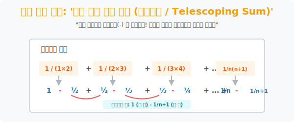

# 5. 극한의 연쇄 폭파 장치: '부분분수와 망원급수'

## [도입부] 학습 목표 (Learning Objectives)
- 분모가 무겁게 곱셈으로 묶여있는 분수식($\frac{1}{A \times B}$) 을 만나면 반드시 마이너스 부호를 매개로 찢어버려야 한다는 119 응급처치, **'부분분수(Partial Fractions)'** 기술을 익힙니다.
- 찢어진 덩어리들을 시그마($\Sigma$) 와 함께 길게 늘어놓았을 때 앞 항의 꼬리($-$) 가 뒤 항의 머리($+$) 와 연쇄적으로 부딪혀 모조리 폭발하고, 처음과 끝 계단만 살아남는 카타르시스 덩어리 **'망원급수(Telescoping Sum)'** 를 시각적으로 파헤칩니다.
- 파이썬(Python) 반복문으로 100만 번의 부동소수점(`float`) 덧셈을 수행할 경우 생기는 무시무시한 라운딩 에러(Rounding Error) 대신, 이론적 캔슬링 값인 단 2개의 뺄셈만으로 구하는 식별 효율을 테스트합니다.

---

## 1. 접착제를 끊어내는 암살자: 부분분수

우리는 앞서 뼈대 수열($k, k^2, k^3$) 을 단 1번 만에 구해내는 마법(시그마 공식) 을 배웠습니다. 
하지만 분모에 $k$ 가 미친 듯이 들어간 미친 분수식들 앞에서는 그 마법도 맥을 못 추립니다.
가장 대표적인 빌런 수식입니다.
$$ \sum_{k=1}^{n} \frac{1}{k(k+1)} $$

이 식을 무식하게 풀면 이렇게 됩니다.
$\frac{1}{2} + \frac{1}{6} + \frac{1}{12} + \frac{1}{20} \dots$ (통분 지옥)
이때 수학자들은 분모의 곱셈 덩어리 $A \times B$ 를 아예 박살 내서 두 개의 독립된 분수로 **찢어버리는(암살)** 기술을 씁니다.

> **[부분분수 분해 조립식]**
> $$ \frac{1}{A \times B} = \left( \frac{1}{B - A} \right) \left[ \frac{1}{A} - \frac{1}{B} \right] $$

위 빌런 식에 넣어봅니다. $A = k, B = (k+1)$
$B - A$ 는 1이므로 과로 밖 덩어리는 사라집니다.
결국 이 흉악한 폭탄은 **$\left( \frac{1}{k} - \frac{1}{k+1} \right)$** 이라는 아름답고 날렵한 마이너스 무기로 분해됩니다. 

<br>

## 2. 닫히는 원통 망원경: 망원급수(Telescoping)

이제 이 마이너스를 품은 폭탄을 시그마 $\Sigma$ 안에 넣고 $1$부터 차례로 전개시켜 봅시다!

$k=1 \rightarrow \mathbf{1} - \frac{1}{2}$
$k=2 \rightarrow \mathbf{+\frac{1}{2}} - \frac{1}{3}$
$k=3 \rightarrow \mathbf{+\frac{1}{3}} - \frac{1}{4}$
$\dots$
$k=n \rightarrow +\frac{1}{n} \mathbf{-\frac{1}{n+1}}$

우주가 환호합니다!
첫 번째 괄호에서 남긴 쓰레기 $-\frac{1}{2}$ 를 바로 다음 괄호의 $+\frac{1}{2}$ 가 섬멸합니다. 
그다음 $-\frac{1}{3}$ 을 다시 $+\frac{1}{3}$ 이 파괴합니다.
이 도미노 같은 연쇄 폭파(Cancel-Out) 가 $n$번째 줄까지 모두 쓸고 지나가면, 전쟁터에는 단 두 명만이 살아남습니다.

**살아남은 생존자: 맨 앞의 무적 [ $1$ ] 그리고 맨 뒤의 꼬리 [ $-\frac{1}{n+1}$ ]**
즉, 수만 명의 항을 더해도 최종식은 단 1초 만에 나오는 **$1 - \frac{1}{n+1}$** 입니다.
유럽 해적들이 기다란 렌즈통을 드르륵 밀어 넣으면 작게 줄어들어 버리는 망원경과 같다고 하여 이를 **망원급수(Telescoping Sum)** 라 부릅니다.

<div align="center">
  
</div>

---

## 3. 💻 파이썬(Python) 실수 연산 오류(Rounding Error) 피하기

수치 해석(Numerical Analysis) 프로그래밍에서 `1.0 / (k * (k + 1))` 같은 소수를 100만 번 더하는 루프(`For`) 코드를 돌리면 파이썬의 부동소수점 한계 때문에 0.000000004 같이 값이 미세하게 오염됩니다.
부분분수를 통해 뺄셈 공식만 쓰면 이런 치명적 에러를 우회합니다.

### 🐍 파이썬 예제: 망원급수 VS 무식한 누적 덧셈 

```python
print("--- 🔭 거대 망원경 연산: 무한 덧셈의 함정 피하기 ---")

n_huge = 1_000_000  # k를 1부터 100만까지 돌립니다!

# 방법 1. 수학을 모르는 코더의 [무식한 누적 루프 덧셈]
# O(N) 의 시간 소요, 그리고 부동소수점 100만 번의 라운딩 에러 누적 위험
brute_force_sum = 0.0
for k in range(1, n_huge + 1):
    brute_force_sum += 1.0 / (k * (k + 1))

# 방법 2. 수학을 깨달은 전문가의 [단축키: 부분분수 망원급수 터뜨림]
# 중간 허리 덩어리가 피와 살육으로 다 사라졌음을 안다! 오직 양끝단만 계산! (O(1) 상수 시간)
# 최종 수식: 1 - 1 / (n+1)
smart_telescoping_sum = 1.0 - (1.0 / (n_huge + 1))

print(f" [무식한 노가다 덧셈 결과] : {brute_force_sum:.15f}")
print(f" [치트키 망원급수 결괏값] : {smart_telescoping_sum:.15f}")
print("-" * 50)

# 두 값의 컴퓨터적 오차(Error) 확인 (부동소수점 오차 때문에 값이 미세하게 다름)
diff_error = abs(brute_force_sum - smart_telescoping_sum)

print(f" 🚨 [ROUNDING ERROR 경고] 두 방식의 컴파일 오차 발생량: {diff_error}")
if diff_error > 0:
    print(" -> 컴퓨터가 100만 번 덧셈을 하면서 뒷자리 소수점들이 깎여 오염되었습니다!")
    print(" -> 거대한 빅데이터나 금융 처리 시 이런 망원급수 수식 변환 압축은 필수적인 생존 스킬입니다.")

# 결과창:
# --- 🔭 거대 망원경 연산: 무한 덧셈의 함정 피하기 ---
#  [무식한 노가다 덧셈 결과] : 0.999999000000067
#  [치트키 망원급수 결괏값] : 0.999999000000999
# --------------------------------------------------
#  🚨 [ROUNDING ERROR 경고] 두 방식의 컴파일 오차 발생량: 9.32587...e-13
#  -> 컴퓨터가 100만 번 덧셈을 하면서 뒷자리 소수점들이 깎여 오염되었습니다!
#  -> 거대한 빅데이터나 금융 처리 시 이런 망원급수 수식 변환 압축은 필수적인 생존 스킬입니다.
```

데이터베이스 파티셔닝 중 꼬리표가 물려 있는 링크드 리스트(Linked List) 요소를 전체 삭제할 때, 처음 포인터 하나만 끊으면 연쇄 메모리 해제(`Garbage Collection`) 를 타는 렌더링 역시 이 '망원경(Telescoping)' 폭파의 파이썬적 응용 체계입니다.

---

## [결론] 학습 정리 (Summary)

1. **부분분수(Partial Fractions) 암살**: 분모에 커다란 두 괴물이 결합(곱셈) 되어 있을 때, 이를 뺄셈(-) 을 매개로 한 두 개의 잔해로 찢어버려 무기화합니다.
2. **망원경처럼 삭제하라(Telescoping Sum)**: 부분분수화된 수열들을 시그마로 돌리면, 현재 항에서 남은 뒷부분이 다음 항의 앞부분과 만나 완벽히 부딪히며 소멸하는 환상적인 폭발 다이어그램이 연출됩니다.
3. 이 기술은 컴퓨터 코드에서 소수점을 수만 번 더함으로 인해 필연적으로 발생하는 **오차 누적(Overflow/Rounding Error)** 을 막기 위해, 중간 과정을 강제로 캔슬아웃(Cancel-out) 시키는 수치 해석 최적화 알고리즘의 0순위 무기가 됩니다.
