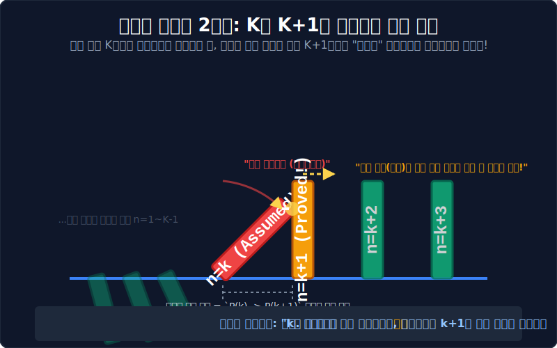

# 05. 수학적 귀납법 2단계: 연쇄 폭발 (Chain Reaction)

## 1. 학습 목표 (Learning Objectives)
* 귀납법 증명의 진정한 핵심이자 가장 두뇌를 많이 써야 하는 **'2단계 ($n=k$ 일 때 참이라 가정하고, $n=k+1$ 일 때 증명해 내기)'** 의 논리적 뼈대를 학습합니다.
* 왜 우리는 결괏값을 아직 모르는 불확실한 숫자 $k$를 참이라고 무작정 들이대서(가정해서) 증명의 부품 엔진으로 써먹는지 철학적 파급 효과를 이해합니다.

## 2. 도미노의 완벽한 간격을 세팅하라
앞서 1단계에서 맨 앞줄의 1번 도미노($n=1$)를 손으로 밀어서 쓰러뜨렸습니다. 하지만 이것만으로는 아직 우주 끝까지 배열된 도미노가 다 쓰러진다고 장담할 수 없습니다. 어쩌면 도미노끼리 간격이 너무 멀어서 2번 도미노까지만 쓰러지고 허무하게 멈출지도 모릅니다.

따라서 전체 시스템이 100% 무한 연쇄 폭발을 일으키려면, 우리는 도미노 사이의 "간격과 물리 타격 역학"이 절대 엇나가지 않음을 수학적으로 입증해야 합니다. 이것이 **귀납법 2단계 (Step 2)** 입니다.

  

## 3. "만약 네가 쓰러진다면, 네 뒷놈도 무조건 같이 끌고 간다!"
귀납법 2단계의 해킹 논리는 다음과 같은 마법의 순서로 진행됩니다.

1. **[가정(Assume)]**: 우주 어딘가에 있는 임의의 순서 $n=k$ 번째에 대해 식이 참이라고 일단 쿨하게 인정(가정)해 줍시다. "$OK$, 네가 팩트 맞다고 쳐 주마!"
2. **[타겟 락온(Target)]**: 우리의 최종 미션은 방금 전 "참이라고 쳐 준 그 식의 재료들" 이리저리 지지고 볶고, 양변에 똑같은 수를 더하거나 곱해서, $n$ 자리에 $k+1$ 을 집어넣었을 때의 공식 형태로 완벽하게 변형 조립해 내는 것입니다.
3. **[증명(Prove)]**: 만약 그 조립(변형)이 모순 없이 깔끔하게 떨어졌다면? 이것은 곧 **"$P(k)$가 맞다는 에너지가 $P(k+1)$ 의 진리값까지 보장해냈다!"** 는 결정적 논리 블럭을 완성한 것입니다.

## 4. 무한 루프의 완성: 도미노 엔진 가동
자, 위대한 발견입니다. 
당신은 방금 2단계를 통해 **"어떤 번호의 놈이 참이 되면, 그 바로 뒷 번호의 놈은 무조건 참으로 타격당한다($P(k) \rightarrow P(k+1)$)"** 는 절대 공장 자동화 룰을 증명해 냈습니다.

이 룰을 방금 전 1단계에서 입증했던 스위치($n=1$ 참)에 연결시켜 볼까요?
* 1단계에 의해 **n=1** 은 참입니다. (팩트)
* 2단계의 자동화 룰 가동! $\rightarrow$ "앞놈 1이 참이면 뒷놈 2도 참이네?" $\rightarrow$ 결국 **n=2** 도 참 확정! (팩트)
* 다시 2단계 가동! $\rightarrow$ "앞놈 2가 방금 참이네? 그럼 뒷놈 3도 참이네!" $\rightarrow$ **n=3** 도 참 확정!
* (무한대까지 자동 연산 폭발...)

인간은 1억 번, 1조 번 계산하지 않았습니다. 그저 스위치를 한 번 켰고(1단계), 1회성 타격 논리(2단계)만 하나 컴퓨터에 박아 넣었을 뿐입니다. 그 논리 회로가 알아서 무한대까지 모든 자연수에 대해 100% 공식이 맞음을 입증해 낸 것, 이것이 인류 수학 증명법의 최고봉 '수학적 귀납법'의 웅장한 작동 원리입니다.

## 5. 학습 정리 (Summary)
1. **귀납법의 2단계 구조**: 임의의 점 $n=k$ 일 때 명제가 참이라고 강력하게 '가정'한 뒤, 그 가정된 식을 재료로 활용하여 $n=k+1$ 일 때의 식의 형태를 모순 없이 유도(증명)해 내는 논리 도약법입니다.
2. **논리 공장 1+2 크로스**: 1단계(트리거 개방)와 2단계(자동 연결 컨베이어 벨트)가 하나로 합쳐지는 순간, 인간의 유한한 머리로 무한(Infinity)의 세계 전체를 모조리 참으로 영원불멸 증명할 수 있게 됩니다.
