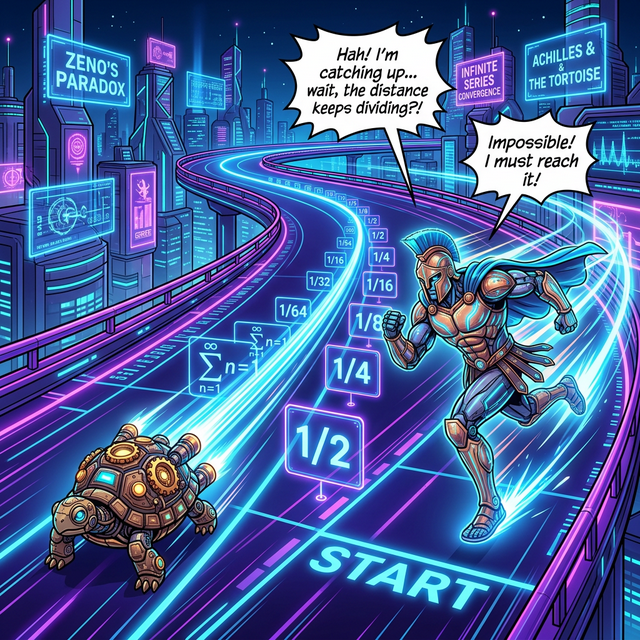

# 03. 세 번째 수업: 거북이를 절대 못 잡는 아킬레스 건, 제논의 역설 (Zeno's Paradox)

철학자 제논은 다음과 같은 무한궤도 런 스토리를 개발해 고대 그리스 학파를 멘붕에 빠뜨립니다.

---

## 1. 뛸수록 도달 불가능한 목표물

1. 가장 빠른 영웅 아킬레스가 느릿한 거북이에게 거만하게 "$100$미터 앞" 에서 출발 핸디캡을 줍니다. 
2. 아킬레스가 드디어 달려서 거북이가 출발했던 위치($100$미터 뷰포인트) 에 서 봅니다.
3. 그런데 그동안 굼뜬 거북이도 앞으로 몇 인치라도 전진했을 거 아닙니까? (예: $10$미터 전진) 
4. 아킬레스가 그 $10$미터를 더 따라잡으려고 뛰어간 찰나의 시간 동안, 거북이는 또 $1$미터를 앞으로 기어 전진했습니다!
5. 아킬레스가 그 $1$미터를 다시 쫓아 뛰어갑니다. 그런데 그동안 거북이는 개미 오줌만큼 $0.1$미터 또 전진했습니다!
6. "야 ㅋㅋ 너 이 티끌만 한 찰나의 거리를 무한 루프로 쫓아가 보시지? 결국 넌 거북이를 죽을 때까지 못 잡아!" 

이것이 미적분을 배우기 전 모든 인류의 두뇌를 후려쳤던 제논의 $1/2$ 역설입니다.

  

## 2. 시간을 무한 프레임으로 썰어버린 말장난 

이 제논의 속임수는 프로그래밍 시각으로 보면 딱 하나입니다! **"아킬레스가 쫓아가는 프레임 초당 틱레이트(시간) 마저도, 거리와 똑같이 비례해서 $\mathbf{1/10}$ 배 씩 지독하게 작아지는 슬로모션 미세먼지 루프로 분쇄해 버렸기 때문"** 입니다.

아킬레스가 100미터 달릴 땐 $10$초가 걸렸다면,
다음 10미터 갭을 달릴 땐 단 1초,
다음 1미터 갭을 달릴 땐 단 $0.1$초,
다음 $0.1$미터 갭 스텝 밟을 땐 단 $0.01$초의 슬로 모션 카메라 찰나가 걸립니다!

자, 제논이 아킬레스에게 부과한 저 영원히 끝나지 않을 것 같은 "수만 번의 스텝" 들이 소모한 전체 시간을 급수로 무식하게 전부 $\pm$ 더해볼까요?

> $\mathbf{Total \ Time = 10 + 1 + 0.1 + 0.01 + 0.001 + \dots}$ (무한 루프)

## 3. 합체된 시간의 한계치 (수렴)

저 먼지 같은 초시계 조각 파편들을 무한번 수억 년 동안 `For` 루프로 뺑이쳐 더해봤자, 모니터에서 찍혀 나오는 우주 끝 최종 시간 누적값 정답은? 저 파편들은 **$11.111111\dots$ 초** 라는 단단한 유리 천장 소수점 바닥에 처박혀 단 $0.0001$초 도 더 위로 돌파하지 못하고 얼어버립니다!

즉, "무한 번 횟수로 쪼그라들어서 스텝 무빙을 친 건 팩트야. 근데! **그 수만 번의 짜잘한 모든 프레임 쑈들을 싹 다 긁어모아 더해봤자 현실 우주 시간으로 고작 $11.11$ 초밖에 타임라인이 안 지난 거라고!**" 
$\to$ 그러니까 $12$초째가 되면 아킬레스는 그 무한의 쓰레기 먼지 프레임을 모두 씹어 잡수시고 거북이를 짓밟고 저 멀리 앞으로 치고 나갑니다!

이것이 "먼지를 무한대($\infty$) 로 더한다고 우주가 폭발하지 않으며, 특정 한계치 락다운(수렴 Limit) 으로 귀결된다" 는 극한(Limits) 사상의 탄생, 컴퓨터가 수학을 해킹해 낸 쾌거입니다. 4장에서 이 멈춤과 폭발 판독기 가드를 부숴보겠습니다.
