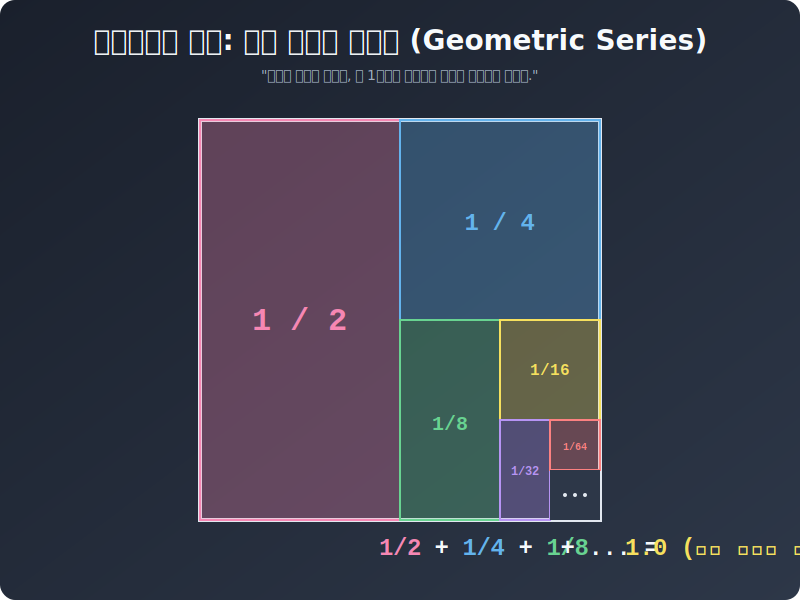



# 05. 다섯 번째 수업: 무한등비급수의 마법진, $S = \frac{a}{1-r}$ (Sum of Geometric Series)

1장의 인트로에서 $1/2 \ + \ 1/4 \ + \ 1/8 \ + \ 1/16$ 먼지 조각들을 아무리 영구 더블 루프로 긁어모아도, 온전한 정사각형 면적 $\mathbf{1}$ 을 돌파하지 못한다고 했습니다.
이 거대한 무한 스텝 더하기의 정답($1$) 을 암산으로 단 $0.1$초 만에 터뜨려주는 폰 노이만급 마법 스펠 코드가 존재합니다.

---

## 1. 전설의 원 샷 원 킬 치트 코드 

앞선 4장 판독기에서 $\mathbf{-1 < r < 1}$ 스캔을 무사히 통과하여 "아, 이 급수는 얌전히 [수렴]해서 안전 지대 유리 천장에 부딪히겠구나!" 확정이 났다면? 그 수많은 무한 덧셈을 컴퓨터 루프로 돌릴 필요조차 없습니다. 

모든 무한 번 덧셈 픽셀 조각들의 우주 총합 영토 면적 사이즈(수렴값 극한 Sum **$\mathbf{S}$**) 는 이 깡패 스크립트 단 한 줄에 모두 담깁니다!

> ## $\mathbf{S = \frac{a}{1 - r}}$

단 2개의 파라미터 숫자 정보만 세팅하면 끝납니다!
* **$\mathbf{a}$** = 무한 수열의 가장 왼쪽 앞대가리를 장식하는 맨 **"첫째 항 몬스터 대빵(시작 베이스 숫자)"**
* **$\mathbf{r}$** = 옆방으로 점프 뛸 때 곱해지는 **"반갈죽 마이너 너프 비율 공비(Ratio)"**

  

## 2. 렌더링 해킹 실습! $\mathbf{a}$ 와 $\mathbf{r}$ 이펙트

아까 1장의 그 유명한 피자 쪼가리 먼지 배열 덧셈에 저 코드를 부어 볼까요?
수식: $\mathbf{\frac{1}{2} \ + \ \frac{1}{4} \ + \ \frac{1}{8} \ + \ \frac{1}{16} \ + \ \dots}$

* 해킹 슬롯 $\mathbf{a}$ (첫 번째 몸통 덩어리 대장): **$\mathbf{\frac{1}{2}}$** (젤 멘 앞에 서있는 피자 반 조각)
* 해킹 슬롯 $\mathbf{r}$ (오른쪽으로 스폰될 때 곱해진 쓰레기 비율률): 역시 옆방 넘어갈 때마다 반 토막 타작을 치고 있으므로 **$\mathbf{\frac{1}{2}}$** 

위대하신 마법 컴파일 스펠 $S = a / (1 - r)$ 분모 파라미터에 투척!
> 총면적 썸 $S = \frac{\frac{1}{2}}{1 \ - \ \frac{1}{2}}$
> $= \frac{\frac{1}{2}}{\frac{1}{2}}$ 
> **$= \ \mathbf{1}$ (절대 불변의 오리지널 피자 1판 락다운!!)**

놀랍지 않습니까? "어? 무한 번이나 조각들을 끝없이 더했는데, 어떻게 $1.000000$ 에서 오차 $1$그램 없는 퍼펙트한 정수 $\mathbf{1}$ 화면이 딱! 종결돼 버리지?"
이 미친 기적은, 우리가 곱해나간 $\mathbf{r = 1/2}$ 이라는 미립자 반환 스케일이 무한 프레임을 굴리며 결국 "제로 먼지 분진" 으로 산화 증발하여 아예 찌꺼기 카운트조차 무시해 버릴 $0.00000$ 백도어 포맷이 터져버렸기 때문입니다!

하지만 인류는 수학 공식을 의심하는 짐승입니다. 우리는 정말 1억 개의 배열을 포 루프로 다 돌렸을 때 저 코드대로 $1$ 이 떨어지는지 파이썬 반복 코어 엔진으로 직접 강제 루프 타격을 꽂아 6장에서 혈투의 대미를 장식하겠습니다.

