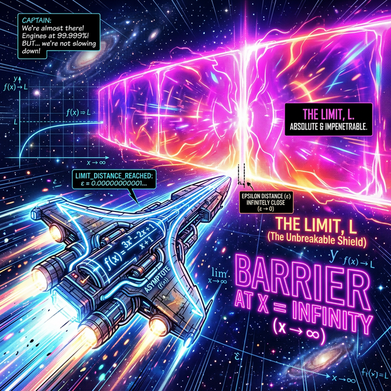

# 00. 인트로: 영원히 닿을 수 없는 투명 에너지 쉴드 (Intro)

우주비행사 캐릭터가 빛의 속도로 엑셀을 밟으며 직진합니다.
그런데 전방 $10\text{km}$ 상공에 **"이 선을 넘어가면 맵 렌더링이 깨져서 강제 종료됩니다!"** 라고 적힌 절대 파괴 불가 투명 쉴드(에피실론 벽) 라인 결계가 쳐져 있습니다.

  

## 1. 다가간다, 하지만 절대 닿지 않는다

이게 무슨 스크립트 버그일까요?
캐릭터가 $n=1$ 턴에는 벽과 $5\text{km}$ 거리, $n=2$ 턴에는 $2\text{km}$ 거리, $n=1000$ 턴에는 벽과 고작 **$0.00000001\text{cm}$** 의 아슬아슬한 거리를 두고 코를 박고 있습니다.

하지만 우리가 턴 횟수 변수 $\mathbf{n}$ 값을 무한대 우주 밖 시간($\infty$) 으로 `while` 루프를 돌려버려도, 저 우주선은 영원히 저 유리 쉴드 벽 숫자 라인에 코만 박고 더 이상 $\mathbf{1mm}$ 도 앞으로 못 뚫고 나아갑니다.

## 2. 미적분학의 창조적 파괴 

이 "영구적인 접근, 그러나 통과 불가" 의 찰나적인 숫자 벽을 기하학자들은 **극한(Limit, $\lim$)** 이라고 선포했습니다.
그동안 인류 수학은 "야, $X$ 버튼을 3번 누르면 $Y$ 몬스터가 튀어나온다!" 처럼 딱딱 떨어지는 깡통 함수방정식(대수학) 이었습니다.
하지만 이 변태 같은 $\lim$ 코드가 침투한 순간부터 수학계는 **"야, $X$ 를 $\infty$ 무한대로 미치게 돌려 보거나, 어떤 숫자 $3$ 의 코앞 먼지 픽셀 찰나까지 $\mathbf{2.9999999}$ 무자비하게 줌인(Zoom-in) 확대 시키면 도대체 저 $Y$ 결과값이 무슨 짓을 할까?!"** 이 동적인 찰나 무빙 파동(해석학) 을 다루기 시작합니다.

미적분 책 가장 맨 처음에 나오는 이 극한 $\lim$ 을, 왜 우리는 미분의 폭파가 다 끝나고 나서 마지막 던전 보스로 소환했을까요?
모든 함수 미분/적분의 코어에는 이 "극한의 유리 천장" 메커니즘 칩셋이 박혀있기 때문입니다. 극한 스위치 매크로의 문법 패치를 1장에서 장착합시다.
