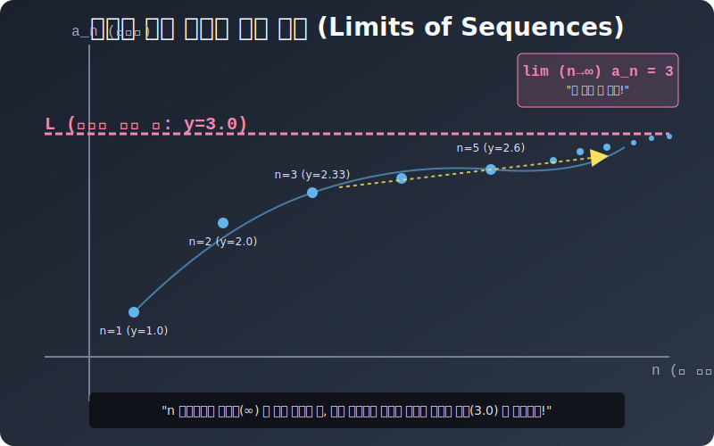

# 01. 첫 번째 수업: 마우스 휠 무한 줌인 무빙 치기, 극한($\lim$) 의 스크립트 선언

수열의 룰은 간단했습니다. 차례대로 줄 세우는 함수죠.
> "야, $n$ 번째 자리에 서 있는 놈의 규칙은 $a_n = \frac{n+1}{n}$ 식을 따른다!"

여기에 우리가 타임라인 조작기(마우스 휠) 를 달아봅니다! 

---

## 1. 노가다 대입 루프 구동

이 규칙 수식에 $1$ 부터 포 루프를 쑤셔 넣어 10 등, 100 등, 10,000 등 순서에 서 있는 놈의 $Y$ 결과 수치를 볼까요?

* $n = 1$ 일 때: $\frac{1+1}{1} = \mathbf{2}$
* $n = 10$ 일 때: $\frac{10+1}{10} = 1.1 = \mathbf{1.1}$
* $n = 100$ 일 때: $\frac{100+1}{100} = 1.01 = \mathbf{1.01}$
* $n = 10,000$ (만 번째 턴!): $\frac{10001}{10000} = \mathbf{1.0001}$

무언가 렌더링 수치 타켓팅이 소름 돋게 느껴지십니까?
"야... 이것들이 계속 타임라인 돌릴수록 숫자가 얍삽하게 작아지긴 지는데... 죽었다 깨어나도 $\mathbf{1}$ 밑으로는 안 꼬라박히고 계속 0000 찌꺼기만 붙이면서 $\mathbf{1}$ 머리 위에 얼어붙는구만!!"

  

## 2. 세 글자의 마법 패치: $\mathbf{\lim}_{n \to \infty}$

이 지긋지긋한 노가다 표 작성을 수학자들은 끔찍하게 싫어했습니다.
"그냥 한 줄 스크립트로 이 우주의 종말 렌더링 샷을 퉁 쳐버리는 패치를 배포하자!" 

그것이 바로 **리디렉트 극한자, 리미트 (Limit, $\lim$)** 스펠의 강제 소환입니다.
위에 썼던 짜잘하고 구질구질한 수식들을, 이렇게 적습니다.

> ### **$\lim_{n \to \infty} \left( \frac{n+1}{n} \right) \ = \ \mathbf{1}$** 
> *(해독문: "야 엔진 파서야! n 숫자를 미친 듯이 $\infty$ 우주 끝까지 스킵해서 땡겨버렸을 때 저 $(\frac{n+1}{n})$ 함수 껍데기 놈의 최종 결착지가 어디냐? 아하, 오차 없이 **$\mathbf{1}$** 이라는 벽에 찌그러지는구나!")*

단 세 글자. "림(lim)". 
이 명령어를 어떤 변수 수식 앞에 딱 붙이는 순간! 그 방정식 타임라인 $n$ 은 즉시 우주 끝 무한대로 복사 오버플로 스킵 렌더링이 처지며, 인간의 뇌로 다다를 수 없는 수억 만년 후의 결괏값(극한값 Limit Value) $\mathbf{1}$ 을 모니터에 한방에 록다운 배출해버립니다.

## 3. 리미트는 왜 필요한가? 

만약 $f(x) = \frac{x^2 - 1}{x - 1}$ 이라는 버그 폭발 함수가 있습니다. 
당신이 x 에다가 $\mathbf{x=1}$ 을 딱 무식하게 대입하면 어떻게 될까요?
분모가 $(1-1) = 0$ 이 되어 컴퓨터 메모리는 "ZeroDivisionError! 0으로 나눌 수 없습니다 삐이익!" 하고 강제 종료(Crash) 블루스크린이 뜹니다.

하지만 **리미트 $\lim_{x \to 1}$** 극한 스킬을 이 폭탄에 둘러치면?
"야 컴퓨터! $x$ 에 1 딱 대입하지 말고! **$\mathbf{1.0000001}$, 아니면 $\mathbf{0.999999}$ 처럼 1에 닿을 듯 말 듯 '무한히 코앞까지 줌인 확대' 상태 렌더링만 띄우고 브레이크 잡아!**" 
오류 폭발을 피해 가면서 "이 녀석이 어디로 가고 있는지 목표 종착점($Y=2$)" 을 빼돌려 엿볼 수 있게 하는 최고급 해킹 디버깅 툴입니다!! 이제 리미트 장비를 어떻게 쪼개고 합치는지 성질을 2장에서 분해해 보겠습니다!
