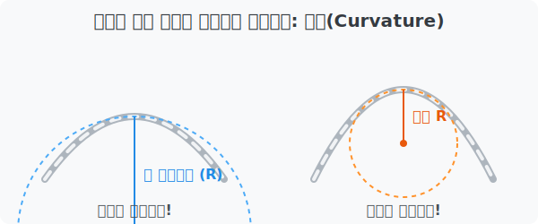

# 1. 굽은 정도를 측정하는 마법: 곡률(Curvature)

## [도입부] 학습 목표 (Learning Objectives)
- '굽어있다'라는 애매한 느낌을 수학적으로 어떻게 숫자로 측정하는지 이해합니다.
- 곡률(Curvature)과 곡률반경(Radius of Curvature)의 반비례 관계를 배웁니다.
- 파이썬(Python) 코드를 사용해 곡률에 따른 안전 속도를 시뮬레이션 해봅니다.

---

## 1. 곡선은 얼마나 굽어있을까?

대관령이나 미시령 고개를 차로 넘어본 적이 있나요? 구불구불한 도로를 운전할 때 어떤 곳은 핸들을 살짝만 꺾어도 되지만, 어떤 곳은 속도를 크게 줄이고 핸들을 획 꺾어야 하는 일명 '헤어핀 코스'가 등장합니다.

우리는 일상에서 "여기는 커브가 완만해", "여기는 커브가 너무 급격해" 라고 말합니다. 하지만 자율주행 자동차를 프로그래밍하는 컴퓨터에게 "조금 완만함" 같은 애매한 말은 통하지 않죠. 컴퓨터와 수학자들은 이 굽은 정도를 정확한 **수치(Number)**로 나타내기로 했고, 그것이 바로 **곡률(Curvature)**입니다.

<br>

## 2. 곡률($\kappa$)과 곡률반경($R$)의 관계

곡선이 휘어진 부분에 딱 들어맞는 가상의 찰흙 원(Circle)을 끼워 넣는다고 상상해 보세요. 



1. **커브가 완만한 곳**: 끼워 넣은 원이 어마어마하게 큽니다. 즉, 원의 반지름(Radius)이 매우 크죠.
2. **커브가 급격한 곳**: 끼워 넣은 원이 아주 작습니다. 원의 반지름(Radius)이 아주 작습니다.

이때 굽은 곳에 딱 들어맞는 가상의 원을 '접촉원'이라 하고, 그 반지름을 **곡률반경(Radius of Curvature, $R$)**이라고 부릅니다. 
수학에서 곡선의 굽은 정도인 **곡률($\kappa$, 카파)**은 곡률반경의 **역수**로 멋지게 정의됩니다.

**$$ \kappa = \frac{1}{R} $$**

- 원이 거대하다 $\rightarrow$ **$R$이 크다** $\rightarrow$ 분모가 크므로 **곡률($\kappa$)은 작다.** (거의 직선에 가까움)
- 원이 조그맣다 $\rightarrow$ **$R$이 작다** $\rightarrow$ 분모가 작으므로 **곡률($\kappa$)은 크다.** (급격하게 꺾임)

이 기발한 역수의 개념 덕분에 가장 펴져있는 '직선'의 곡률은 $1/\infty$, 즉 $0$ 이라는 완벽한 논리가 완성됩니다!

---

## 3. 💻 파이썬(Python)으로 곡률에 따른 안전속도 계산하기

실제 고속도로를 설계할 때 도로의 곡률반경($R$)에 따라 차량이 튕겨 나가지 않는 제한속도($V$)를 결정합니다. 파이썬 함수 하나로 커브길의 속도 제한 표지판을 자동으로 생성하는 프로그램을 짜볼까요?

```python
import math

# 곡률반경 R (미터) 이 주어졌을 때, 
# 원심력을 견디는 적정 설계속도 V (km/h) 를 반환하는 함수
def calculate_safe_speed(radius_R):
    # 단순화된 물리 공식: V = sqrt(127 * 마찰계수 * R)
    # (일반 아스팔트 노면 마찰계수를 약 0.15 로 가정)
    friction = 0.15
    safe_speed = math.sqrt(127 * friction * radius_R)
    return round(safe_speed)

# 다양한 커브길 데이터베이스 구축
curves = {
    "고속도로 완만한 커브": 1000,   # 곡률반경 1000m (곡률 아주 작음)
    "국도 일반 커브": 250,      # 곡률반경 250m
    "대관령 급커브(헤어핀)": 30   # 곡률반경 30m (곡률 아주 큼!)
}

print("--- 곡률반경에 따른 도로 제한속도 설계 ---")
for road_name, R in curves.items():
    curvature_k = 1 / R
    speed = calculate_safe_speed(R)
    
    # \u03BA 는 그리스 문자 카파(kappa)의 유니코드입니다.
    print(f"🛣️ {road_name}")
    print(f"  - 원의 반지름(R): {R}m")
    print(f"  - 수학적 곡률(\u03BA): {curvature_k:.4f}")
    print(f"  - 🚨 추천 제한속도: {speed} km/h\n")
```

이렇게 수학적 원리 `K = 1 / R` 과 물리 공식을 융합하면 컴퓨터는 수천 킬로미터에 달하는 내비게이션 맵의 모든 커브마다 적정한 감속 경고를 0.1초만에 뿌려줄 수 있습니다. 

---

## [결론] 학습 정리 (Summary)

1. **곡선의 수치화**: '굽어있다'는 직관적인 느낌을 측정이 가능한 수학적 숫자로 만든 것이 **곡률(Curvature, $\kappa$)**입니다.
2. **곡률반경 역수의 법칙**: 커브가 급할수록 딱 들어맞는 원의 크기가 작아지므로, 곡률은 곡률반경(R)을 뒤집은 **$\kappa = 1/R$** 로 정의됩니다. 반비례의 아름다운 예시입니다.
3. **자율주행과 설계의 기초**: 이 곡률 데이터를 파이썬 등 컴퓨터로 계산하여 최적의 자동차 조향 각도를 정하고 안전 제한 속도를 산출해냅니다.
