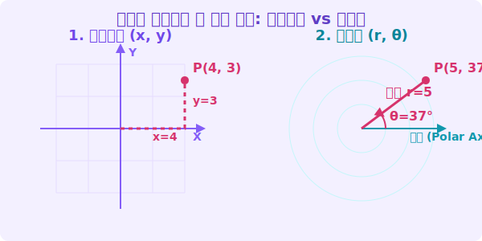

# 2. 극좌표(Polar Coordinates): 회전과 거리의 세계

## [도입부] 학습 목표 (Learning Objectives)
- '바둑판' 모양의 직교좌표계(Cartesian)에서 벗어나, 레이더망 모양의 **극좌표계(Polar)** 개념을 장착합니다.
- 점의 위치를 $x, y$ 가 아닌 **거리($r$)**와 **각도($\theta$)**로 나타내는 방식을 이해합니다.
- 파이썬(Python)과 `math` 모듈 삼각함수를 사용하여 두 좌표계 사이를 자유자재로 변환하는 코드를 작성해 봅니다.

---

## 1. 세상을 바라보는 두 가지 관점

친구에게 보물을 묻어둔 장소를 설명한다고 상상해보세요.

1. **도시 깍쟁이의 방식 (직교좌표계)**: "초등학교 정문에서 동쪽으로 40미터 가고, 북쪽으로 30미터 가!"
2. **해적 선장의 방식 (극좌표계)**: "초등학교 정문에서 북동쪽 **37도 각도**를 쳐다보고, 그 방향으로 곧장 **50미터** 걸어가!"

우리가 학교에서 늘 그리던 십자가 모양의 $x, y$ 좌표 평면을 **데카르트 직교좌표(Cartesian Coordinates)**라고 합니다. 위, 아래, 양 옆의 격자(Grid)로 이루어져 있죠.
하지만 배를 띄우는 레이더망, 드론의 회전 카메라, 그리고 행성의 궤도를 계산할 때는 동서남북 직진 개념보다 **'회전하는 각도'**와 **'중심에서의 거리'**가 훨씬 직관적입니다. 

이를 위해 수학자들은 **극좌표계(Polar Coordinates)**를 발명했습니다.



<br>

## 2. $(r, \theta)$ : 극좌표의 문법

직교좌표계가 $(x, y)$ 라면, 극좌표계는 **$(r, \theta)$**라는 문법을 씁니다.
- **$r$ (radius)**: 중심점(원점 혹은 극점)으로부터 보물까지 뻗어나간 직선 거리입니다. 음수가 될 수 없습니다.
- **$\theta$ (theta)**: 기준선(주로 오른쪽 x축 방향)으로부터 마주보는 방향이 얼마나 회전했는지를 나타내는 각도입니다. 일반 각도(도, Degree)나 호도법(라디안, Radian)을 모두 씁니다.

따라서 아까 해적 선장이 말한 보물의 위치는 직교좌표로는 $(40, 30)$ 이지만, 극좌표로는 $(50, 37^\circ)$ 가 됩니다. 

<br>

### 직교좌표 $\leftrightarrow$ 극좌표 변환 마법 공식
피타고라스의 정리와 삼각함수(Sin, Cos)를 이용하면, 두 세계의 좌표를 완벽하게 통역할 수 있습니다!

**1) 극좌표 $(r, \theta)$를 직교좌표 $(x, y)$로 번역하기:**
$$ x = r \times \cos(\theta) $$
$$ y = r \times \sin(\theta) $$

**2) 직교좌표 $(x, y)$를 극좌표 $(r, \theta)$로 번역하기:**
$$ r = \sqrt{x^2 + y^2} $$
$$ \theta = \tan^{-1}\left(\frac{y}{x}\right) $$ 
*(참고: $\tan^{-1}$는 탄젠트의 역함수인 아크탄젠트로, 각도를 구해주는 계산기입니다)*

---

## 3. 💻 파이썬(Python)의 수학 모듈로 좌표계 통역사 만들기

우주 탐사선이나 미사일 유도 시스템에는 직교좌표와 극좌표 스위칭이 1초에도 수백 통씩 일어납니다. 파이썬의 `math` 라이브러리를 사용해서 좌표를 통역해주는 코딩을 실습해 봅시다.

### 🐍 파이썬 예제: 좌표계 쌍방향 번역기 코딩

```python
import math

# --- 1) 극좌표 (r, theta) -> 직교좌표 (x, y) 변환 ---
# 극좌표 데이터: 거리 5, 각도 36.87도 (레이더 상의 위치)
r = 5
theta_degree = 36.87

# 컴퓨터 math 모듈은 각도를 '라디안(Radian)'으로만 받기 때문에 
# 반드시 각도를 라디안으로 변환해 주어야 합니다.
theta_radian = math.radians(theta_degree)

# x = r * cos(theta), y = r * sin(theta)
x_val = r * math.cos(theta_radian)
y_val = r * math.sin(theta_radian)

print(f"극좌표 ({r}, {theta_degree}도) -> 직교좌표 ({x_val:.1f}, {y_val:.1f})")
# 결과: 극좌표 (5, 36.87도) -> 직교좌표 (4.0, 3.0)


# --- 2) 직교좌표 (x, y) -> 극좌표 (r, theta) 변환 ---
# 이번엔 반대로 x가 -3, y가 4인 위치의 데이터
pt_x = -3
pt_y = 4

# 피타고라스 정리로 거리(r) 구하기: math.hypot() 기능 사용
new_r = math.hypot(pt_x, pt_y)

# 수학의 아크탄젠트로 각도(theta 라디안) 구하기
# 프로그래밍에서는 방향까지 정확히 잡아주는 math.atan2(y, x)를 애용합니다.
new_theta_rad = math.atan2(pt_y, pt_x)

# 사람이 읽기 쉽게 각도 단위(Degree)로 변환
new_theta_deg = math.degrees(new_theta_rad)

print(f"직교좌표 ({pt_x}, {pt_y}) -> 극좌표 ({new_r:.1f}, {new_theta_deg:.1f}도)")
# 결과: 직교좌표 (-3, 4) -> 극좌표 (5.0, 126.9도)
```

수학 교과서에서는 $\arctan$(아크탄젠트) 공식의 맹점 때문에 사분면의 위치를 일일이 상상해야 하지만, 파이썬의 `math.atan2(y, x)` 함수는 $x$와 $y$의 위치를 분석해 **$360$도 전 방위의 각도를 완벽하고 똑똑하게 반환**해준다는 점이 컴퓨터 공학의 매력입니다!

---

## [결론] 학습 정리 (Summary)

1. **극좌표(Polar Coordinate)**: 가로축, 세로축이 아니라 기준점에서의 **단도직입적인 거리($r$)**와 **회전한 각도($\theta$)**로 세상의 위치를 표현하는 시스템입니다.
2. **좌표의 통역**: 삼각함수(Sin, Cos)와 피타고라스의 정리는 두 좌표계를 이어주는 유일하고 확실한 번역기 역할을 합니다.
3. **컴퓨터 프로그래밍의 지혜**: 복잡한 아크탄젠트 각도 계산에서 파이썬의 `math.atan2()` 함수를 사용하면 컴퓨터가 인간보다 더 똑똑하고 예외 없이 방향 각도를 추출해 냅니다.
