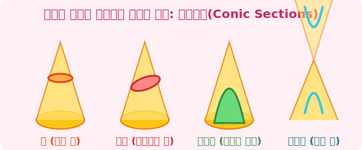

# 3. 우주를 지배하는 곡선: 이차곡선 (Conic Sections)

## [도입부] 학습 목표 (Learning Objectives)
- 원뿔을 자르는 단면에 따라 원, 타원, 포물선, 쌍곡선이 어떻게 생성되는지 시각적으로 이해합니다.
- 이차곡선이 인공위성이나 행성의 궤도, 안테나 통신에 어떻게 활용되는지 알아봅니다.
- 파이썬(Python)의 수학 식을 이용해 이차곡선을 컴퓨터로 그리는 원리를 확인합니다.

---

## 1. 아이스크림 콘(원뿔)을 잘라보자!

도화지에 컴퍼스로 돌려 그리는 원, 찌그러진 계란 모양의 타원, 공을 던질 때 그려지는 포물선 등 우리가 아는 대부분의 아름다운 곡선들은 사실 **'원뿔(Cone)'** 하나에 모두 숨어 있습니다. 이들을 묶어 **원뿔곡선(Conic Section)**, 수식에 x와 y의 제곱($^2$)이 들어간다고 해서 **이차곡선**이라고도 부릅니다.



- **원(Circle)**: 원뿔을 밑면과 완벽하게 수평으로 자르면 나타납니다. ($x^2 + y^2 = r^2$)
- **타원(Ellipse)**: 살짝 비스듬하게 자르면 찌그러진 원, 타원이 됩니다. 태양계를 도는 지구를 포함한 모든 행성의 궤도는 완벽한 원이 아니라 타원형입니다!
- **포물선(Parabola)**: 원뿔의 옆면 빗변(모선)과 완벽하게 평행한 각도로 자르면 위가 뻥 뚫리고 아래로 둥근 포물선이 나타납니다. 인공위성 수신기(파라볼라 안테나)가 전파를 한가운데로 모으는 성질 덕분에 위성방송을 볼 수 있습니다.
- **쌍곡선(Hyperbola)**: 수직으로 바짝 자르면 두 개의 원뿔이 만나는 나비넥타이 모양의 곡선이 나타납니다. 망원경의 렌즈 설계나, 배와 비행기가 현재 위치를 파악하는 로랜(LORAN) 내비게이션에 쓰입니다.

<br>

## 2. 대수학(수식)과 기하학(그림)의 만남

옛날 그리스 시대에는 이 도형들을 그저 흙바닥에 막대기로 그렸지만, 데카르트가 발명한 '$x, y$ 좌표 평면' 덕분에 이 신비한 도형들은 드디어 **숫자와 공식**으로 완벽하게 제어될 수 있게 되었습니다! (이것을 해석기하학이라 부릅니다.)

모든 이차곡선은 다음과 같은 하나의 똑같은 마법의 방정식 안에 갇혀 있습니다.
$$ Ax^2 + Bxy + Cy^2 + Dx + Ey + F = 0 $$

컴퓨터 과학자나 물리학자들은 행성이 포물선을 그릴지 타원을 그릴지 분석하기 위해 $A, B, C$ 값의 조건을 따지는 판별식을 계산합니다.

---

## 3. 💻 파이썬(Python)으로 느끼는 이차곡선의 미학

방정식에 들어가는 숫자 하나만 바꿔도 모양이 포물선에서 타원으로 확확 바뀝니다. 파이썬에서는 $y = ax^2$ 같은 형태를 반복문이나 `matplotlib` 같은 라이브러리를 통해 수만 개의 점을 찍어 모니터에 구현합니다.

### 🐍 파이썬 예제: 포물선 데이터 직접 만들어보기

파라볼라 안테나의 곡선이자 분수대의 물줄기인 가장 대표적인 $y = x^2$ 포물선을 파이썬 리스트로 만들어 보겠습니다.

```python
# x의 범위를 -5 부터 5까지 설정 (좌표)
x_values = range(-5, 6)

# 포물선을 저장할 두 개의 리스트
parabola_points = []

print("--- 포물선(y = x^2) 컴퓨터 계산 좌표 생성기 ---")

for x in x_values:
    # 이차곡선의 핵심: 프로그래밍에서는 곱하기 두 번(**) 이 제곱을 뜻합니다.
    y = x ** 2
    parabola_points.append((x, y))  # (x, y) 좌표 한 쌍을 리스트에 끼워넣기

# 생성된 좌표를 눈으로 확인해봅시다.
for point in parabola_points:
    # 튜플의 첫번째 요소를 point[0], 두번째 요소를 point[1]로 표현합니다.
    print(f"좌표: x={point[0]:>2}, y={point[1]:>2}")

# 출력 결과 엿보기:
# 좌표: x=-5, y=25
# 좌표: x=-4, y=16
# ...
# 좌표: x= 0, y= 0  (여기가 포물선의 꼭짓점! 가장 움푹 파인 곳)
# ...
# 좌표: x= 5, y=25  (오른쪽으로 다시 확 치솟습니다!)
```

컴퓨터 그래픽(CG)이나 게임 개발(Unity 등)에서 대포를 쏘아 올리거나 공이 튀어오르는 모든 궤적은 이와 같은 파이썬/C++의 $x^2$ 연산을 1초에 60번씩 반복하여 그려내는 눈부신 이차곡선 렌더링 기술의 결과물입니다!

---

## [결론] 학습 정리 (Summary)

1. **원뿔의 단면들**: 원뿔을 어떤 각도로 자르느냐에 따라 우주와 자연을 지배하는 원, 타원, 포물선, 쌍곡선 4가지 도형이 탄생합니다.
2. **이름의 기원 (이차곡선)**: 데카르트의 좌표 평면 위에서 모든 원뿔곡선은 $x, y$가 무조건 2번 제곱($x^2, y^2$)되는 수식 형태를 가지기 때문에 이차곡선이라고 불립니다.
3. **컴퓨터 물리의 정수**: 날아가는 물체, 행성의 궤도를 시뮬레이션 하는 모든 현대 프로그래밍 코어 엔진 속에는 이 방정식이 고스란히 저장되어 끊임없이 연산되고 있습니다.
