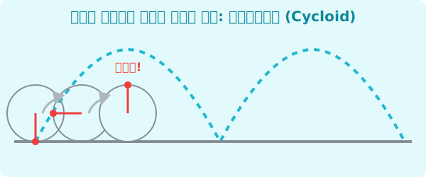

# 4. 자전거 바퀴의 궤적: 사이클로이드 (Cycloid)

## [도입부] 학습 목표 (Learning Objectives)
- 굴러가는 바퀴에 테이프 하나를 붙였을 때 테이프가 공중에서 그리는 놀라운 궤적, '사이클로이드'를 알아봅니다.
- 사이클로이드가 가지는 기적의 성질: **'최단 강하 곡선(Brachistochrone)'**을 완벽하게 이해합니다.
- 복잡해 보이는 도형의 궤적을 파이썬(Python)과 라이브러리로 모델링하여 애니메이션처럼 상상할 수 있는 감각을 기릅니다.

---

## 1. 달리는 자전거 바퀴의 수학

놀이터에서 놀다 자전거 바퀴에 야광 스티커를 하나 붙였습니다. 그리고 깜깜한 밤에 자전거가 앞으로 쭉 굴러간다면, 그 야광 스티커의 불빛은 어떤 모양을 그리면서 움직일까요? 

단순히 동그라미를 그리며 날아갈 것 같지만, 자전거가 앞으로 전진하고 있기 때문에 실제 궤적은 바닥에서 통통 튀어오르는 듯한 여러 개의 아치(Arch) 모양을 그립니다. **바퀴가 직선 위를 미끄러지지 않고 굴러갈 때, 바퀴 둘레의 한 점이 그리는 곡선**을 가리켜 **사이클로이드(Cycloid)**라고 부릅니다.



수학적으로 회전하는 각도 $\theta$에 매개변수를 두면, $x = r(\theta - \sin\theta)$, $y = r(1 - \cos\theta)$ 라는 매우 아름다운 삼각함수 파동 식을 얻습니다. 

<br>

## 2. 사이클로이드의 기적 2가지

이 평범해 보이는 궤적은 17세기 수학자 갈릴레오, 파스칼, 뉴턴 등을 엄청난 충격에 빠뜨린 기적의 성질 두 개를 가지고 있습니다!

1. **최단 강하 곡선 (미끄럼틀의 마법)**
   높은 곳에서 낮은 곳으로 공을 굴릴 때, 1) 대각선 직선 코스, 2) 밑으로 쑥 빠진 원형 코스, 3) 둥근 사이클로이드 코스 중 누가 가장 빨리 도착할까요? 정답은 3번 **사이클로이드** 곡선입니다. 초반에 가파르게 떨어져 중력 가속도를 엄청나게 벌어들여 쏜살같이 골인 지점에 먼저 도착해버리는 마법! (독수리가 먹이를 낚아챌 때도 이 궤적으로 떨어집니다)

2. **등시 곡선 (진자의 마법)**
   사이클로이드 그릇을 뒤집어 놓고 위쪽 꼭대기에서 구슬을 굴리든, 그릇 바닥 바로 근처에서 구슬을 조금 굴리든, 바닥에 도달하는 **시간이 완벽하게 일치**합니다! 출발선이 달라도 동시에 도착하는 미친 그릇이죠. 이 원리를 이용해 한 치의 오차도 없는 회중시계 톱니바퀴를 만들었습니다. 

---

## 3. 💻 파이썬(Python)의 수학 식 매개변수 다루기

직선처럼 단순하지 않은 파동이나 바퀴 궤적을 컴퓨터가 그리게 하려면 `시간` 이나 `회전 각도` 역할을 하는 $t$ (혹은 $\theta$)라는 매개변수를 이용해 반복문을 돌립니다.

### 🐍 파이썬 예제: 매개변수 방식을 이용한 점 추적기

```python
import math

r = 10  # 자전거 바퀴의 반지름이 10이라고 합시다!

print("--- 사이클로이드 궤적 좌표 추적 ---")

# 바퀴가 0도에서 총 180도(반바퀴) 구를 때까지의 x, y 좌표
# math.radians() 를 이용해 우리가 아는 '도(Degree)'를 컴퓨터 언어로 변환
for degree in range(0, 181, 45):  # 45도 간격으로 찰칵! 찰칵!
    t = math.radians(degree)   # 매개변수 세팅 완료!
    
    # 사이클로이드 절대 마법 공식
    x = r * (t - math.sin(t))
    y = r * (1 - math.cos(t))
    
    # 바닥면(바퀴와 맞닿은 점 y=0) 에서 점점 최고점 위로 붕 떠오릅니다!
    print(f"회전 {degree:3d}도 -> 바퀴 스티커의 위치: x={x:5.2f}, 공중 높이 y={y:5.2f}")

# 결과 예측 (180도일 때 = 코사인 값이 -1 이 되므로 y는 r*2 인 20 높이!!)
# ... 어둠 속에서 찍힌 위치가 최고점이라는 것을 수학이 예측해냅니다.
```

자전거가 얼마나 굴러갔느냐(시간이나 각도)를 독립적인 제3의 통제 변수($t$)로 꺼내놓고, 그것에 맞춰 $X$ 좌표와 $Y$ 좌표가 알아서 연산되도록 짜여진 매개변수 방정식은 로봇 팔의 궤적을 그리거나 컴퓨터 애니메이션에서 유령이 폴터가이스트 현상을 일으키듯 부드럽게 돌아다니는 효과를 줄 때 널리 쓰이는 고급 프로그래밍 기법입니다.

---

## [결론] 학습 정리 (Summary)

1. **사이클로이드**: 원이 바닥에 미끄러지지 않고 굴러갈 때 원에 찍힌 한 점이 그려내는 아치 모양의 곡선입니다.
2. **최단 거리보다 빠른 최단 시간**: 대각선 숏컷 도로보다, 사이클로이드 곡선 모양의 미끄럼틀로 물건을 떨어뜨리는 것이 시간을 가장 단축시키는 '최단 강하 곡선'의 진리를 배웁니다.
3. **매개변수 방정식**: 파이썬 프로그래밍에서는 직접 $y = f(x)$ 로 복잡하게 접근하지 않고, 제 3의 각도 팩터($\theta$)를 `math.sin` 등에 대입하는 매개변수로 컴퓨터 애니메이션 렌더링을 매우 가볍고 우아하게 처리합니다.
