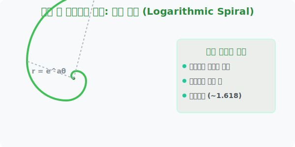

# 5. 자연의 성장 패턴: 로그나선 (Logarithmic Spiral)

## [도입부] 학습 목표 (Learning Objectives)
- 앵무조개 껍질이나 우주의 은하수 팔에서 흔히 발견되는 우주적인 패턴, **로그나선(Logarithmic Spiral)**을 배웁니다.
- 앞서 배운 극좌표계 위에서 $r$과 $\theta$의 수식이 어떻게 로그나선을 그려내는지 원리를 이해합니다.
- 파이썬(Python)과 `matplotlib` 시각화 라이브러리를 통해 생명의 나선형 패턴을 직접 코딩으로 그려보는 체험을 합니다.

---

## 1. 생명은 직선이 아닌 나선으로 자란다

바다에 사는 앵무조개가 몸통이 커지면서 자신의 집(껍질)을 늘려갈 때, 모양이 찌그러지거나 각지지 않고 완벽하고 부드럽게 점점 커지는 껍데기 모양 패턴을 그립니다. 
이를 수학자 데카르트가 최초로 분석하여 수식으로 정리했는데, 바로 이것이 **등각나선** 또는 **로그나선**이라 불리우는 자연계 최고의 예술 작품 모양입니다.

허리케인(태풍)의 구름 소용돌이 형태나, 태양계가 뭉쳐있는 우리 은하(Milky Way)의 나선팔 구조 등, 세상이 스케일업(Scale-up) 확장될 때 가장 안정적인 에너지를 가지는 구조가 바로 이 나선입니다.



<br>

## 2. 극좌표계와 로그나선 합체!

이 나선을 직교좌표계 $x, y$ 로 표현하려 들면 머리가 엄청나게 아픕니다. 하지만 아까 2번째 수업에서 배웠던 **레이더망을 닮은 극좌표계 $(r, \theta)$**를 데려오면 수식이 경이로울 정도로 단순해집니다.

로그나선의 방정식: 
**$$ r = a \cdot e^{b\theta} $$**

- $r$ : 원점에서의 거리 (껍질의 크기)
- $\theta$: 한 바퀴 뱅그르르 회전한 각도 
- $e$ : 성장률을 뜻하는 자연상수 (대략 2.718...)
- $a, b$: 나선이 얼마나 쭉쭉 뻗어 나갈지 결정하는 스피드 조정 변수 

"각도($\theta$)가 뱅글뱅글 돌아 커질수록, 중심에서 뿜어져 나가는 거리($r$)가 지수승($e$)으로 폭발적으로 커진다!" 는 생명의 팽창법칙 그 자체입니다.

---

## 3. 💻 파이썬(Python)으로 해바라기 씨앗 그리기

수학 공식에 숨어 있는 이 신비로운 곡선을 파이썬 데이터 과학용 라이브러리인 `matplotlib`을 이용해 단 10줄의 코드로 부활시켜 볼 수 있습니다.

### 🐍 파이썬 예제: 매직 넘버 나선 그리기

```python
import math
# 보통 화면에 그래프를 그리기 위해 matplotlib 라이브러리를 사용합니다.
# (이 예시는 실행을 위한 핵심 논리만 작성했습니다)
import matplotlib.pyplot as plt

a = 1      # 시작 크기
b = 0.2    # 휘어지는 비율 (작을수록 소라게 껍질처럼 촘촘히 돕니다)

theta_vals = []
r_vals = []

print("--- 자연계의 로그 나선 계산기 ---")

# 0도부터 720도(두 바퀴)까지 뱅글뱅글 돌면서 수학 좌표 스캔!
for degree in range(0, 720, 10):
    theta = math.radians(degree)   # 컴퓨터는 라디안 단위만 씁니다!
    
    # 핵심 공식: r = a * e^(b * theta)
    r = a * math.exp(b * theta)
    
    theta_vals.append(theta)
    r_vals.append(r)

# 극좌표(Polar) 전용 그래프 도구를 이용해 멋지게 출력!
plt.polar(theta_vals, r_vals, color='green', linewidth=3)
plt.title("The Beauty of Logarithmic Spiral", fontsize=15)
plt.show() # 모니터 화면에 그림 등장!
```

코드를 한 번만 짜놓고 `b = 0.2` 변수를 `0.5`로 스위치 하나 띡 바꾸면 앵무조개가 태풍으로 변신하고, 또 변수를 바꾸면 해바라기 씨앗 패턴으로 변하는 것이 바로 컴퓨터 그래픽스(CG)와 절차적 생성(Procedural Generation)의 짜릿한 묘미입니다!

---

## [결론] 학습 정리 (Summary)

1. **로그나선**: 회전하는 각도가 커질수록 크기가 지수 함수적으로 일정한 비율로 폭발하며 파생되는 우주의 나선 구조입니다.
2. **극좌표계의 승리**: $x, y$가 아닌 **$(r, \theta)$** 를 사용했더니 대자연의 구조가 한 줄짜리 방정식 $r = a \cdot e^{b\theta}$ 로 압축되는 수식의 위대함을 알 수 있습니다.
3. **만물의 코딩**: 소라 껍데기, 지문, 우주, 식물 잎새 등 세상의 모든 것은 수학 방정식 시스템에 의한 시뮬레이션임이 파이썬 코딩을 통해 완벽하게 증명됩니다.
