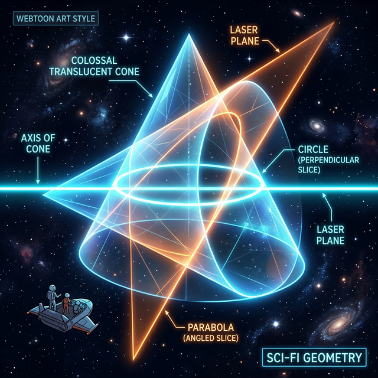

# 00. 인트로: 원뿔을 자르는 마법의 칼날 (Intro)

밤하늘을 올려다보십시오. 
인공위성은 지구 주위를 어떻게 완벽한 **'원(Circle)'** 을 그리며 돌고 있을까요? 달은 왜 조금 찌그러진 오벌형 궤도인 **'타원(Ellipse)'** 으로 지구를 돌까요? 우주 탐사선이 행성의 중력을 이용해 스윙바이를 할 때 튕겨 나가는 궤도는 왜 **'쌍곡선(Hyperbola)'** 일까요? 그리고 우리가 지상에서 대포를 쐈을 때 포탄이 떨어지는 궤적은 왜 완벽한 **'포물선(Parabola)'** 일까요?

이 우주에 존재하는 모든 물체의 움직임 궤적은, 놀랍게도 단 **하나의 입체 도형(원뿔, Cone)** 에서 모조리 파생되었습니다.

  

## 1. 우주를 지배하는 원뿔

원뿔(Cone)은 아주 신비로운 모양입니다. 삼각뿔이나 사각뿔은 기둥 모서리가 거칠지만, 원뿔은 뾰족한 위에서부터 둥근 바닥까지 모든 면이 매끄럽게 무한히 이어지는 유일한 회전체입니다. 

고대 그리스 시대 메나이크모스(Menaechmus) 라는 천재 수학자는, 공간상에 놓인 이 원뿔형 덩어리를 **"각도를 달리해서 레이저 평면(평평한 칼)으로 썰어본다면?"** 이라는 기괴하고 아름다운 기하학적 상상 스크립트를 최초로 실행시켰습니다.

그 결과, 평면이 원뿔을 자르고 지나간 '단면(자른 면)' 의 테두리 곡선 궤적은 우리가 지구상에서 던지는 모든 돌맹이의 궤적, 혜성의 궤적을 토씨 하나 틀리지 않고 완벽하게 설명해 버리는 4가지의 곡선을 탄생시켰습니다.

## 2. 대수학과 기하학의 만남

**이차 곡선(Conic Sections)**. 
말 그대로 "원추(원뿔) 를 잘라낸(Section) 곡선" 이라는 뜻의 이 단어 속에는, 사실 거대한 컴퓨터 프로그래밍 해킹 좌표 기술이 숨겨져 있습니다.

1부에서 배웠던 인수분해의 괴물 수식들, 예를 들어 $y = x^2$ 이나 $x^2 + y^2 = 1$ 같은 "알파벳 $X$ 들이 제곱되어 나오는 $2$차 방정식" 스크립트들을, デ카르트($x, y$) 모니터 좌표 평면에 렌더링(Rendering) 하여 점을 찍어보면? 
경악스럽게도 그 모든 수식의 점들이 연결되어 그리는 선형 모양이 바로 **이 원뿔을 잘라낸 곡선의 테두리 모양과 $100\%$ 완벽히 일치**한다는 엄청난 비밀이 밝혀집니다.

그래서 이름이 "이차(방정식) 곡선" 인 것입니다. 
원뿔을 썰어내는 각도와, 당신이 키보드로 엔터를 쳐야 할 파이썬 $2$차 방정식 스크립트. 이 두 가지가 만나는 가장 우아한 접점, "원, 포물선, 타원, 쌍곡선" 의 4개 방으로 여러분을 초대합니다.
