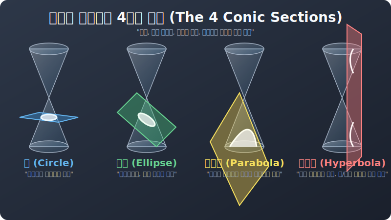

# 02. 두 번째 수업: 원뿔을 자르는 4가지 방법 (Four Slices)

메나이크모스가 보여준 3차원 해킹 기법, 원뿔 절단(Conic Section) 의 메커니즘은 아주 직관적입니다.
그는 서로 뾰족한 꼭짓점을 맞댄 '두 개의 원뿔 모래시계' 모형을 허공에 세워두고, 넓적한 칼날(평면) 을 4가지 종류의 각도로 쓱 썰어 보았습니다. 
칼의 각도(경사) 와 원뿔 옆면(모선) 의 경사가 이루는 이 위대한 충돌에서, 우주의 4가지 움직임 궤적이 모두 도출됩니다.

  

---

## 1. 완벽한 수평 자르기: 원 (Circle)

* **칼날 각도:** 바닥과 완벽히 평행, 각도 $0^\circ$ 로 수평 썰기
* **궤적:** 단면 테두리로 가장 반듯하고 예쁜 동그라미인 **원호(Circle)** 이 나타납니다.
* **우주의 의미:** 중력이 완벽한 거리에서 팽팽하게 잡아당길 때 나오는 궤적입니다. (예: 정지궤도 인공위성)

## 2. 살짝 비스듬히 자르기: 타원 (Ellipse)

* **칼날 각도:** 바닥보다는 기울어졌지만, 원뿔 한 덩어리 옆면을 완전히 통과해서 빠져나올 정도로 비스듬하게 썰어냅니다.
* **궤적:** 찌그러진 원, 길쭉한 달걀 모양의 테두리인 **타원(Ellipse)** 가 나타납니다. 칼의 경사가 심해질수록 더 찌그러진 모양(이심률 증가)이 길게 당겨집니다.
* **우주의 의미:** 달, 행성 등 우주에 존재하는 거의 모든 태양계 행성의 실제 타원 궤적(케플러 법칙)에 해당합니다. 

## 3. 원뿔 옆면과 완벽히 평행하게 썰기: 포물선 (Parabola) 

* **칼날 각도:** (이것이 가장 중요합니다) 칼의 기울기 경사를 점점 높이다가, **"원뿔 껍데기의 빗변 경사(모선) 와 완벽하게 나란한 미친 평행각도"** 로 푹 하고 썰어 내립니다!
* **궤적:** 칼날이 원뿔의 반대편 바닥 모서리를 영원히 관통하지 못하고 끝없이 열린 채로 벌어지는 아치(Arch) 홈통 곡선, **포물선(Parabola)** 이 떨어집니다.
* **우주의 의미:** 포탄을 던지거나 수돗물 호스에서 물을 뿌릴 때 나오는 물리학의 정석 낙하 궤도 탄도학 코드입니다.

## 4. 아예 수직으로 내리찍기: 쌍곡선 (Hyperbola)

* **칼날 각도:** 평행각도를 넘어서, 완전히 직각($90^\circ$) 수직에 가깝게 칼을 퍽 하고 아래로 내려찍어 버립니다.
* **궤적:** 이때 칼날은 허공에 맞닿아있던 '모래시계 위쪽 원뿔' 까지 일직선으로 연달아 통과하며 아랫방향으로 썰어버립니다. 그 결과, 위쪽 원뿔 단면에 하나, 아래쪽 원뿔 단면에 하나. **완벽하게 똑같이 생긴 U자 곡선 두 개가 등(背)을 지고 벌어진 기괴한 거울상 궤적 '쌍곡선(Hyperbola)'** 이 나타납니다.
* **우주의 의미:** 행성의 중력장에 빨려 들어갔다가 빙글 돌지 않고 아예 바깥 우주로 튕겨 날아가 버리는 무한대의 '스윙바이 탐사선 이탈 궤적' 과 정확히 일치합니다.

자, 이 4가지 절단각 기하학 중, 인류가 가장 먼저 실생활의 전쟁과 투석기, 로켓을 쏘기 위해 연구해야만 했던 **1순위 파이프라인. '포물선(Parabola)'** 의 내부 해킹 모델부터 다음 장에서 집중 분석해 보겠습니다.
