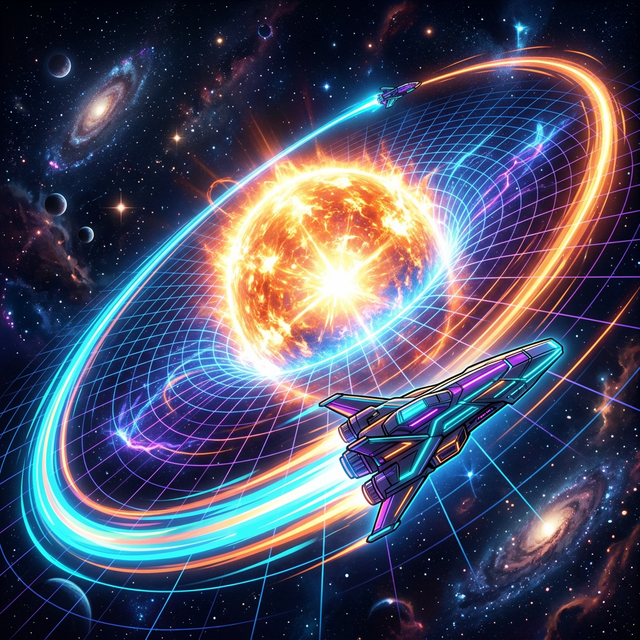

# 00. 인트로: 두 개의 태양이 지배하는 궤도 (Intro)

1부에서 포물선(Parabola) 은 바닥의 선 하나와 공중의 별(초점) 하나 사이에서 팽팽하게 줄다리기를 하며 하늘을 향해 무한히 치솟거나 바닥으로 추락하는 U커브의 정석을 보여주었습니다.
하지만 실제 우리 태양계 행성들이 도는 궤도는 무한히 도망갈 수 있는 U자 곡선이 아닙니다. 우주선이나 지구가 태양계 밖으로 무한히 튕겨 날아가지 않고 매년 제자리로 돌아오는 **'닫힌 궤도(Closed Orbit)'** 를 형성하려면 어떻게 해야 할까요?

그 해답은 초점(Focus 중력점)이 1개가 아니라 **$2$개(두 개의 블랙홀, 두 개의 태양)** 가 서로 밀당을 해야 만들어집니다! 

  

## 1. 완벽함과 찌그러짐의 경계

고대인들은 천체의 움직임이 신의 거룩한 섭리라고 믿었고, 감히 "찌그러진 동그라미" 를 그리며 돈다는 것은 신성 모독이라고 생각했습니다.
그래서 코페르니쿠스조차 이 우주의 모든 행성은 "완벽하게 아름다운 정원(Circle)" 궤도로만 돈다고 코딩 오류를 박아두고 평생을 낭비했습니다. 

하지만 요하네스 케플러(Kepler) 라는 미친 데이터 데이터베이스 분석가가 튀어나오면서 우주의 진실이 폭로됩니다.
수만 건의 티코 브라헤의 별 관측 데이터를 엑셀 내림차순으로 정리하던 그는, 지구와 화성을 포함한 모든 행성이 진짜 돌고 있는 궤도가 원형($x^2+y^2=r^2$) 이 아니라, **한쪽으로 길게 찌그러진 달걀 모양인 타원(Ellipse)** 임을 전 세계 최초로 밝혀냅니다! (케플러 제1법칙: 타원 궤도의 법칙)

## 2. 모래시계를 자른 세 번째와 네 번째 단면 

사실 타원(Ellipse) 은 원뿔의 머리통을 살짝 아주 비스듬하게 잘라서($0$도 보다 조금 큰 각도) 통과시킬 때 나오는 아름다운 폐쇄 곡선 단면입니다. 
하지만 만약 천체가 태양의 중력장으로 미친 속도로 진입하다가, 바깥으로 튕겨져 영혼 끝까지 도망가버리는 탈출 궤도 위성이라면? 그 궤적은 원뿔을 아예 수직으로 내리찍었을 때 나오는 평행 우주 끝까지 두 갈래로 벌어지는 **쌍곡선(Hyperbola)** 궤적을 그리게 됩니다.

이 단원에서는 도대체 이 찌그러진 타원과 도망치는 쌍곡선이 파이썬 데카르트 좌표계 평면 위에서 어떻게 변수 $(x, y)$ 코드로 제어되는지, 두 개의 징 박힌 못(포커스) 과 팽팽한 고무줄 하나면 우주의 궤도를 여러분의 노트북 위로 다운로드할 수 있는 마법을 코딩해 보겠습니다!
