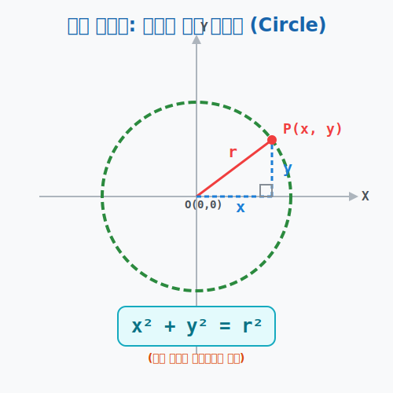

# 01. 첫 번째 수업: 다이아몬드 반지, 완벽한 원의 방정식 (Circle)

우주의 찌그러진 달걀인 타원(Ellipse) 이 어떻게 코딩되는지를 배우기 전에, 가장 완벽하고 평화로웠던 상태. 즉, **단 하나의 태양(초점)만을 가진 시스템인 '원(Circle)'** 의 렌더링 코드부터 확실하게 짚고 넘어가야 합니다.
타원이란 사실 이 완벽했던 원이 좌우로 살짝 찌부러진 버그(변형 스킨) 상태에 불과하기 때문입니다.

---

## 1. 가장 단순한 궤도 추적기 (원의 정의)

원의 기하학적 정의는 우주에서 가장 단순한 제약 조건 필터를 가지고 있습니다.

> **마우스 커서 점 $P$ 는 화면 한가운데 박혀있는 중심점(태양) 으로부터, 언제나 무조건 정확히 $r$(반지름 거리) 만큼 떨어진 곳에서만 반짝거려야 한다!**

이를 파이썬 좌표 코딩으로 옮겨볼까요?
1. 중심점 좌표(태양) 를 화면의 정중앙인 원점 **$(0,0)$** 이라고 합시다.
2. 마우스 커서 점을 우주선 좌표 **$P(x, y)$** 라 합시다.
3. 이 두 점 $(0,0)$ 과 $(x,y)$ 사이의 거리를 구하는 피타고라스 거리 공식 스크립트를 돌립니다.
   $\rightarrow \sqrt{(x - 0)^2 + (y - 0)^2} = \mathbf{거리 \ r}$

짜잔! 여기서 또 계산하기 더러운 외곽 껍데기 루트($\sqrt{}$) 를 폭파해 버리기 위해 양쪽 사이드 코드를 몽땅 제곱(Square) 으로 튕겨버리겠습니다.

> **$x^2 + y^2 = r^2$**

끝났습니다! 
이것이 인류가 찾아낸 가장 아름답고 단순한 대수학적 황금 비율 원(Circle, 중심이 원점인) 의 방정식입니다. 

* 예컨대 **$x^2 + y^2 = 25$** 라는 코드를 보았다 칩시다. 
* 해커는 즉시 뇌동맹 스캐너로 읽습니다. "아하! 이 놈은 화면 정중앙 픽셀 $(0,0)$ 에 태양이 있고, 반지름이 정확히 $\mathbf{5} \ (5^2=25)$ 미터인 완벽한 동그라미 레이더망이구나!"

## 2. 중심점을 강제로 끌고 다니기 (원의 평행이동)

만약 내가 게임 엔진을 만들 때, 이 거대한 폭발 이펙트 동그라미 링을 화면 정중앙 $(0,0)$ 이 아니라, 캐릭터가 서 있는 좌표 우측상단 **$(a, b)$** 쪽으로 쑥 밀어서 복사하고 싶다면 어떻게 코드를 변형해야 할까요?

이전 단원(포물선)에서 가장 무식하고 효과적으로 배운 "치환 오프셋 스킬" 을 그대로 입력하면 됩니다.
알파벳 변수 안에다가 억지로 뺄셈 오프셋 족쇄를 채워버리십시오!
* $X$ 자리에 $\mathbf{(x - a)}$ 를!
* $Y$ 자리에 $\mathbf{(y - b)}$ 를!

> **$(x - a)^2 + (y - b)^2 = r^2$**

이 코드를 본 순간 당신은 "아! 반지름 $r$ 은 렌더링 그대로이면서, 원의 중앙 코어 위치만 모니터상의 **$(a, b)$** 좌표 공간으로 통째로 복붙 되어 텔레포트 이동한 스크립트 링이구나!" 라고 해독할 수 있습니다. 

자, 완벽한 하나짜리 태양의 궤적(원) 은 이렇게 얌전하고 정복하기 쉽습니다. 
하지만 다음 챕터부터, 우주가 갑자기 두 개의 태양(초점) 을 허공에 불쑥 불려 놓고는, 고무줄 하나를 팽팽하게 걸어버리는 기괴한 타원 궤적 그리기 강제 퀘스트를 시작합니다!
