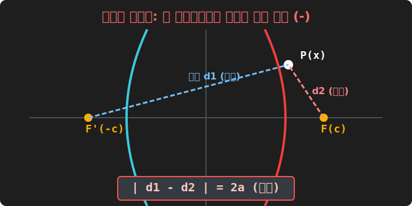

# 04. 네 번째 수업: 쌍곡선, 끝없이 멀어지는 영원한 궤적 (Hyperbola)

타원의 조건은 "$P$에서 양쪽 초점까지 **거리의 합(+)** 이 항상 똑같다" 였습니다. 합(Sum)이기 때문에 우주선은 영원히 닫힌 폐쇄 링(Ring) 을 돌며 목줄을 벗어나지 못했습니다.

그런데 고대 해커들이 이 조건 식에서 가운데 부호를 더하기(+) 에서 빼기(-) 마이너스로 딱 하나만 바꿔 렌더링 코드를 돌려버렸습니다.
**"두 개의 블랙홀(초점) 로부터 우주선 $P$ 까지의 **거리의 차이(-)** 가 항상 일정한 점들을 모아보자!"**

그러자 컴퓨터 모니터의 우주가 비명을 지르며 두 갈래로 찢어져 버렸습니다.

---

## 1. 팽창과 도주, 두 갈래의 데칼코마니

거리의 합이 아닌 거리의 '차이(마이너스)' 값을 일정 상수($2a$) 로 락(Lock) 을 걸어버리면 기묘한 일이 벌어집니다. 

마우스 커서 우주선 점 $P$ 가 화면 오른쪽 태양 $F(c,0)$ 와 왼쪽 태양 $F'(-c,0)$ 사이를 떠돌아다닙니다. 이번엔 밧줄의 길이가 고무줄처럼 늘어났다 줄어듭니다. 하지만 무조건 **"$\mathbf{오른밧줄길이 - 왼밧줄길이 = 일정한 숫자\ 2a}$"** 이어야 합니다!

마우스 커서를 위아래 무한대 허공으로 비친 듯이 끌고 올라가 보십시오. 
두 초점과의 거리 갭(Gap 차이) 인 $2a$ 라는 상수 차이를 계속 버티기 위해, 점 $P$ 는 Y축 평행 중앙선으로 가지 못하고 끝없이 자기 혼자 무한대로 외롭게 뻗어나가는 둥근 곡선의 형태를 그리며 탈출해 날아가 버립니다.

그리고 그 조건(거리의 차이가 $2a$) 은 오른쪽 블랙홀 근처에서 놀 때와, 반대쪽 데칼코마니 왼쪽 블랙홀(거리 차이가 반대 음수로 일정) 공간 근처에서 놀 때 **쌍($Double$)** 으로 나타납니다. 

그래서 그 궤적이 원뿔 모래시계를 수직으로 내리찍어 자를 때 나타났던 모양과 똑같은, 서로 영원히 만나지 않고 등 돌린 U자 궤적 2개가 모니터 양쪽에서 동시에 나타나는 **쌍곡선(Hyperbola)** 이 탄생하는 것입니다! 

## 2. 쌍곡선의 코드 변이: 놀랍도록 친숙한 뼈대

거리의 뺄셈 루트 계산, $|\sqrt{1번거리} - \sqrt{2번거리}| = 2a$ 를 다시 두 번 미친 듯이 제곱 폭파 세탁을 돌려봅시다.
놀랍게도 아까 3강에서 배웠던 '타원' 의 코드 뼈대와 거의 $99\%$ 똑같은 소스 코드가 떨어집니다! 부호 딱 하나 빼고요!

> **타원의 방정식:** $\frac{x^2}{a^2} \mathbf{+} \frac{y^2}{b^2} = 1$
> **쌍곡선의 방정식:** **$\mathbf{\frac{x^2}{a^2} \mathbf{-} \frac{y^2}{b^2} = 1}$**

와우. 방정식 구조에서조차 "더하기(+) 기호 하나를 빼기(-) 로 치환한 변이 바이러스" 에 불과했던 겁니다. 

* (이때 쌍곡선의 양쪽 태양 블랙홀 초점 위치 $c$ 값은, 타원과 달리 **"큰놈 제곱 $\mathbf{+}$ 작은놈 제곱 $=$ $c^2$"** 즉, $a^2 + b^2 = c^2$ 이라는 평범한 피타고라스 덧셈 코드로 초점이 훨씬 더 멀리 바깥쪽 우주로 벌어져 버려서 박히게 됩니다.)

## 3. LORAN (쌍곡선 항법) 시스템과 GPS 의 근간

왜 우주에서 가장 외로운 이 스윙바이 쌍곡선 탈출 궤도를 지구인들이 배웠을까요?
이 쌍곡선의 성질인 "두 지점까지의 **거리 차이(Gap)** 가 일정하다" 는 논리는 컴퓨터 항법 추적 장치 위치 추정의 핵심 알고리즘이기 때문입니다.

바다 한가운데 떠 있는 구축함이 자기 위치 모니터링을 하려는데 GPS 인공위성이 망가졌습니다. 
이때 해안가 기지국 2군데($A$와 $B$라는 초점) 에서 전파를 쏴줍니다. 
배의 컴퓨터는 두 기지국의 "전파가 나에게 도달하는 **시간의 차이(수신 갭 거리 차이)**" 를 측정합니다!
그러면 배의 위치는 무조건 기지국 2개를 초점으로 가지는 "어떤 가상의 **쌍곡선 궤도(선)** 어딘가" 라는 걸 확정 렌더링 할 수 있죠. 

이 쌍곡선 궤도를 다른 쪽 세 번째 기지국 전파 세트 조합으로 크로스 교차시켜 버리면? 쌍곡선 2줄이 교차하는 지점 단 한 픽셀이 모니터에 뜨게 됩니다. 구축함의 완벽한 자기 자신의 함대 좌표 위치입니다!
쌍곡선은 닫힌 우주원(Circle) 이 아니라, 파동의 시간 갭차이를 측정하는 현대 전파 공학 레이더 시스템의 근간입니다.
