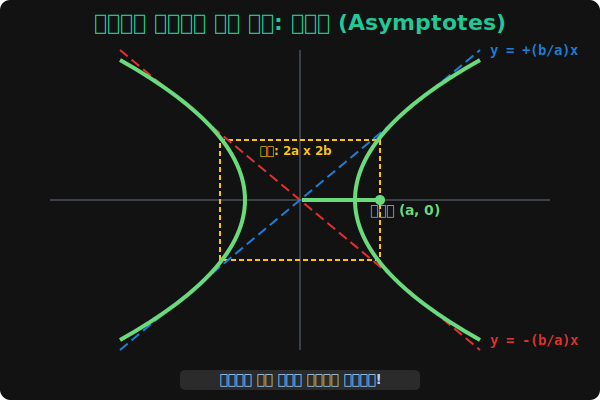

# 05. 다섯 번째 수업: 쌍곡선의 점근선 (Asymptotes) 벽 치기 

모니터 양극단으로 한없이 뻗어나가는 쌍곡선 우주선의 궤적 코드를 유심히 분석해 보던 수학자들이 코딩 오류 같은 이상한 점 하나를 발견했습니다.
쌍곡선이 바깥 우주의 무한대 좌표($x \rightarrow \infty$) 로 멀찍이 도망갈수록, 왠지 자기 맘대로 우주를 제멋대로 어지럽히며 휘어 날아가는 것이 아니라! **모니터 허공에 그어진 어떤 투명하고 반듯한 대각선 '유리벽(직선)' 들에 미친 듯이 가까이 쩍쩍 달라붙으며(하지만 영원히 통과하거나 만나지는 못하는) 평행하게 날아가 버리는 기괴한 현상**을 눈치챈 것입니다.

이 투명한 우주의 통제선(유리벽) 을 우리는 **'점근선 (Asymptote line)'** 이라고 부릅니다. 

---

## 1. 다가갈 수 없는 영원한 철벽 레이저

쌍곡선의 메인 렌더링 코드 $\frac{x^2}{a^2} - \frac{y^2}{b^2} = 1$ 을 열어,
변수 $X$ 값을 $1억, 100억, 1경...$ 무한대 숫자 픽셀로 막 넣어 봅니다.
비율적으로 오른쪽에 쪼그맣게 달려있던 **상수 찌꺼기 "$= 1$"** 이라는 숫자는 $X$값이 무한대($100억^2$) 같이 거대하게 커질수록 아무 쓸모 없는 먼지 조각으로 비율상 증발해($\approx 0$) 무시 처리되어 버립니다. 

즉, 이 렌더링 코드가 우주 끝무한대 픽셀에서는 근사치로 이렇게 뭉개집니다.
> $\frac{x^2}{a^2} - \frac{y^2}{b^2} \approx 0$  $\quad \Rightarrow \quad$ 양변 제곱근 박기!
> **결과: $\mathbf{y = \pm \frac{b}{a} x}$**

이게 무슨 일입니까? 
곡선 궤도라고 철석같이 믿었던 쌍곡선 코드가, 무한대 먼지 필터 하나를 씌웠더니 갑자기 가장 정직하고 예의 바른 대각선 모양의 **$\mathbf{1차 직선 일차함수}$** 스크립트! 즉 $y = \frac{b}{a} x$ 와 $y = -\frac{b}{a} x$ 라는, 가위표 로 크로스 $X$ 자 교차하는 방탄유리벽 모기장 직행 레이저 기둥 두 줄기가 모니터상에 렌더링 되어버렸습니다!

## 2. 쌍곡선을 렌더링하는 궁극의 치트키 박스

그래서 프로그래머가 손으로 화면에 쌍곡선을 직접 스케치 코딩해 그려볼 때는, 쓸데없이 막 곡선 호를 그리는 초보 짓을 하지 않습니다.
가장 먼저 데카르트 평면 중심축 $(0,0)$ 허공에 투명한 $X$자 기둥 두 줄기를 세팅해 박아버립니다. 

**[쌍곡선 렌더링 필승 알고리즘 가이드]**
1. $\frac{x^2}{4} - \frac{y^2}{9} = 1$ 을 마주했다면? 밑의 괄호 숫자들 $a=2$, $b=3$ 을 재빨리 추출합니다.
2. 중심 $(0,0)$ 부터 가로 좌우로 $\pm 2$칸 짜리, 세로 위아래로 $\pm 3$칸 짜리 **투명한 네모 박스(직사각형)** 를 허공에 쫙 포진시킵니다.
3. 그 직사각형 네모 박스의 대각선 모서리 귀퉁이를 쾅쾅! 관통하며 통과하는 거대한 $X$자 대각선 레이저(점근선) 선을 쭉 긋습니다. 
4. 이제 쌍곡선의 꼭짓점 엉덩이($+2, -2$) 에 찍고, 바깥 무한대를 향할 때는 방금 그어놓은 $X$자 레이저(점근선) 방탄 유리벽을 영원히 뚫지 못한 채 그 옆구리에 수렴하여 부들부들 평행하게 따라붙어 도망가는 $U$자 벌림 곡선을 위아래, 혹은 양옆 쌍으로 시원하게 찍어주면? **완벽 오차율 $0\%$ 의 뷰티풀 쌍곡선 렌더링 패치 스케치 코딩** 완성입니다!

점근선이라는 "한계 다이 캐스팅(Limit barrier)" 은, 우주의 어떤 힘찬 스윙바이 에너지를 가진 로켓 궤도라도 결국 특정 기울기의 탈출 벡터의 물리 한계 레이저 벽(직선 비율 $\frac{b}{a}$) 이라는 프로그래머의 거대한 통제 선로 그물망을 절대 넘어서지 못한다는 위대한 물리 한계 증명 로직입니다. 

자, 긴 논리 설명을 끝냄으로 펜과 스케치를 놓겠습니다. 
6강에서는 우리가 배운 위대한 이차곡선들 (타원과 쌍곡선) 이 실제 파이썬 모듈 코드 안에서 행성을 공전시킬 때 어떻게 $X, Y$ 그래프를 예쁘게 도출해 내는지, 직접 Matplotlib 코드를 돌려 눈앞에서 우주선을 쏘아 올려 보겠습니다!
