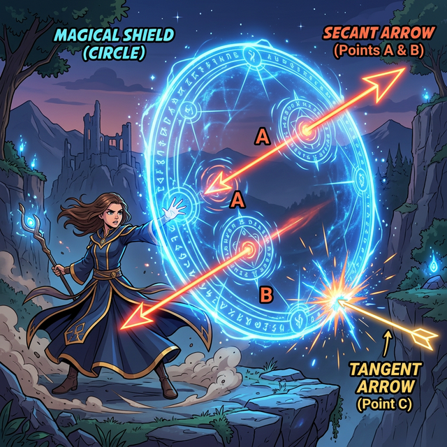

# 00. 인트로: 방어막을 뚫는 레이저 빔 (Intro)

우주를 배경으로 하는 게임을 만든다고 상상해 봅시다.
우리 편 행성이 화면 한가운데 아름다운 동그라미 모양으로 위치 해 있습니다. 그런데 저 멀리서 적군의 레이저 빔(직선) 이 무서운 속도로 날아옵니다.

이 레이저가 행성에 떨어질 운명은 수학적으로 딱 $3$가지 렌더링 스크립트 중 하나로 결론 납니다.

1. **Miss (빗나감):** 레이저가 행성 방어막(원) 을 스치지도 않고 저 멀리 우주 밖으로 날아갑니다. (교점이 $0$개)
2. **Grazing (스침, 접선):** 레이저가 행성의 대기권 최외곽 껍데기를 아슬아슬하게 단 $1$픽셀 차이로 스치며 불꽃을 튀기고 날아옵니다! (교점이 $1$개)
3. **Collision / Piercing (관통, 할선):** 최악의 사태! 레이저가 행성 방어막을 완전히 뚫고 들어와 행성 표면 $2$군데를 박살 내며 관통해 지나갑니다!! (교점이 $2$개)

  

## 1. 1차원 직선과 2차원 원의 충돌 시스템

이 충돌 시스템을 컴퓨터가 어떻게 계산해 낼까요? 
바로 **중심에서부터 레이저 빔까지의 "최단 거리($d$)"** 와, 우리 **행성의 크기 "반지름($r$)"** 을 엑셀처럼 비교하는 것입니다.

* 만약 $d > r$ 이면? (가장 짧은 거리마저도 반지름보다 길게 떨어져 있다면) $\rightarrow$ 허공을 난타한 빗나간 레이저!
* 만약 $d = r$ 이면? (거리가 소름 돋게 반지름과 정확히 일치한다면) $\rightarrow$ 대기권을 스치고 지나가는 '접선(Tangent)'!
* 만약 $d < r$ 이면? (직선이 너무 가까이 파고 들어와 반지름보다 거리가 짧아졌다면) $\rightarrow$ 방어막이 찢어지는 관통형 '할선(Secant)'!

## 2. 각도(Angle) 가 품은 그림자 복제 마법

원이 수많은 직선과 레이저 세례를 받으며 뚫리면, 그 내부에는 기괴하게 꺾인 파편 삼각형들이 무수히 탄생합니다.
놀랍게도 ಈ 안쪽에 생성된 삼각형들의 모서리 각도들(원주각) 은, 그 꼭짓점이 원 껍데기 위에만 제대로 착 달라붙어 있다면 화면 내 어느 곳으로 드래그 앤 드롭을 해서 좌표를 옮기든 **"무조건 평생 똑같은 $100\%$ 고정 각도를 유지하는" 소름 돋는 불변의 복제(Clone) 렌더링 마법**을 부립니다.

이 72권 단원에서는 둥근 원형 세계에 직선이 꽂힐 때 발생하는 가장 폭력적이고도 아름다운 충돌과 반사의 각도 법칙, 접선과 현이 부딪히는 불꽃 방멱(Power of a circle) 의 정리, 그리고 신비로운 '원주각 불변의 해킹 코드' 까지 모조리 뜯어서 파헤쳐 보겠습니다. 레이더 스크린 켤 준비 되셨습니까?
