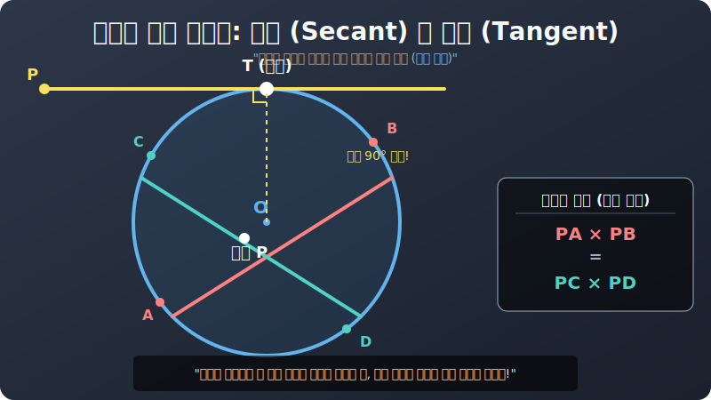

# 02. 두 번째 수업: 무자비한 관통, 할선(Secant) 과 방멱의 정리 

접선(Tangent) 이 자판기 겉면을 아슬아슬하게 살짝 스쳐가는 빗맞은 스파크 라면, **'할선(Secant line)'** 은 문자 그대로 원을 칼로 쪼개듯(割 자를 할) 내부로 무자비하게 뚫고 쑤셔 들어가는 치명적인 관통 레이저 빔입니다.

그리고 이 할선 방어막 관통 로직 안에는, 프로그래머들도 렌더링 화면을 보고 소름 돋아 할 우주 기하학의 마법 비율이 100% 숨어 있는데 이것이 바로 **"방멱의 정리(Power of a circle)"** 라는 해킹 코드입니다.

---

## 1. 두 개의 레이저가 둥근 우주 안에서 크로스(교차) 할 때

둥근 행성(원) 내부에 커다란 지하던전을 하나 팠다고 칩시다. 
이 둥근 동굴 안에서 당신이 붉은 레이저 $\text{선(AB)}$ 과 푸른 레이저 $\text{선(CD)}$ 두 자루를 대충 벽을 뚫고 지나가도록 냅다 교차시켜 버립니다.
이때 두 선이 허공 정중앙 어딘가에서 "파직!" 하고 X자로 부딪치는 폭발 **'교점 $P$'** 가 하나 만들어지겠죠?

  

자, 레이저가 $P$ 때문에 두 동강씩으로 조각났습니다.
* 붉은 선 조각 파편: **$\mathbf{PA}$ 와 $\mathbf{PB}$**
* 푸른 선 조각 파편: **$\mathbf{PC}$ 와 $\mathbf{PD}$**

아무렇게나 대충 던진 선이라도 이들의 길이 파편을 곱해보면 무시무시한 동기화(Sync) 가 발생해 버립니다!

> **방멱의 십자 스크립트 해킹 (내부 관통):**
> $\mathbf{PA \times PB = PC \times PD}$
> "붉은 파편 두 조각을 곱한 수치는! 무조건 푸른 파편 두 조각을 곱한 수치와 $100\%$ 똑같은 비율 상숫값을 갖는다!"

## 2. 밖에서 뚫고 들어온 두 발의 저격 (원 외부의 할선)

이번에는 교점 $P$ (스나이퍼) 가 아예 원 밖인 우주 허공 멀리 서 있습니다.
여기서 둥근 행성의 왼쪽 머리통 측면과, 오른쪽 아랫배 측면을 향해 두 방의 저격 탄($A, B$ 관통탄과 $C, D$ 관통탄) 을 깊숙이 박아 넣었습니다.
이번에도 방패막(원) 을 뚫고 들어가며 파편 길이들이 조각나게 되죠.

1번 저격탄이 지나간 궤적: 내 모니터(점 $P$) 에서 행성 껍질 진입 지점까지의 거리($\mathbf{PA}$) $\times$ 행성을 통과해 쭉 뚫고 반대쪽 껍질 밖으로 터져 나간 총 누적 거리($\mathbf{PB}$) 

놀랍게도 아까 터졌던 내부 폭파 공식과 글자 하나 다르지 않은 우주의 비율 스크립트가 여기서 똑같이 먹혀들어 갑니다.

> **방멱의 정리 (외부 타격):**
> $\mathbf{PA \times PB = PC \times PD}$

어떤 위치에서 어떤 각도로 우주선을 격추시켜도, 원이라는 신비로운 방어막 시스템에 부딪히는 순간 **"외부 총알 진입 거리 $\times$ 끝까지 관통한 전체 거리"** 의 곱셈량 에너지는 똑같은 탄환 상숫값으로 보존된다는 무시무시한 질량 보존의 유사 엔진입니다.

## 3. 접선(스침) 과 할선(관통) 이 퓨전 합체 스킬을 쓴다면?

가장 악랄하고도 아름다운 혼종 복합 함수가 있습니다. 
우주 바깥의 $P$ 점에서 **한 발은 행성을 팍 뚫어버리는 관통탄(할선 $AB$)** 을 날리고, **남은 한 발은 아슬아슬하게 방어막 끝 1픽셀만 긁고 지나가는 스침 스파크 (접선 $T$)** 를 날린 상황입니다.
이 둘이 만나면 곱셈 공식은 어떻게 진화할까요?

아까의 논리를 그대로 가져옵시다.
관통탄 쪽의 에너지 렌더링은 여전히 **$PA \times PB$** (진입 $\times$ 완전 관통 총량) 입니다.
스쳐가는 쪽의 에너지는? 뚫지를 못하고 점 $T$ 에서 멈춰버렸으니, 그냥 $\mathbf{PT}$ 의 길이를 아쉬운 대로 $\mathbf{2}$번 때려 곱해버리면($\mathbf{PT^2}$) 됩니다!

> **스침과 뚫림의 결합 (접선과 할선의 방멱):**
> $\mathbf{PA \times PB = PT^2}$
> "(완전관통 총기류 조합) = (스침 아슬아슬 스파크 길이의 제곱량)"

이 방멱(Power) 의 마법은 삼각형의 닮음(Similarity) 시스템을 이 동그란 껍데기 안에 교묘하게 우겨넣어서 컴퓨터가 좌표계산 없이 길이만으로도 에러 버그 보정값을 도출할 수 있게 해 준 고대 그리스의 위대한 컴퓨터 알고리즘이었습니다.
자, 직선 레이저는 여기서 만족하고, 가장 악질적이고 강력한 "모서리에 붙은 공중 부양 각도복사 마법", <원주각> 레이더로 다음 장 넘어가겠습니다.
