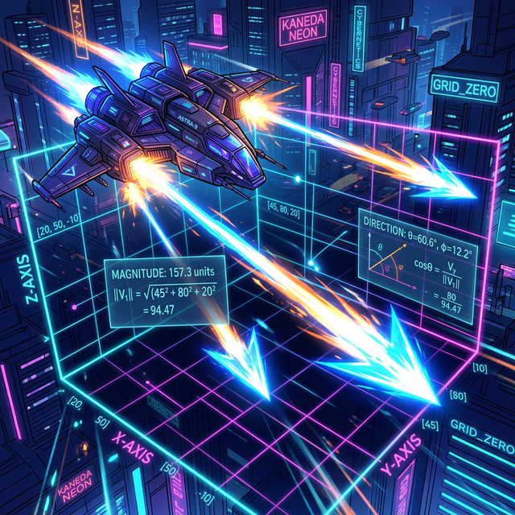

# 00. 인트로: 우주선의 가속 엔진과 방향타 (Intro)

당신이 2D 슈팅 게임을 코딩하고 있다고 가정해 봅시다. 당신의 우주선 객체(`Player`) 에 스피드 값을 변수에 부여합니다. 
`speed = 100` 
이 코드를 빌드하고 실행하면 우주선이 멋지게 날아갈까요? 절대 아닙니다. 모니터 중앙에 멍청하게 멈춰서 "엔진은 터질 듯 도는데 도대체 화면 어디로 가야 할지 몰라 미치겠어!" 라며 에러 로그를 뿜어낼 것입니다.

  

## 1. 반쪽짜리 데이터, 스칼라(Scalar)

우주선이 길을 잃은 이유는 `speed = 100` 이라는 정보가 **"크기(Magnitude)"** 만 가진 반쪽짜리 바보 데이터, 즉 **스칼라(Scalar)** 이기 때문입니다.
온도($24^\circ\text{C}$), 몸무게($60$kg), 나이($20$살) 같이 그냥 숫자 하나띡 던져주면 끝나는 평화로운 우주엔딩 데이터들이죠. 
하지만 물리와 움직임의 세계(게임, 시뮬레이터, 라이다 센서) 에서는 이딴 반쪽짜리 정보로는 아무 짝에도 쓸모가 없습니다.

## 2. 완벽한 물리 캡슐, 벡터(Vector) 의 탄생

우주선을 움직이려면 엔진의 파워(속력) 에 **"운전대(방향 Direction)"** 를 강제로 하나로 묶어 결합해 주어야 합니다.
> "시속 $100$km 로 가라! **(크기 Magnitude)** + 북동쪽($45^\circ$) 을 향해서! **(방향 Direction)**"

이 두 가지 필연적인 데이터를 뜯어지지 않게 하나의 지퍼백에 묶어놓은 위대한 화살표 수학 기호 캡슐을 바로 **'벡터(Vector)'** 라고 탄생 지어 불렀습니다.
기하학에서는 화살표의 "길이" 로 힘의 $100$ 크기를 표현하고, 화살표 촉의 "머리통 방향" 으로 북동쪽 $45$도의 운전대를 표현합니다. 

이 벡터 화살표가 모니터 상에서 어떻게 꼬리를 물고 이어지며, 서로 징그럽게 부딪혀서 합쳐지거나 찢어지는지 앞으로 다가올 수업에서 스크립트를 파헤쳐 봅시다!
