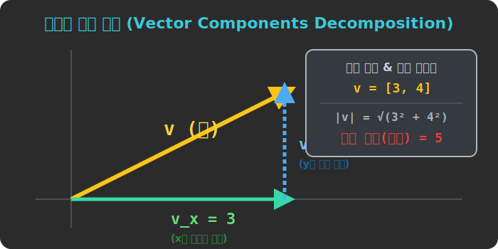

# 02. 두 번째 수업: 벡터를 쪼개라! X축과 Y축 컴포넌트 성분 분해

허공을 자유롭게 대각선으로 날아가는 화살표(벡터) 를 파이썬 컴퓨터의 메모리에 입력하려고 합니다. "야 시리야, 저기 북동쪽 45도 방향으로 파워 $10$ 만큼 총알 하나 쏴줘!" 라고 음성으로 코딩할 수는 없잖아요? 

컴퓨터가 알아들을 수 있는 숫자 Array 배열 형식인 `[?, ?]` 모양으로 이 화살표 막대기를 무자비하게 해체(Decomp) 해서 쪼개 내야만 합니다.

---

## 1. 피타고라스의 삼각자 렌더링 도마

"아무리 미친 듯이 기울어진 대각선 화살표 뼈대라도, 가만히 뚫어지게 쳐다보면 사실 그 화살표는 가로 뼈대 하나와 세로 뼈대 하나를 직각으로 포개어 만든 껍데기에 불과하다!"

모든 대각선 벡터 $\vec{v}$ 는 직각삼각형 빗변 모양으로 모니터에 누워 있습니다. 
우리는 포토샵 사각 툴로 이 화살표의 **가로 그림자(X축 투영)** 와 **세로 그림자(Y축 투영)** 길이만큼 싹둑 썰어서 두 개의 덩어리로 잘라버립니다.

* **$\mathbf{V_x}$ (X축 컴포넌트):** 오른쪽(가로) 으로 얼만큼 기어갔냐?
* **$\mathbf{V_y}$ (Y축 컴포넌트):** 위쪽(세로) 으로 얼만큼 기어 올라갔냐?

> **요약:** 
> "저기 북동쪽 45도 방향 파워 $10$ 짜리 화살표의 진짜 정체는... 사실 **오른쪽 스칼라 파워 $7.07 \ (\text{Vx})$** 와 **위쪽 스칼라 파워 $7.07 \ (\text{Vy})$** 를 레고 블록처럼 이어 붙인 더블 스칼라 콤보 장난감이다!"

## 2. 배열(Array) 로 벡터 가두기 

이제 가로 X 그림자와 세로 Y 측량 데이터 숫자를 얻었습니다. 
이걸 컴퓨터의 엑셀 칸이나 1차원 배열(List) 에 가지런히 컴마(,) 로 묶어서 강제로 가두어 버리는 순간, 대각선 화살표는 완벽한 게임 엔진 데이터 기호로 재탄생합니다.

이것을 수학자들은 껍데기 괄호 `< >` 나 파이썬 `[ ]` 리스트 구조체로 적고, **'벡터의 성분 (Components of vector)'** 표시라고 부릅니다. 

* **$\mathbf{\vec{v} = [V_x, V_y]}$**

예를 들어, 슈퍼 마리오가 오른쪽으로 딱 $3$칸 전진하고, 그 상태에서 위로 점프를 $4$칸 뛰어서 결국 우상단 특정 대각선 공중 부양 지점에 도착했다면, 마리오가 뛰쳐나간 대각선 벡터 힘줄의 코드는?
**$\vec{v} = [3,\ 4]$** 끝입니다! 매우 엘레강스하죠. 

  

## 3. 내 엔진 파워(크기) 의 진짜 덩치 역추산 기법

어떤 적 전투기가 `v = [3, -4]` 라는 벡터 정보표(콤포넌트 성분 배지) 하나만 달고 우리 화면에 등장했습니다.
오른쪽으로 $3$, 아래쪽으로 데미지 $4$ 만큼 찍어 누르는 방향성을 가졌군요! 

자, 이 적기의 **[진짜 총 엔진 추진 파워, 즉 화살표의 대각선 덩치 막대기 실제 길이]** 는 얼마일까요?
우리의 위대한 직각삼각형 가성비 해킹툴인 "피타고라스 정리" 레이저를 한 방 쏴버리면 끝납니다!
(밑변 제곱 + 높이 제곱 = 빗변 엔진 길이 제곱!)

> **벡터 크기(Magnitude / Length) 렌더링 역추산 바운더리:**
> $\mathbf{|\vec{v}| = \sqrt{({V_x})^2 + ({V_y})^2}}$ 

계산 때려볼까요? 
$|\vec{v}| = \sqrt{3^2 + (-4)^2} = \sqrt{9 + 16} = \sqrt{25} = \mathbf{5}$ !!
와우! 이 우주선의 순수 엔진 출력 스칼라 파워는 정확히 **$\mathbf{5}$마력** 이었습니다. 

가로축과 세로축 숫자 두 개만 배열 Array 에 저장해주면, 파이썬 컴퓨터는 알아서 대각선 화살표의 앵글 각도와 막대기 전체 파워 체력(Magnitude) 을 순식간에 $0.1$밀리초 만에 뿌려댈 수 있는 미친듯한 렌더러가 됩니다.
다음 장에서는 이렇게 배출된 벡터들을 서로 합체(+) 하고 충돌 꼬리물기를 하여 "두 힘이 엉켜 싸울 때 최종 승리 향방(합력)" 이 기하학적으로 어떻게 그려지는지 SVG 이미지와 함께 다이제스트 하겠습니다!
