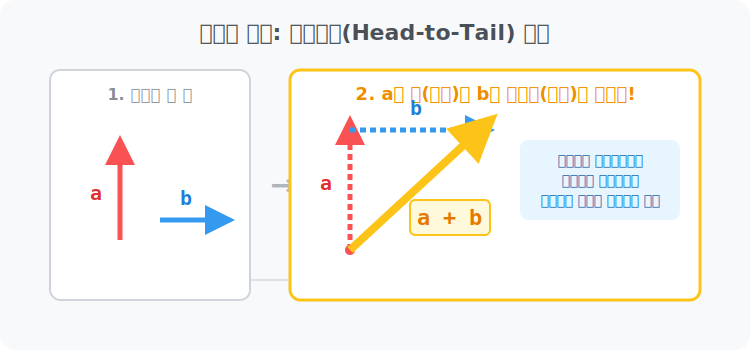

# 03. 세 번째 수업: 화살표 꼬리 잡기 렌더링, 벡터의 덧셈 (Vector Addition)

마리오가 점프를 뜁니다! (위쪽 화살표 вектор $\vec{a}$)
그런데 이 스테이지는 강한 강풍 머신이 켜져 있어서 마리오를 계속 오른쪽으로 밀어냅니다. (오른쪽 화살표 돌풍 벡터 $\vec{b}$)

이 두 가지 힘이 마리오의 몸뚱아리 하나에 동시에 타격을 가할 때, 우리 불쌍한 마리오는 허공에서 도대체 "어느 대각선 궤적" 으로 튕겨 날아갈까요? 
이걸 시각적으로 렌더링해서 답을 뽑아내는 미친 기하학 스킬이 바로 **"벡터의 덧셈 (Vector Addition)"** 입니다.

---

## 1. 꼬리에 머리를 물어라! (Head-to-Tail Method)

명심하십시오. 우리는 1강에서 "벡터는 하늘 어디로 드래그 앤 드롭을 하든 크기와 방향만 같으면 복제 취급한다" 고 해킹 법칙을 정했습니다.
강풍 화살표 $\vec{b}$ 를 마우스로 끈 다음, 마리오 점프 화살표 $\vec{a}$ 의 끝자락에 연결해 봅시다.

> **꼬리잡기 렌더링 매크로 (다각형법):**
> 1. 오리지널 첫 번째 화살표(마리오 점프 $\vec{a}$) 를 그린다.
> 2. 두 번째 화살표(강풍 $\vec{b}$) 의 엉덩이(시점, 꼬리) 를 콱 쥐어 잡고 끌고 온다.
> 3. 그 엉덩이를 첫 번째 화살표의 뾰족한 화살촉(종점, 대가리 Head) 에 **"탁!"** 하고 물리적으로 접착시킨다! (이어 달리기 바통 터치!)
> 4. 자, 이제 **"가장 맨 처음 출발했던 배꼽($\vec{a}$의 꼬리)"** 에서부터 시작하여, 릴레이가 모두 끝난 **"가장 마지막 최종 도착지($\vec{b}$의 대가리)"** 를 향해 한 방에 치고 올라가는 최후의 거대 대각선 다이렉트 화살표 하나를 찍! 그어준다.

이 최후의 대각선 다이렉트 화살표가 바로 두 힘이 합쳐진 결과물, **합성 벡터($\mathbf{\vec{a} + \vec{b}}$)** 입니다! 물리 엔진 게임에서 마리오는 이 아름다운 대각선 궤적 하나를 그리며 바람을 뚫고 날아갑니다.

  

## 2. 평행사변형 마법: 두 마리 말이 수레를 끌 때

꼬리잡기 이어달리기가 아니라, 아예 수레 하나를 가운데 놓고 말 두 마리가 양쪽 대각선으로 밧줄을 매달고 V자로 팽팽하게 끈다고 상상해 봅시다.
이번엔 화살표가 꼬리 잡기를 안 하고, **양쪽 화살표의 두 엉덩이(시점) 가 수레 배꼽 중심 한 곳에 묶여 있습니다.** 
어떻게 합쳐야 할까요?

이때 기하학자들은 콤파스를 꺼내 위대한 사각형 렌더링을 칩니다.
> **평행사변형 렌더링 매크로:**
> 화살표 $\vec{a}$ 와 화살표 $\vec{b}$ 를 두 변의 기초 뼈대로 삼아서, 점선을 찍찍 그어 **"커다란 평행사변형(마름모꼴)"** 상자를 완성시킨다.
> 그리고 출발점 엉덩이에서부터 그 평행사변형 상자의 맞은편 모서리 꼭짓점을 관통하도록 대각선 화살표를 냅다 그어버린다!

결과는? 아까 헤드 투 테일 꼬리잡기로 낑낑대며 그렸던 노란색 최후의 대각선 벡터와 **$100\%$ 완벽하게 방향과 막대 길이가 일치하는 복제품 벡터($\vec{a}+\vec{b}$)** 가 출력됩니다. 

## 3. 배열 코드로 컴파일하면? (진짜 미친 꿀빨기)

지금까지 그림으로 뼈 빠지게 이었던 합력 시스템을 2강에서 배운 배열 Array 컴포넌트 숫자 코드로 치환해 보면 어떨까요? 수학의 진정한 예술이 터집니다.
* 마리오 점프력 벡터: $\vec{a} = [0, 5]$ (위로만 $5$칸)
* 옆구리 강풍 벡터: $\vec{b} = [3, 0]$ (오른쪽으로만 $3$칸)

자, 종이 꺼내서 평행사변형 그리고 자시고 할 필요 있습니까? **그냥 $X$는 $X$끼리 더하고, $Y$는 $Y$끼리 같은 성분(끼리끼리) 배열 덧셈 엑셀 함수를 갈겨버리면 끝입니다!**

> **$\vec{a} + \vec{b} = [0+3, \ 5+0] = \mathbf{[3, \ 5]}$**

결과값 $[3, 5]$ 벡터! "아하, 마리오는 결국 최종적으로 오른쪽으로 $3$칸 기어가고 위쪽으로 $5$칸 기어 올라간 공중 대각선 위치에 쳐박혀 랜딩 하겠군!" 
$X, Y$ 독립 분해의 위력이 여기서 포텐을 터뜨립니다. 방향 공간이 아무리 비틀려 있어도 숫자로 찢어 놓으면 초등학생 덧셈 문제로 바뀐다는 사실! 벡터의 뺄셈 지옥은 4장에서 뵙겠습니다.
