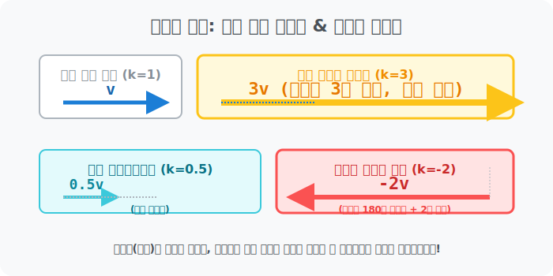



# 05. 다섯 번째 수업: 에네르기파 뻥튀기! 스칼라 곱셈 (Scalar Multiplication)

슈팅 게임에서 비행기가 날아가다가 "스피드 업!(Speed Up)" 아이템을 처먹었습니다. 
비행기가 날아가던 [방향 각도] 앵글에는 전혀 변화를 주지 않고, 오직 날아가는 막대기 길이 엔진 [속도 속력(크기)] 만 무자비하게 터보 부스트로 밀어서 $3$배로 뻥튀기시켜야 합니다.

기하학 화살표 렌더링판과 파이썬 배열 뎁스에서 이 뻥튀기 부스트 코드를 어떻게 엔진에 끼워 넣어야 할까요? 이것은 **"벡터의 스칼라배 (Scalar Multiplication)"** 라는 마법 주문 하나로 해결됩니다.

---

## 1. 방향타는 놔두고 고무줄만 $3$배로 땡겨라!

어떤 스칼라 숫자 $\mathbf{k}$ (예: 배수율 $3$) 를 벡터 $\vec{v}$ 화살표 앞에 곱하기 스위치로 붙여버린 **$\mathbf{3\vec{v}}$** 의 시각적 정체는 무엇일까요?

* 화살표의 머리통 앵글 각도는 $1$밀리미터 각도조차 틀어지지 않습니다. 
* 오직 그 방향 선상 레일을 그대로 타고, 화살표의 꼬리부터 대가리까지의 꼬챙이 몽둥이 길이(엔진 파워) 가 물리적으로 쭉쭉 늘어나는 고무줄 렌더링 **$\mathbf{3}$배 팽창 (Zoom in)** 처리가 될 뿐입니다! 

만약 배율 상수 스칼라 숫자값 $k$ 가 어떻게 변하느냐에 따라 우주선 슬라이드 바 렌더링에 미친 변화가 생깁니다.
1. $\mathbf{k > 1}$ 일 때: (예: $2\vec{v}$, $5\vec{v}$) 길이가 그 배수만큼 존나게 늘어나고 팽창하는 오버클럭 뻥튀기 부스터!
2. $\mathbf{0 < k < 1}$ 일 때: (예: $\frac{1}{2}\vec{v}$) 길이가 쪼그라들고 압축되는 감속 너프. (애기 화살표 됨)
3. $\mathbf{k < 0}$ 음수 버그 일 때!: (예: $-3\vec{v}$) **앗! 화살표 대가리가 $180^\circ$ 완전 유턴 역진행으로 뒤집어진 채로!** 막대 길이가 3배로 길어집니다. 백 브레이킹 뒤로 후진 부스터 엑셀! 

  

## 2. 성분 분해 배열 속 치트 복제 

$X, Y$ 컴퓨터 레지스터 컴포넌트 배열 리스트 속에서는 이게 어떻게 작동할까요? 
마리오가 날아가는 대각선 점프 궤적 벡터가 $\mathbf{\vec{v} = [2, 3]}$ (오른쪽 $2$, 위로 $3$) 이었다고 칩시다. 

파워 업 버섯 아이템을 먹고 점프력을 $4$배 부스트 뻥튀기 시키는 스칼라 연산 **$4\vec{v}$** 가 함수 파라미터로 입력되면?
기하학으로 $4$번 선을 이어 그릴 필요 없이, 너무나 멍청할 정도로 단순 무식하게 분배 법칙 스크립트만 쏴주면 됩니다.

> $\mathbf{4\vec{v}} = 4 \times [2, 3]$
> $= \mathbf{[4 \times 2, \ 4 \times 3]} = \mathbf{[8, \ 12]}$

끝났습니다! 모니터 그래픽 담당 렌더러에게 "야 이 우주선 오른쪽 8 픽셀, 위쪽 12 픽셀짜리 미친 궤적으로 대포동 미사일처럼 날려라!" 라고 쏴주는 초고속 `for loop` 최적화 코드가 완성되었습니다. 

## 3. 가장 고결한 마법 엔진: "단위 벡터 (Unit Vector)" 

그런데 프로그래머들이 가끔 이런 꼴값을 떱니다. 
"야. 우주선 방향타 앵글 데이터 각도만 순수하게 쪽 뽑아서 남겨 두고 싶은데, 막 엔진 파워(막대기 길이 덩치 크기) 가 $100$이고 $80$이고 미친 듯이 제각각 지멋대로라서 계산이 너무 더러워." 

이 쓰레기 같은 크기 덩치 데이터를 100% 포맷시켜 버리고 퓨어 순수 결정체로 압축하는 해킹 기술이 있습니다.
어떤 괴물 같은 길이($\mathbf{Size=100}$) 를 가진 벡터 $\vec{v}$ 가 있더라도, 그 벡터를 자기 자신의 덩치 크기 데이터($100$) 인 스칼라값으로 무조건 다이렉트로 나눠(Divide 분수) 버리면 어떻게 될까요?
($\frac{1}{100}$ 이라는 스칼라 너프 배율값 스위치를 자기 배때기에 곱해버린 셈!)

짜잔! 그러면 화살표의 앵글 각도 통과 방향성은 그대로 $100\%$ 보존된 채, **화살표의 미친 막대기 길이가 무자비하게 깎여나가며 "길이 덩치가 오직 $\mathbf{1}$ 로 딱 떨어지는" 앙증맞고 아름다운 스탠다드 1 규격 화살표**로 변이됩니다!

이 무적의 $1$ 규격 막대기 화살표를, 방향성은 간직하되 크기의 오물 덩치를 포맷시킨 기하학의 영혼, **"단위 벡터 (Unit Vector)"** 라고 부릅니다. 
슈팅 게임 레이저 충돌 반사각 연산 엔진(Dot Product 내적 등) 에 들어갈 때 이 $1$짜리 단위 벡터 정규화(Normalize) 해킹 공정이 들어가지 않으면 물리 시뮬레이터 서버는 계산 과부하로 폭발하고 맙니다. 

자, 기하학의 붓질은 끝났습니다. 드디어 이 모든 $X, Y$ 부품들을 한 줄 텍스트 명령어로 우주 시뮬레이션을 갈아버리는 궁극의 파이썬 라이브러리, **NumPy(넘파이) 배열 벡터 엔진 가동 실습**으로 파트 6 최후 장막을 올리겠습니다!

