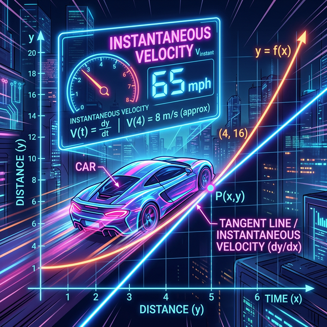

# 00. 인트로: 과속 단속 카메라의 버그 (Intro)

고속도로에 설치된 멍청한 과속 단속 카메라 A 와 10km 뒤에 설치된 카메라 B 가 있습니다.
내 차가 카메라 A 를 미친 듯한 속도인 시속 $200$km 로 쌩~ 하고 통과했습니다. 속도위반 딱지가 날아올까요? 아닙니다! 
나는 A 카메라를 통과하자마자 브레이크를 미친 듯이 밟고 갓길에 세워 $30$분 동안 컵라면을 끓여 먹었습니다. 그리고 시속 $20$km 로 살살 기어가서 카메라 B 를 통과했습니다.

경찰청 컴퓨터에 찍힌 나의 속력은: "(총 거리 10km) 나누기 (총 걸린 시간 35분)" $\rightarrow$ **시속 18km! 거북이 정상 주행! (무죄!)** 
이런 멍청한 평균 속도(Average Velocity) 만으로는 10분 전 내 차가 폭주를 뛰던 "진짜 범죄 현장(그 $0.1$초 찰나의 폭주 스피드)" 을 절대 잡아낼 수 없습니다.

  

## 1. 곡선의 비밀을 캐는 현미경 툴킷 

이 세상 자연의 포물선 곡선은 단 1초도 멈춰있지 않습니다. 
공을 던지면 처음엔 무지하게 빠르게 팍 튀어나가다, 정점에 이르면 무중력처럼 $0$초간 **정지($0$ 속도)** 하고, 다시 마이너스 중력을 받으며 추락(마이너스 가속) 합니다.
만약 당신이 이 공의 $1.2$초 위치 타임라인에 마우스를 들이밀고 "지금 당장! 이 $1.2$초 시점의 실린더 스피드 기울기가 얼마지?" 라고 컴퓨터 시스템 콜을 한다면, 컴퓨터 시스템은 **미분(Derivative)** 연산 스크립트를 백그라운드에서 터트려야 합니다.

## 2. 뉴턴과 라이프니츠의 미친 오버클럭 

17세기 천재 뉴턴과 라이프니츠는, 카메라가 단 한 개밖에 없어도 이 찰나의 속도를 구할 수 있는 버그 같은 해킹 우회로를 발견합니다.

> "카메라 A 와 B 사이의 간격 거리가 엄청 멀어서 평균 속도가 바보가 된다면? 
> **그 간격을 1미터, 0.1밀리미터.. 아니, 아예 두 카메라가 부딪혀 찌그러질 때까지 미친 듯이 0(Zero) 에 무한히 가깝게 밀착(Limit 수렴) 시켜 버리면 어떻게 될까?** 
> 분모가 0이 되어 컴퓨터가 터질 텐데.. 아니, 터지기 직전 단 1밀리초 전! 그 순간을 포착(캡처) 해내면 그게 바로 "순간 스피드" 일거야!"

우주를 1프레임 단위로 멈춰 세우고 곡선의 굽은 등을 칼날(접선 Tangent) 로 매끈하게 저며내는, 세계에서 가장 짜릿한 스피드 해킹 코드 "미분" 속으로 엑셀을 밟아보겠습니다.
