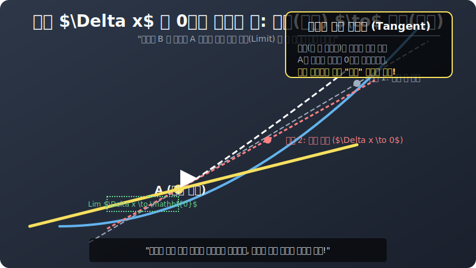

# 02. 두 번째 수업: 간격을 영(0) 으로 부숴라! 순간 변화율 (Instantaneous Rate)

방금 1장에서 끝점에서 끝점까지 빨랫줄을 그어버린 [할선의 기울기 = 평균 속도] 는 버그 덩어리라는 걸 알았습니다.
내 차의 진짜 성능, "지금 당장! 내 눈앞 계기판에 찍혀 있는 이 찰나의 폭주 스피드" 를 잡기 위한 뉴턴의 광기 어린 카메라 간격 조작 로직을 가동합니다.

---

## 1. 카메라를 앞당겨라! 밀착 렌더링

처음에 서울 $A[0]$ 와 부산 $B[4]$ 사이는 $4$시간짜리($X$좌표 텀) 미친 간격이었습니다.
이 간격 조각($\Delta x$, 델타 엑스) 을 줄여 모니터 타겟의 $X$축을 미친 듯이 확대(Zoom in) 합니다. 

1. **간격 축소(1):** 부산에 있던 $B$ 카메라를 뜯어서 $A$ 카메라 바로 코 앞 $X=1$ 지점에 둡니다. 거리는 딱 1. $(\Delta x = 1)$
2. **간격 축소(2):** $B$ 카메라를 더 땡깁니다! 이번엔 $A$ 로부터 불과 $10$ 미터 떨어진 0.001 간격 앞에 둡니다! $(\Delta x = 0.001)$ 
3. 자, $A$ 점과 $B$ 점을 이었던 거대한 똥구멍 할선 꼬챙이가 어떻게 변하고 있습니까?
   $B$ 점이 $A$ 점을 향해 미친 듯이 롤러코스터 레일을 타고 오그라들어 추락해 내려가면서, 그 두 점을 잇던 긴 할선이 서서히 눕고 기울어지며 곡선 표면과 소름 돋게 수평 밀착(동기화) 되어 가고 있습니다.

  

## 2. 분모가 터지는 에러 $0 / 0$ 스크립트!

이제 당신은 흥분해서 마우스를 광클합니다. "야! 아예 카메라 두 대 간격을 $\mathbf{0}$ 초 갭으로 완전하게 충돌 융합시켜서 겹쳐버려! $A$ 와 $B$ 픽셀을 한 점으로 치환해!!"
그리고 기울기 변화율 수식에 $\Delta x = 0$ 간격을 대입해 엔터를 칩니다. 

* 평균 스피드 = $\frac{f(A + 0) - f(A)}{0}$
* **= 무자비한 $\mathbf{0 / 0}$ Zero Division 런타임 에러 텍스트 작렬!! (System Crash!)**

당연합니다! 수학 우주에서 분모를 $0$ 으로 나누는 짓거리는 블랙홀을 터트리는 금기 중의 금기입니다. "아니 속도를 구하려면 이동 거리와 시간 텀($\Delta x$) 이 눈꼽만큼이라도, 어쨌든 $0.00...001$ 이라도 숫자 갭이 존재해야 연산을 할 거 아니냐? 시간이 $0$ 인데 거리가 어떻게 나와!"

## 3. Limit (극한) 함수의 등판: "0 은 아니지만 0 에 무한히 빌붙는 상태"

뉴턴이 이 에러를 피하려고 개발한 우주 최강의 해킹 패치 툴, 그것이 바로 극한, **'리미트 Limit ($lim$)'** 캡슐입니다.
기계적인 $0$ 나눗셈 오류를 피하면서, 분모 텀을 우주 극한 끝까지 수거해서 먼지 조각만한 숫자로 밀어 넣어 소수점 뒷자리를 깎아내는 무한 축소 치트키! 

> $\lim_{\Delta x \to 0}$
> "야 분모 갭! 너 아직 완전히 죽어서 $\mathbf{0}$ 이 된 건 아니야! 하지만 계속 $\mathbf{0.000000001}$ 마이크로 단위로 0을 향해 미친 듯이 빨려 들어가며 **수렴(Limit)** 하고 있어라! 분모 에러는 절묘하게 피하면서 간격은 없애버린 복제 매크로!!"

이 극한 치트 $\lim$ 을 장착하는 순간, 아까까지만 해도 곡선 뱃속을 두 동강 내며 파괴하던 "할선의 평균 속도" 막대기는, 오직 한 점(Dot) 위를 불꽃 튀기며 살짝 긁고 지나가는 가장 섹시한 빛의 레이저, **"접선(Tangent line) 의 찰나의 순간 스피드"** 로 알을 깨고 부활합니다. 다음 3장에서 그 수식(미분 계수) 과 접선 렌더링에 대해 알아보겠습니다.
