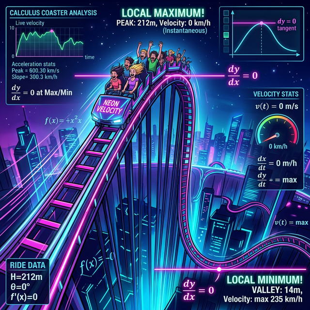

# 00. 인트로: 보이지 않는 우주 지형의 뼈대를 캐내다 (Intro)

RPG 게임의 미개척 맵(Fog of War, 안개 낀 영역) 안에 들어왔을 때 유저는 모니터 화면이 시커멓게 꺼져 있어 산맥이 어떻게 생겨 먹었는지 그래프 궤적을 육안으로 전혀 볼 수가 렌더링 되지 않습니다. 
이 암흑 우주 속에서 지형이 위로 오르막길인지 구덩이 아래로 쏠린 내리막인지를 판별할 유일한 생명줄 시스템 콜이 바로 1부 미분(미분계수) 의 **"$f'(x)$"** 기울기 부호뿐입니다.

  

## 1. 장님이 지팡이로 산맥을 등반하는 법

자, 내비게이션 없이 안대만 낀 플레이어가 다이내믹 레일에 올라탔습니다.

* 플레이어가 센서 `diff()` 버튼을 꾹 누릅니다. **"삐빅! 현재 접선의 기울기 $\mathbf{+4}$ 입니다!"** 
  $\rightarrow$ 플러스 양수! 아하, 내 엔진은 지금 중력을 뚫고 치솟으며 위를 향해 가속하는 **'오르막 궤도 (증가)'** 를 돌파 중이다!
* 한참 가다가 다시 꾹! **"삐빅! 현재 접선의 기울기 $\mathbf{-10}$ 입니다!"** 
  $\rightarrow$ 마이너스 음수!! 워워! 미친 듯이 수직으로 땅에 쳐 박히는 롤러코스터 **'추락 궤도 (감소)'** 다!

## 2. 미분기어로 지도를 해킹하다 (도함수의 위용)

이 렌더링 로그를 취합하면 플레이어는 안대를 끼고도 자신이 탄 차가 어떨 땐 오르고, 어떨 땐 처박힌다는 우주 맵의 뼈대 형태(개형 그래프) 를 완벽하게 2차원 화면 모니터에 스케치할 수 있게 됩니다.
이것이 "도함수 $f'(x)$ 스위치" 가 곡선 롤러코스터 그래프 $f(x)$ 본체의 전체 실루엣 설계도를 그릴 수 있게 해주는 마스터키 브금인 이유입니다.

거대한 $3$차 방정식이나 $4$차 방정식 몬스터의 꾸불꾸불하고 더러운 곡선 형태도, 미분 렌더링 한 방이면 아주 심플한 $+ / 0 / -$ 부호 식별값 베리어로 해체 분해됩니다. 1장부터 도함수 자판기의 플러스(+) 와 마이너스(-) 스위치 판독 스크립트로 돌입합시다!
