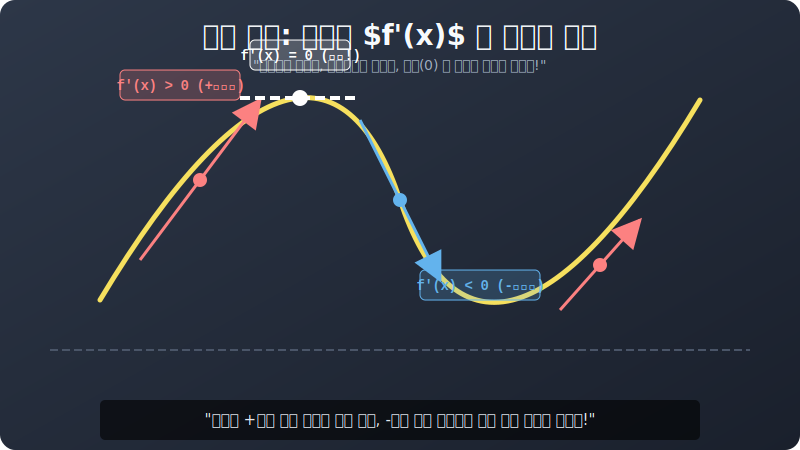

# 01. 첫 번째 수업: 도함수 자판기의 $+ / -$ 스위치, 증가와 감소

차를 몰고 미지의 곡선 언덕을 달립니다. 계기판(도함수 리모컨) 에 적힌 스피드 기호 극성 부호를 살펴봅시다. 

---

## 1. 플러스(+) 스위치: 오르막 엑셀 밟기! (증가)

당신의 도함수 자판기 스피드 센터 수치 $f'(x)$ 가 $\mathbf{+3}, \mathbf{+12}, \mathbf{+100}$ 처럼 전부 **양수(Positive, 0보다 큼)** 가 찍혀 나왔습니까? 
그 렌더링 스팟에서는 무조건 얄짤없이 롤러코스터 앞머리가 위를 향해 들려진 채 오른쪽으로 치고 올라가는 **'증가(Increasing) 타임라인'** 을 타고 있다는 증거입니다! 

> **$\mathbf{f'(x) > 0 \ \ \rightarrow \ \ }$ 증가 (스피드 우상향 UP!)**

## 2. 마이너스(-) 스위치: 브레이크 없는 내리막 다이브! (감소)

반대로 계기판의 스피드 센서 $f'(x)$ 가 $\mathbf{-5}, \mathbf{-20}, \mathbf{-1000}$ 처럼 피투성이 **음수(Negative, 0보다 작음)** 가 찍혀버렸습니까? 
이 구간은 그래프 본체 뼈대가 땅바닥을 향해 곤두박질치며 급경사 추락을 겪고 있는 **'감소(Decreasing) 타임라인'** 존입니다! 

> **$\mathbf{f'(x) < 0 \ \ \rightarrow \ \ }$ 감소 (스피드 우하향 DOWN!)**

  

## 3. 부호 변이의 분기점 해킹 

만약 어떤 3차 함수 코어 로직이 $f'(x) = x^2 - 4$ 라는 속도 계기판 마스터키를 배출해 냈다고 쳐 봅시다. 
언제 오르고 내릴지 범위를 쪼개볼까요? 도함수를 $0$ 기준으로 부숴봅니다.
* $x^2 - 4 > 0$ 이 되는 존: (오르막 스위치 점등!) $\rightarrow$ $x < -2$ 이거나 $x > 2$ 인 변방 바깥쪽 영토!
* $x^2 - 4 < 0$ 이 되는 존: (지옥불 내리막 다스플레이 점등!) $\rightarrow$ $-2 < x < 2$ 의 샌드위치 계곡 영토! 

끝났습니다. 오리지널 함수의 우주 지도를 한 번도 구경하지 않은 장님 상태에서도, **"이 함수의 포물선 본체는 애초에 $-2$ 구역 전까지는 계속 오르막 곡선을 치다가 $\to$ 갑자기 $-2$ 부터 $2$ 구간까지 깊은 골짜기로 처박힌 후 $\to$ $2$를 넘어가면 영원토록 다시 치솟아 올라가는 (N자형 뱀파이어 날개 궤도) 야생 몬스터구나!"** 라고 완벽하게 기하학적 맵 스캔을 때려버린 것입니다!

자, 그렇다면 오르막(+) 에서 내리막(-) 으로 스위치가 "탁!" 하고 바뀌면서 기어가 엇갈리는 **딱 그 변속 분기점** 에서는 무슨 물리적 충돌 현상이 벌어질까요? 
그게 바로 롤러코스터 꼭대기 정점 프레임에서 발생하는 궁극의 $\mathbf{Zeho(0)}$ 멈춤 상태, 2장의 "극대와 극소" 버그 트리거입니다!
