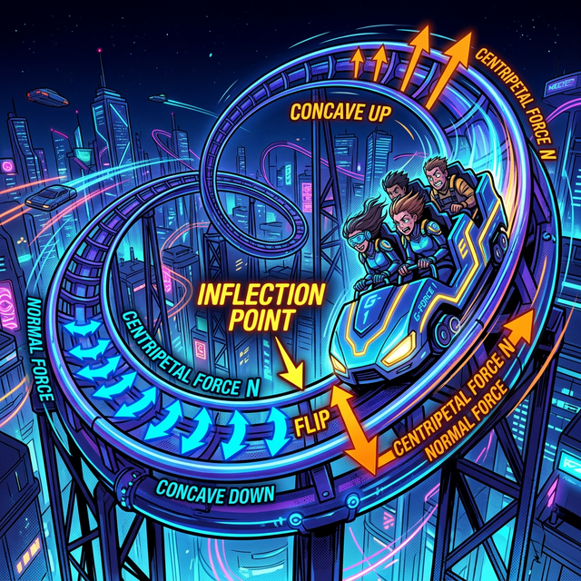

# 00. 인트로: 스피드의 스피드, G-Force 충격량 (Intro)

레이싱 휠로 코너링 자동차 시뮬레이션을 구현하고 있습니다. 단순히 속도(`Velocity = 100km/h`) 데이터만 모니터에 터지면 레이싱은 재미가 없습니다. 
우리는 시속 $100$km 로 코너를 돌 때 플레이어의 몸통(등짝) 이 "조수석 창문 쪽으로 거칠게 튕겨 나가는 중력의 압박감(G-Force)" 을 화면 렌더링에 구현해야 합니다. 

  

## 1. 속도가 점점 변한다는 것 (속도 + 계기판 바늘)

전방에 100미터 직선 트랙이 있습니다. 내 자동차의 속도가 $\mathbf{+10, +10, +10}$ 으로 일정(스피드 기울기 $f'(x)$ 일정) 하다면 내 몸은 그냥 시트에 평화롭게 앉아있습니다.
그런데 만약 내 자동차의 속도가 $\mathbf{+10 \to +50 \to +200}$ 으로 부스터를 터뜨리며 미친 듯이 스피드가 "변화(오버클럭 가속)" 한다면? 내 뒤통수는 뒷좌석 헤드레스트에 콰직! 하고 처박힐 겁니다.

이 등짝을 찍어 누르는 부스터 압박감, 즉 **'가속도(Acceleration)'** 의 힘을 어떻게 스크립트로 도출해야 할까요?

## 2. 도함수를 한 번 더 갈아라! 

이 1부~2부에서 주구장창 우려먹은 **"접선 순간 스피드 센서" 1차 미분 도함수 ($f'(x)$)** 기억나시죠?
그 $f'(x)$ 스피드 자체가... '시간이 지나면서 웽~ 하고 점점 커지고 있는지, 감속해서 줄어들고 있는지' 스피드의 흐름(스피드값의 기울기 변화율) 을 알아야 합니다. 

그럼 기하학 해커들은 쿨하게 대답합니다. 
> "야! 그 $f'(x)$ 도 어차피 또 하나의 곡선 함수일 뿐이잖아! 
> **그 함수를 다시 한번 $\mathbf{diff()}$ 미분 믹서기 엔진에 골인시켜서 스크립트를 두 번(더블) 갈아버려!! 무스비 치트 폭발!!**"

네! 이렇게 2번 미분 칼질을 연타석으로 맞고 탄생한 진정한 G-Force 중력 센서, **"이계도함수(Second Derivative, $\mathbf{f''(x)}$)"** 의 세계로 드리프트를 땡겨보겠습니다.
