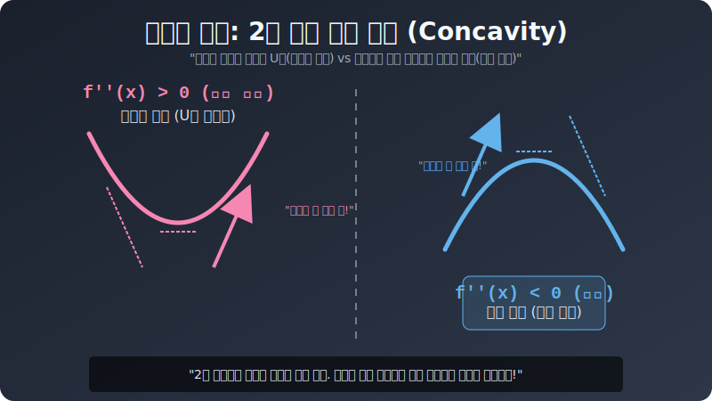

# 02. 두 번째 수업: 하늘정면 웃는 상($\cup$) vs 바닥 땅벌레 절망 상($\cap$)

곡선 그래픽이 "아래로 뽈록 튀어나온 U자 계곡($\cup$)" 인가, "위로 뽈록 튀어나온 뒤집어진 우산산맥($\cap$)" 인가? 이 시각적 굴곡 형상을 수학자들은 **오목(Concave)** 과 **볼록(Convex)** 이라는 토나오는 한글 단어로 부릅니다.
2번 연속 치트된 이계도함수 $\mathbf{f''(x)}$ 센서의 플러스/마이너스 부호 하나로 이 거대한 지형의 구부러진 뱃살 곡률 렌더링이 $100\%$ 완벽 판정됩니다!

---

## 1. 스마일 오르가즘 가속 부스터! $\mathbf{f''(x) > 0}$

미분을 두 번 쳤더니 값어치가 플러스(+) 양수가 도출되었습니다. 
이 말은 뭐다? 아까 1장에서 엔진 **스피드 바늘이 점점 커지며(가속되며) 상승 기류를 타는 가속 로켓**이라고 흥분했었습니다.

* 스피드 기울기 변화: $\mathbf{-10} \to \mathbf{-2} \to \mathbf{0} \to \mathbf{+5} \to \mathbf{+20}$
* (지하로 처박히던 지옥불 스피드가 점차 서서히 브레이크를 잡더니 $\to$ 바닥을 평평히 치고 $\to$ 위로 폭주하며 치솟아 오르기 시작함!)

이 궤적을 연필로 부드럽게 이어 그려보십시오. 완벽한 **유리잔 밥그릇 모양의 U자, 즉 하늘을 우러러보는 싱긋 "웃는 얼굴 스마일 상($\cup$)"** 이 도화지에 렌더링 됩니다.
이 형태를 기하학에서는 **"아래로 볼록 (위로 오목, Concave Up)"** 지형이라고 정의합니다.

> **$\mathbf{f''(x) > 0 \ \ \rightarrow}$ 아래로 볼록 ($\cup$) 가속 구간 코너링!**

## 2. 브레이크 추락의 무간 지옥! $\mathbf{f''(x) < 0}$

반대로 더블 미분값이 마이너스(-) 음수가 도출되면 엔진 상태는 어떻게 될까요?
스피드 계기가 계속 감속되며(나락으로 꺾이며) 떨어지는 절벽 다이빙 모드입니다.

* 스피드 기울기 변화: $\mathbf{+50} \to \mathbf{+5} \to \mathbf{0} \to \mathbf{-10} \to \mathbf{-80}$
* (마치 대포알을 하늘로 팍! 쐈을 때 처음엔 미친 듯이 하늘로 치솟다가 $\to$ 중력을 맞아 점차 속도가 둔해져 허공에 정지 $\to$ 이내 머리를 돌려 땅바닥으로 미친 듯이 내리꽂히는 탄도탄!)

이 포물선을 선으로 이어 그리면 비를 막는 **엎어진 종 모양, 혹은 "슬픈 얼굴 절망 상($\cap$)"** 이 렌더링 됩니다.
기하학에서는 **"위로 볼록 (아래로 오목, Concave Down)"** 지형이라고 칭합니다.

> **$\mathbf{f''(x) < 0 \ \ \rightarrow}$ 위로 볼록 ($\cap$) 감속 브레이크 꺾임!**

  

## 3. 오목/볼록 버그 탐지기 요약

그래서 미분을 2번 때린 $\mathbf{f''(x)}$ 의 부호는 모니터 화면상 "곡선 지형 뱃살이 어느 쪽으로 굽어 통통하게 늘어져 살이 쪘는가" 를 알려주는 실루엣 실측 스캐너 단서가 됩니다. 
자! 그렇다면 2차 스캐너마저 **플러스도, 마이너스도 아닌 딱 중간의 제로 $\mathbf{f''(x) = 0}$** 가 떨어지는 찰나의 버그 순간은 언제 터질까요? 

그 대답은 핸들을 우측 밥그릇 코너로 미친 듯이 틀다가 $\to$ 갑자기 급 커브 반대편 좌측 우산 터널 강하로 "운전대 스위치가 확! 뒤집혀 꺾이는" S자 커브의 정중앙. 
기하학 최고난도 회피 스폿, **"변곡점 (Inflection Point)"** 으로 3장에서 연결됩니다!
