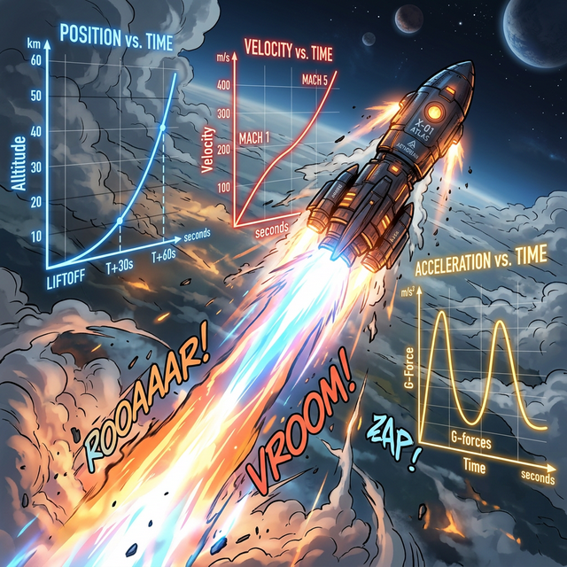

# 00. 인트로: 우주 발사체 물리 엔진 트레이닝 (Intro)

로켓을 우주로 쏘아 올리는 관제 센터의 시뮬레이터 맵은 아주 직관적입니다.
그들은 $Y$ 축을 "땅바닥으로부터 로켓이 떠오른 상공의 고도(Height, 위치)" 로 잡고, $X$ 축을 "발사 버튼을 딱! 누른 직후부터 흘러가는 초시계 타임라인(Time, $t$)" 으로 설정합니다.

  

## 1. 시간($\mathbf{t}$) 이 지배하는 함수 방정식

지금까지 우리는 맵 데이터를 다룰 때 항상 $f(x)$ 였습니다. (X 스팟 위치를 밟으면, Y 높이가 나오는 지형 렌더링).
하지만 현실의 동역학 물리는 맵 자체가 움직이는 게 아니라 **시간(Time)** 이라는 1차원 컨베이어 벨트 위를 굴러갑니다.

그래서 물리 렌더링 함수는 항상 시간 텍스트 뼈대인 $\mathbf{t}$ 변수를 장착하고 기동합니다.
> **$\mathbf{x(t) = -5t^2 + 20t + 50}$**
> 해석: "발사 후 $t=1$초 가 딱 지났을 때 이 로켓은 하늘 위 $65$m 높이($x$) 좌표 허공에 둥둥 떠서 날아가고 있다!"

## 2. 뉴턴의 미분 트리: 3단 로켓 분해

이 위치($x$) 정보 함수 딱 한 개만 주어졌을 때, 1차 미분을 쓰면 $\mathbf{v(t)}$(스피드계 속도) 가 튀어나오고, 한 번 더 미분 콤보를 먹이면 $\mathbf{a(t)}$(가속도계 G-Force) 가 튀어나옵니다.

이 3가지 위치, 속도, 가속도 데이터 쪼가리를 가지고 우리는 **"로켓이 정확히 몇 초에 바닥에 쾅! 하고 박치기 충돌하여 박살 나는가?"**, **"로켓 엔진이 연소를 멈추고 최고점 정점을 찍은 후, 대가리를 돌려 땅으로 막 추락하기 시작하는 [낙하 무중력 체공 프레임] 이 터지는 정확한 찰나는 몇 초 때인가?"** 를 전부 해킹할 수 있게 됩니다.
이것이 동역학 기초 파이프라인, **'1차원 직선 운동'** 이며 1장에서부터 바로 로켓 폭격 스크립트를 짜보겠습니다.
