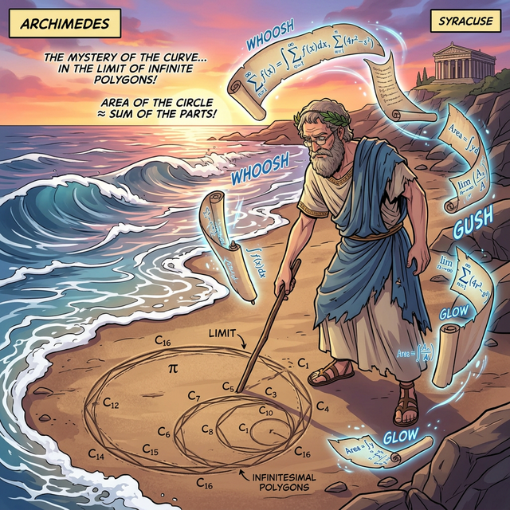

# 00. 인트로: 곡선을 정복하려는 인간의 집념 (Intro)

고대 이집트인들은 나일강이 매년 범람하고 나면, 엉망진창으로 곡선이 되어버린 농경지의 땅 넓이를 다시 공평하게 나누어주는 기술이 그 무엇보다 중요했습니다. 
삼각형이나 직사각형 같은 반듯한 다각형은 밑변 곱하기 높이로 면적을 쉽게 구할 수 있지만, "구불구불한 강물의 경계선"이나 "원형 포도밭"의 넓이는 대체 어떻게 계산해야 할까요?

---

## 1. 아르키메데스와 '구분구적법'의 탄생

반듯한 사각형의 넓이 공식밖에 없던 고대인들은, 곡선을 만났을 때 천재적인 꼼수 하나를 생각해 냅니다. 
**"곡선 아래의 모양을 우리가 계산할 수 있는 사각형(또는 삼각형)으로 아주 잘게 쪼개서 통째로 다 더해버리자!"**

이것이 바로 미적분학의 출발점이자 '적분(Integration)'의 가장 핵심인 **'구분구적법(Method of Exhaustion, 실진법)'**의 탄생입니다.

  

기원전 3세기, 아르키메데스는 원의 넓이를 구하기 위해 원 안에 다각형을 그려 넣기 시작했습니다. 
정육각형의 넓이, 정$12$각형의 넓이, 정$96$각형의 넓이... 이렇게 각을 계속 무한히 늘려나가다 보면, 다각형의 뾰족한 테두리 모서리들이 원의 둥근 테두리에 완벽하게 밀착되어 결국 '이론적인 원의 넓이'를 구할 수 있다는 무시무시한 무한(Infinity)의 아이디어를 떠올린 것입니다.

## 2. 쪼개고 결합한다: 미분과 적분의 관계

우리는 흔히 고등학교에서 미분(방향과 속도를 구하기 위해 대상을 한없이 쪼개는 것)을 먼저 배우고, 그다음에 적분(넓이를 구하기 위해 조각을 합치는 것)을 배웁니다.
하지만 놀랍게도 역사적으로는 **공간의 넓이를 구하는 '적분' 기술이 '미분' 기술보다 1,500년 이상이나 먼저 발명**되었습니다!

- 인류의 첫 수학적 생존 필수품은 "땅의 면적(적분)" 이었기 때문입니다.
- 나중에 17세기에 이르러서야 뉴턴(Newton)이 떨어지는 사과나 대포알의 궤도 같은 "순간의 움직임(미분)" 에 관심을 가지게 되었죠.

## 3. 세상을 시뮬레이션 하는 부품, 적분

오늘날 인간의 생명을 살리는 병원의 MRI 입체 스캔, 인공지능이 확률 분포의 곡선 아래 넓이를 구하는 과정, 날씨를 시뮬레이션 하는 슈퍼컴퓨터의 엔진, 심지어 3D 게임엔진에서 컵에 물이 차오르는 렌더링까지!

모두 이 "곡선을 무한히 쪼갠 직사각형들의 넓이를 더하는" 위대한 아르키메데스의 철학에서 비롯되었습니다.
이제 그 원시적이면서도 무한히 아름다운 '리만 합(Riemann Sum)'의 직사각형 성벽 쌓기 현장 속으로 들어가 봅시다.
