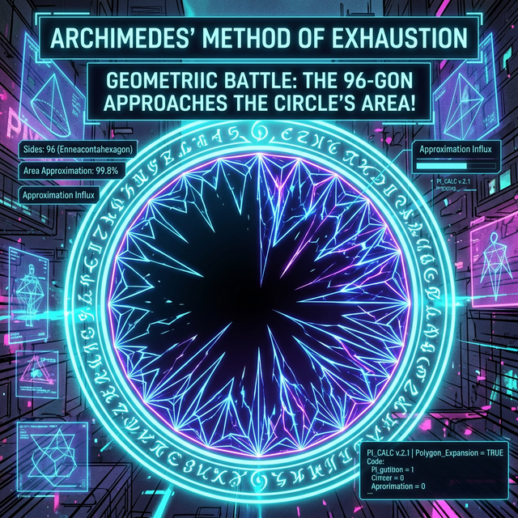

# 01. 첫 번째 수업: 아르키메데스와 넓이의 비밀 (Area and Volume)

고대 그리스 시대에는 최첨단 컴퓨터와 미적분 공식이 없었습니다. 오직 직사각형($\text{가로} \times \text{세로}$)과 삼각형의 넓이 구하는 공식뿐이었습니다.
이 제한된 무기 하나만으로 역사상 가장 경이로운 방법으로 원의 넓이나 그릇의 부피에 접근했던 옛 천재들의 지혜를 살펴봅시다.

---

## 1. 이 지구상에 완벽한 곡선은 없다?

초등학생도 원의 넓이 구하는 공식을 압니다: $\text{반지름} \times \text{반지름} \times 3.14 (\pi)$.
하지만 고대인들에게 "구불구불한 둥근 모양의 면적을 구하라"는 미션은 달에 사람을 보내는 것만큼 절망적인 난제였습니다. 곡선 길이를 측정할 단단한 잣대조차 없었으니까요.

여기서 아르키메데스라는 천재가 발상을 완전히 뒤집습니다.
"원의 넓이를 모른다면, **원 안에 우리가 넓이를 잴 줄 아는 정삼각형이나 정사각형을 욱여넣자!**"
그리고 정사각형의 넓이를 구합니다. 당연히 원의 넓이보다 작겠죠. (빈 틈이 생기니까요)

그는 포기하지 않고 각을 늘려서, 정팔각형, 정16각형, 정96각형을 원 안에 계속 때려 넣습니다!

## 2. 실진법(Method of Exhaustion) : 공백을 갉아먹다

아르키메데스가 다각형의 각을 늘릴수록 (예: 정96각형), 다각형의 테두리는 원의 곡선에 미친 듯이 바짝 달라붙었습니다. 남는 빈 공간(오차)이 점점 $0$을 향해 갉아 먹히며 줄어든 것이죠.

수학자들은 이 거칠고 무식하면서도 확실한 아이디어를 **'실진법(Method of Exhaustion)'**이라 불렀습니다. (다각형으로 남은 틈새 공간을 소진, 혹은 기진맥진하게 만들어버린다는 뜻입니다.)

> **"오차가 사라질 때까지, 자를 수 있는 모든 것을 무한히 더 잘게 잘라서 채워 넣는다."**

이 말 한마디가 적분의 $90\%$를 설명하는 가장 완벽한 심장부가 되었습니다. 

## 3. 원뿔과 구의 부피도 쪼개서 증명하다

아르키메데스의 이 미친 '쪼개기 스킬'은 평면 넓이(원)에만 그치지 않았습니다.
입체 도형인 '구(Sphere, 둥근 공)'의 겉넓이와 부피조차 모를 때, 그는 구 속에 무수히 많은 원기둥 장작들을 수만 겹으로 포개어 쌓는 아이디어를 생각해 냈습니다. 

원기둥 탑의 조각 층을 무한히 얇게 종이장처럼 슬라이스(Slice) 쳐서 촘촘하게 쌓아 올리면, 그 탑의 계단식 거친 표면이 점점 매끄러워지며 완벽한 둥근 '구'의 표면적 밀착할 것이라 확신한 것입니다. 무식해 보이지만 반박할 수 없는 이 아이디어는 후대에 뉴턴과 라이프니츠를 만나 정식 '적분(Integration)' 기호인 $\int$ (인테그랄) 의 형태로 완성됩니다.

이 거칠지만 우직한 사각형 쌓기 기술이 어떻게 함수 기호와 수식으로 진화했는지, 다음 챕터의 '리만 합' 수학 공식으로 확인해 보겠습니다.
