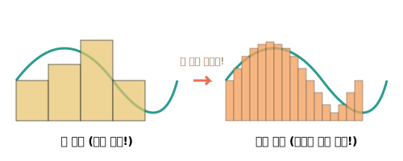

# 01. 우리는 적분을 왜 배울까? (What is Integral?)

안녕하세요! 오늘부터 우리는 가장 위대한 수학적 발견 중 하나인 **적분(Integral)**에 대해 배울 것입니다. 
"수학의 꽃"이라고도 불리는 미분과 적분은 너무 어렵고 복잡하다는 편견이 있지만, 그 원리 자체는 아주 단순하고 매력적입니다.

우리가 적분을 배우는 이유와 적분이 대체 무엇인지, 그리고 인공지능(AI)과 컴퓨터 시대에 적분이 어떻게 쓰이는지 재미있게 알아봅시다!

---

## 1. 서론: 왜 적분을 배워야 할까? (Why do we learn it?)

여러분, 혹시 스페이스X(SpaceX)가 쏜 로켓이 우주로 나아가거나 다시 땅으로 정확하게 착륙하는 장면을 본 적 있나요?
아니면 넷플릭스나 유튜브의 인공지능 알고리즘이 여러분이 좋아할 만한 영상을 추천해 주는 것은요?

이 모든 **최첨단 기술의 중심에는 '적분'이 숨어 있습니다.**

<div align="center">
  
</div>

* **미래 예측 (변화의 누적)**: 세상의 모든 것은 변합니다. 자동차의 속도, 로켓의 궤도, 주식의 가격 등이죠. 적분은 이런 '순간적인 변화량(미분)'들을 차곡차곡 모아서 **'전체적인 결과(총량)'를 알아내는 기술**입니다. 
* **불규칙한 세상 분석**: 반듯한 네모, 세모의 넓이는 초등학생도 구할 수 있습니다. 하지만 구불구불한 강물의 넓이, 로켓이 날아간 곡선 궤적의 길이처럼 **'불규칙한 곡선'의 넓이와 부피**를 구하려면 오직 적분만이 해답을 줄 수 있습니다.

우리가 데이터 과학, 인공지능, 자율주행, 우주 공학 등 4차 산업혁명 시대의 기술을 이해하고 개발하기 위해서는 적분이 그 **기초 언어**가 되는 것입니다.

---

## 2. 기초 개념: 적분이란 "잘게 쪼개서 더하는 마법"

적분의 한자를 풀어보면 **적(積: 쌓을 적), 분(分: 나눌 분)**입니다. 즉, "먼저 잘게 나눈 다음, 그것들을 다시 차곡차곡 쌓는다(더한다)"는 뜻입니다.

재미있는 비유를 하나 들어볼까요?

> **🖼️ 비유: 구불구불한 수영장 바닥재 깔기**
> 여러분이 구불구불한 강물 모양의 콩팥 수영장에 네모난 바닥 타일을 깐다고 상상해 보세요. 
> 곡선으로 된 테두리 부분 때문에 네모난 타일이 깔끔하게 맞아떨어지지 않겠죠? 빈틈이 생기거나 삐져나올 것입니다.
> 
> **어떻게 하면 빈틈없이 완벽하게 덮을 수 있을까요?**
> 바로 **타일의 크기를 모래알처럼 아주 작게 부수는 것**입니다! 

<div align="center">
  
</div>

타일이 무한히 작아진다면, 구불구불한 테두리라도 완벽하게 빈틈없이 덮어낼 수 있습니다.
이것이 바로 적분의 핵심 원리입니다.
1. 구불구불한 곡선 아래의 넓이를 아주 얇은 직사각형들로 **잘게 쪼갠다. (분, 分)**
2. 그 수천수만 개의 직사각형 넓이를 **모조리 다 더한다. (적, 積)**

---

## 3. 전통 수학 수식과 AI 프로그래밍 (Math & Python)

그렇다면, 수백 년 전 수학자들의 손 계산과 현대 과학자들의 파이썬(Python) 컴퓨터 계산은 어떻게 다를까요? 
놀랍게도 근본적인 뼈대는 완벽히 똑같습니다! 

둘 다 "함수(수식)"의 곡선 모양을 분석하여 넓이를 계산합니다.

### 📝 1. 전통적인 수학 기호 (SymPy)
우선 적분을 수학 교과서 기호로 어떻게 나타내고 푸는 지, 파이썬의 기호 수학 계산 라이브러리인 **`SymPy`** 를 통해 살펴보겠습니다.
학교에서는 손으로 공식을 외워 풀지만, `SymPy`를 사용하면 AI가 방정식 수식을 문자로 이해하고 자동으로 풀어줍니다!

```python
import sympy as sp

# 1. 기호 설정 (x라는 스펠링을 수학 미지수 x로 쓰겠다고 선언)
x = sp.Symbol('x')

# 2. 곡선의 모양을 수학 함수 fx로 지정 (예: y = x의 제곱)
fx = x**2

# 3. 우아한 수학 기호 적분 계산! 
# 뜻: 함수 fx를 x=0 부터 x=5 까지 구간 적분(integrate) 해라!
result = sp.integrate(fx, (x, 0, 5))

print(f"곡선의 넓이 수식 계산 결과: {result}")
# 출력 결과: 곡선의 넓이 계산 결과: 125/3 (즉, 41.666...)
```
이렇게 컴퓨터가 $41.666\dots$ 이라는 정확한 분수 정답 $125/3$ 을 뱉어냅니다!

### 💻 2. 인공지능 엔지니어의 시각화 (Matplotlib)
이번에는 이 계산 결과를 그래프로 그려서 사람의 눈에 색칠 된 넓이로 확 와닿게 보여주는 **`NumPy`**와 **`Matplotlib`** 라이브러리 코드입니다. 자율주행 회사의 모니터나 데이터센터에서는 늘 이런 파란색 그래프가 둥둥 떠다니죠!

```python
import numpy as np
import matplotlib.pyplot as plt

# 1. 0부터 5까지 아주 잘게 쪼갠 100개의 x 포인트를 생성! (적분의 기본인 '잘게 쪼개기')
x_points = np.linspace(0, 5, 100) 
y_points = x_points ** 2          # y 값은 x 포인트의 제곱

# 2. 뼈대 곡선 그리기
plt.plot(x_points, y_points, color='red', linewidth=3, label='y = x^2 Curve')

# 3. 곡선 아래에 파란색으로 예쁘게 칠하기 (이 색칠된 양이 적분 넓이입니다)
plt.fill_between(x_points, y_points, color='lightblue', alpha=0.6, label='Integral Area (Volume)')

# 4. 보기 좋게 꾸미고 화면에 띄우기
plt.title('What is Integral? - Calculating Area under the Curve')
plt.xlabel('x Axis (ex: Time)')
plt.ylabel('y Axis (ex: Speed or Value)')
plt.legend()
plt.grid(True)
plt.show() # 모니터 출력!
```

이 코드를 실행하면 방금 우리가 증명한 $125/3$ 넓이만큼 파랗게 이쁘게 물든 곡선 차트가 탄생합니다! 

---

## 4. 3줄 요약 (Summary)

1. **적분은 전체를 구하는 기술이다**: 시시각각 변하는 복잡한 데이터 조각들을 모아 하나의 총량과 결과를 예측할 수 있다.
2. **잘게 쪼개서 더한다 (적, 분)**: 삐뚤빼뚤한 곡선의 넓이도 아주 얇은 사각형으로 무한히 쪼개서 더하면 완벽한 진짜 넓이가 도출된다.
3. **AI 시대의 코딩 융합**: 파이썬 `SymPy`를 통해 공식을 풀고, `Matplotlib`으로 시각화하면 머리 아픈 옛날 계산 방식에서 벗어나 4차 산업혁명의 실용적인 예측 도구로 적분을 써볼 수 있다.

다음 시간에는 이 "잘게 쪼개서 더하기"의 원리를 좀 더 맛있는 '피자 비유'를 통해 극한(Limit)의 세계로 파헤쳐 보겠습니다! 준비됐나요? 02번 강의로 넘어갑시다!
