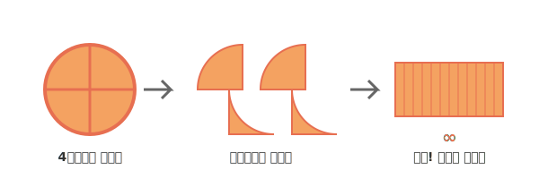

# 02. 피자를 천만 조각으로 자르면 넓이를 구할 수 있을까? (The Principle of Integral)

지난 시간에는 왜 적분을 배우고, 적분의 강력한 목표가 "구불구불한 도형의 넓이와 양을 구하는 것"이라는 점을 배웠습니다. 그렇다면 적분은 도대체 **어떻게(How)** 매끈하지 않은 모양의 넓이를 완벽하게 구해낼까요? 

비결은 바로 수학에서 가장 무서운 마법, **"단순한 모양이 될 때까지 무한히 쪼개라!"**는 극한(Limit)의 원리에 있습니다. 옛날 철학자들과 수학자들의 아이디어가 파이썬 코드로 어떻게 구현되는지 살펴보죠.

---

## 1. 서론: 우리는 왜 피자를 조각낼까? (The Need to Slice)

원이나 피자처럼 구불구불한 둥근 모양의 넓이를 우리 조상님들은 어떻게 구했을까요?
우리가 초등학교 때 쉽게 배웠던 원의 크기나 부피 공식을 맨 처음 만들어낸 수학자들도 처음에는 막막했습니다.

단 한 가지 그들이 아는 확실한 무기가 있었습니다.
**"네모 반듯한 직사각형의 넓이는 곱셈(가로 × 세로)으로 쉽게 구할 수 있다."**

그렇다면 어떻게든 피자를 사각형으로 **"변신"**시킬 수만 있다면 그만두면 안 될까요?

<div align="center">
  
</div>

> **(참고: 생성된 AI 아트워크)**
> 

---

## 2. 기초 개념: 피자 자르기와 테트리스 맞추기

피자를 4조각으로 자른 다음, 위아래로 지그재그 테트리스 하듯이 끼워 맞춰 봅시다. 아직은 위아래가 둥글고 울퉁불퉁한 모양입니다.
이번에는 피자를 8조각으로 자르고, 16조각으로 잘라 볼까요?

* **8조각 피자**: 톱니바퀴 무늬가 있지만 사다리꼴 비슷한 형태가 됩니다.
* **1000조각 피자**: 너무 가늘어서 테두리의 둥근 부분이 거의 직선같이 평평해집니다.
* **무한대($\infty$) 조각의 피자**: 조각이 머리카락보다 얇아져서, 지그재그로 붙이면 아예 오차가 1도 없는 **완벽하게 매끈한 하나의 '직사각형'**이 되어 버립니다!
  (이 직사각형의 넓이 = 원둘레의 절반 $\times$ 반지름 = $\pi r \times r = \pi r^2$)

> 💡 **수학의 흑마법: 극한 (Limit)**
> 이렇게 끝을 알 수 없을 정도로 "한계점까지 아주 얇게 작아지는 것"을 수학 용어로 **'극한(Limit)'**이라고 부릅니다. 기호로는 멋있게 `$\lim_{n \rightarrow \infty}$` 라고 쓰죠.
> 영원히 끝나지 않을 것 같은 극한의 목표에 언제 도착하냐고요? 우리 눈으로는 보이지 않지만, 파이썬과 같은 컴퓨터 수식 엔진은 이 극한을 정확하게 **"하나의 완벽한 숫자"**로 떨어뜨려 줍니다!

---

## 3. 전통 수학 수식과 AI 프로그래밍 (Math & Python)

이번에도 역시 전통적인 수학 공식을 컴퓨터에 이식해서 테스트를 해볼 시간입니다.

### 📝 1. 수식으로 보는 극한 증명 (SymPy의 Limit 사용)
컴퓨터가 어지러운 극한(Limit) 문장 기호를 어떻게 사람처럼 읽어내고, 오차율 0%의 '완벽한 숫자'로 답을 낼까요? `SymPy` 라이브러리의 `limit` 명령어를 보면 수학자들이 어떻게 종이에서 하던 일을 디지털로 옮겼는지 단번에 이해가 됩니다.

```python
import sympy as sp

# 1. 기호 설정 (n: 무한대로 쪼갤 피자 조각의 개수)
n = sp.Symbol('n')

# 2. 극한 수식 (예: 원 안에 내접하는 다각형의 넓이 수식 극한 등)
# 여기서는 아주 쉬운 n이 무한대로 커질때, 1/n 이 어떻게 될까 묻는 아주 기초적인 문제!
pizza_slice_width = 1 / n 

# 3. 우아한 수학 기호 "Limit" 계산!
# "조각(n)이 무한대(sp.oo)를 향해 나아갈 때, 피자 1조각의 넓이는 무엇이 되느냐!"
result = sp.limit(pizza_slice_width, n, sp.oo)

print(f"조각 수(n)가 무한대(∞)가 될 때 조각의 너비: {result}")
# 출력 결과: 조각 수(n)가 무한대(∞)가 될 때 조각의 너비: 0
```
이러면 컴퓨터가 수학 공식을 증명하듯이 멋지게 `0` 이라는 결괏값을 증명해 줍니다. 

### 💻 2. 인공지능 엔지니어의 빅데이터 잘라 더하기 (반복문)
앞서 배운 무한한 극한과 수학 공식을 실제로는 로봇이나 AI 시뮬레이터 프로그램에서 어떻게 써먹을까요? 데이터 센터나 인공지능 엔진 안에서는 기호 계산보다는 **"아주 많이 쪼개서 일일이 무식하게(?) 다 덧셈하기"**를 활용하여 넓이의 오차를 극한까지 줄여냅니다. 파이썬의 `for 루프(반복문)`를 보실까요?

```python
# 피자를 엄청 무수히 무식하게 많이 자르는 "적분 시뮬레이션!"

pieces = 1000000 # 100만 조각으로 쪼갠다고 상상합시다 (우리의 극한 limit)
width_of_piece = 5.0 / pieces # 조각 한 개의 너비 (dx에 해당!)

total_area = 0 # 넓이 누적을 저장할 빈 데이터 통 (메모리)

print(f"피자를 {pieces} 조각으로 나누어 넓이를 구하는 중...")

# 1번 조각부터 100만번 조각까지 차례대로 넓이를 구해 다 더하는 'for 문' 작동!
for i in range(pieces):
    current_x = i * width_of_piece        # i번 조각의 x 위치
    current_height = current_x ** 2       # 조각의 (높이) 곡선 계산
    
    area_of_this_piece = current_height * width_of_piece # 조각 넓이 
    total_area += area_of_this_piece      # 전체 넓이 통에 더하기!

# 결과를 출력합니다.
print(f"컴퓨터가 100만 번의 덧셈을 한 결과 적분 넓이는: {total_area} 입니다!")
# 실제 수학 공식 결과값(41.666..)과 99.999% 일치하는 괴물같은 정확도가 나옵니다.
```

컴퓨터 안에서 이렇게 수십만 번을 조각내서 더하는 계산 빙식을 **수치적분(Numerical Integration)**이라고 부릅니다. 여러분은 벌써 기상청의 날씨 예측 프로그램이나 자율주행 회사가 이동 거리를 구하는 핵심 알고리즘 뼈대를 방금 이해한 것입니다!

---

## 4. 3줄 요약 (Summary)

1. **둥근 피자를 네모로 만들기**: 적분은 곡선 모양의 복잡한 덩어리를 우리가 넓이를 알기 완벽히 쉬운 가장 단순한 쪼가리(직사각형 등)로 쪼개는 일에서 출발한다.
2. **극한(Limit)의 도입과 파이썬 `SymPy`**: 수학적 극한 개념 `$\lim$` 를 쓰면 곡선의 오차가 완전히 $0$으로 사라지며, 이는 파이썬의 로봇 뇌 `SymPy.limit`이 완벽하게 대리 계산할 수 있다!
3. **컴퓨터의 덧셈 알고리즘과 수치적분**: 복잡한 공식을 머리 싸매고 풀지 않아도, 파이썬 반복문을 사용해 백만 번을 잘게 자르고 일일이 더해주면 AI와 시뮬레이션 프로그램들이 적분을 밥 먹듯이 써먹는 무기가 된다.

다음 시간에는 페인트 롤러를 상상해 보며, 이 무한히 잘게 자른 '직사각형 조각'들을 대체 어떻게 설정해야 벽 높이의 오차(빈틈과 삐져나옴)를 최적화(Optimization)할 수 있을지 이야기해 보죠. 기계 학습(로봇학습)의 힌트가 숨어있는 **위대한 리만(Riemann) 할아버지의 "상합과 하합"** 편을 기대하세요! 
