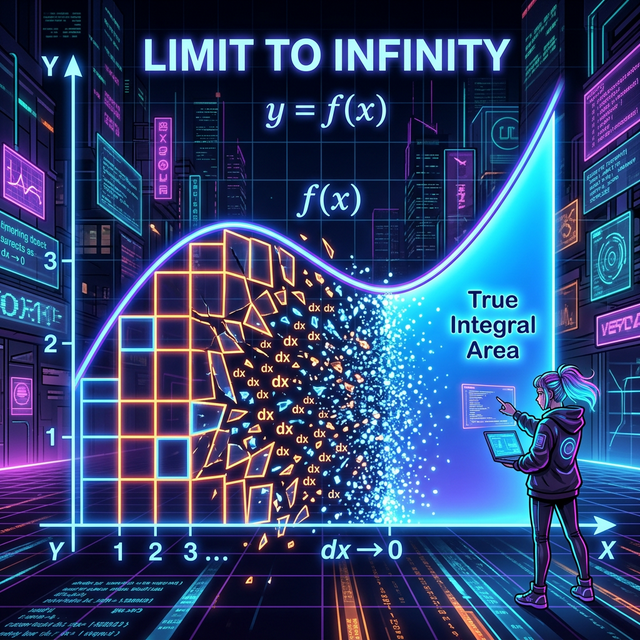

# 02. 두 번째 수업: 리만 합, 직사각형 무한 러시 (Riemann Sums)

아르키메데스의 막노동(?) 쪼개기 아이디어를 수학의 엄밀한 공식으로 정리한 사람이 바로 19세기 독일 천재 수학자 베른하르트 리만(Bernhard Riemann)입니다. 이 사각형 탑 쌓기 아이디어는 그의 이름을 따서 **'리만 합(Riemann Sum)'**이라고 부릅니다.

---

## 1. 곡선을 정복하는 사각형 포위망

어떤 오르락내리락하는 함수 그래프 곡선 밑의 넓이를 구하고 싶다고 해봅시다. 
아래 SVG 애니메이션 다이어그램을 통해 이 "구분구적법(쪼개고 더하기)"의 기하학적 의미를 시각적으로 확인해 볼까요?

<div align="center">
  
</div>

1. 왼쪽 그림은 가로 구간을 **단 4덩어리의 두꺼운 직사각형**으로 나눈 그림입니다. 파란 곡선과 사각형 윗면 사이에 커다란 **빨간색 빗금 진 빈틈(오차)**이 발생합니다.
2. 오른쪽 그림은 가로 구간을 무려 **20조각의 얇고 미세한 직사각형**들로 자른 것입니다. 사각형의 윗면이 파란 곡선의 형태를 거의 비슷하게 흉내 내며, 오차가 눈에 띄게 사라진 것을 볼 수 있습니다.

## 2. 컴퓨터 시뮬레이션: 파이썬(Python)으로 사각형 무한 루프 돌리기!

과거의 수학자들은 이 잘게 쪼갠 수백만 개의 직사각형 넓이를 펜과 종이로 일일이 계산하다가 토를 할 뻔했습니다. 하지만 우리에겐 컴퓨터가 있습니다!

파이썬의 `for` 무한 반복문을 사용하면, 불과 몇 줄의 코드로 넓이를 순식간에 **시뮬레이션 누적(Sum)**해버릴 수 있습니다. 예를 들어, 포물선 모양의 곡선 함수 $f(x) = x^2$ 에서 $x$가 $0$부터 $1$까지 변할 때, 그 아래 영역의 넓이를 구해 봅시다.

```python
# [Python Code] 포물선 f(x) = x^2 아래 넓이를 '리만 합'으로 시뮬레이션 하기
def f(x):
    return x ** 2

start_x = 0     # 시작점
end_x = 1       # 끝점
N = 1000        # 사각형을 몇 번 쪼갤 것인가? (1,000번)

# 가로폭(밑변) = 전체 길이를 N등분한 아주 얇은 두께 (dx 역할)
dx = (end_x - start_x) / N   
total_area = 0  # 누적할 총 넓이 폭

# 직사각형 장작을 N번 (1,000번) 반복해서 쌓는 for 반복문
for i in range(N):
    # i번째 직사각형의 왼쪽 모서리의 x 좌표
    current_x = start_x + (i * dx)
    
    # 직사각형 넓이 = 세로 높이(f(x)) * 가로 굵기(dx)
    rect_area = f(current_x) * dx
    
    # 넓이를 계속 누적 (덧셈 기호 'Sigma Σ' 의 컴퓨터 버전)
    total_area = total_area + rect_area
    
print(f"N이 1000일 때의 면적(리만합): {total_area:.6f}")
# N을 10만 개로 늘리면, 이론적인 '진짜 넓이(1/3, 즉 0.333333...)'에 거의 일치하게 됩니다!
```

> 수학 기호인 $\Sigma$ (시그마: 모두 다 더해라) 는 프로그래밍에서 `for` 반복문 속의 `total_area += rect_area` 누적 연산 코드와 똑같은 컴퓨터 논리 로직입니다! 


## 3. 리만 합의 위력: N이 무한대로 간다면?

위의 파이썬 코드에서 $N$(사각형 조각의 개수)을 $10$번 쪼갰을 때보다 $1,000$번 쪼갰을 때 실제 넓이인 `0.33333...` 에 훨씬 더 가까운 결과가 나옵니다. 
그렇다면 $N$을 무한대($\infty$, 수학 기호로 Limit $\lim_{n \to \infty}$)로 엄청나게 늘려버려, 밑변($dx$)의 두께가 머리카락, 아니 원자 단위보다 얇아져서 사실상 길다란 선분 $0$(Zero)에 수렴하게 만든다면 어떻게 될까요? 

그 얇은 선들의 빨간색 빈틈 오차는 완벽하게 증발 소멸하며, 우리가 원했던 **"신조차 예측할 수 없는 완벽한 곡선 아래 진짜(True) 지형의 넓이"** 가 튀어나옵니다. 



이 극단의 징그러운 아이디어를 한 줄의 우아한 기호로 압축한 것이 바로, 다음 챕터에서 다룰 **"정적분(Definite Integral)"** 기호 $\int$ 모험의 시작점입니다.
