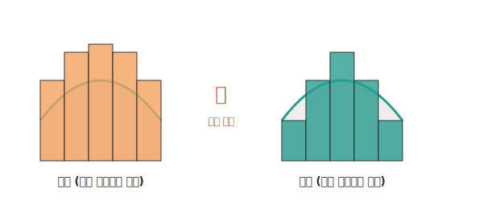

# 03. 롤러로 벽을 칠하며 깨닫는 적분 (Generalization of Area)

안녕하세요! 지난 시간에 피자 조각을 무한히 쪼개서 극한(Limit)의 원리를 맛보았죠? 
그런데 이번에는 수학적인 질문을 좀 더 현대적으로 바꿔볼게요. 위가 구불구불한 둥근 모양의 터널 벽면이 있다고 합시다. **"이 불규칙한 벽면의 넓이를 정말 정확하게(오차 0%) 구하려면 어떻게 해야 할까요?"**

오늘 우리는 독일의 천재 수학자 베른하르트 리만(Riemann)이 고안한 가장 확실한 적분법, **'리만합(Riemann Sum)'**의 뼈대와 이것이 어떻게 현대 인공지능(AI)의 오차 최적화에 연결되는지 배워보겠습니다.

---

## 1. 서론: 오차를 어떻게 줄일 수 있을까?

우리에게 주어진 무기는 **'가로가 아주 얇은 직사각형 모형 롤러'**입니다. 이 직사각형 롤러 단위로 구불구불한 벽면 위를 한 칸씩 색칠한다고 상상해 봅시다.

그런데 벽이 위아래로 곡선이니까, 윗부분이 반듯한 네모난 롤러로는 곡선 높이에 완벽하게 딱 맞춰서 색칠할 수가 없습니다. 
분명 칠이 안 되어 남는 빈틈(모자란 곳)이 생기거나, 롤러가 밖으로 삐져나오는(더 칠해진 곳) 오류가 발생하게 됩니다. 

바로 여기서 **상합(Upper sum)**과 **하합(Lower sum)**이라는 아주 똑똑한 개념이 등장합니다.

<div align="center">
  
</div>

> **(참고: 생성된 AI 아트워크)**
> 

---

## 2. 기초 개념: 넓이를 "가두어 포위"하는 극한 작전!

넓이의 '진짜 100% 정답'은 곡선이라서 한 방에 공식으로 구할 수는 없지만, 우리는 적어도 **진짜 넓이가 어떤 값들의 사이(샌드위치)에 있는지**는 확실히 알 수 있습니다.

*   **상합 (Upper sum)**: 삐져나오게 색칠하기
    *   항상 곡선의 가장 높은 점을 기준으로 사각형 윗변을 긋습니다.
    *   (삐져나온 넓이) = (진짜 넓이) + (오차 에러값)
    *   따라서 아무리 못해도 무조건 **진짜 벽면의 넓이보다 큽니다.**
*   **하합 (Lower sum)**: 모자라게(안전하게) 색칠하기
    *   항상 곡선의 가장 낮은 점을 기준으로 사각형 윗변을 긋고, 절대 곡선 밖으로 안 삐져나가게 합니다.
    *   (빈틈투성이 넓이) = (진짜 넓이) - (오차 에러값)
    *   따라서 무조건 **진짜 벽면의 넓이보다 작습니다.**

즉, **(하합) < (우리가 구해야 할 진짜 넓이) < (상합)** 이라는 포위망(범위)을 완벽하게 잡아낼 수 있죠! 

> 💡 **진짜 넓이를 구하는 마법 (극한의 재등장)**
> 롤러의 가로 폭(바닥 너비)을 $1m$ 에서 $1cm$, 그리고 수천만 분의 $1mm$인 바늘처럼 무한히 얇게 바꿔나가 봅니다. (2강에서 배운 **극한!**)
> 
> 롤러 막대가 얇아지면 얇아질수록 상합의 삐져나온 에러 넓이와 하합의 빈틈 에러 넓이가 점점 0에 가깝게 줄어들어 사라집니다(!).
> 결국, 에러가 사라지면서 상합과 하합을 포위하던 두 숫자가 **완벽하게 똑같은 하나의 숫자**로 겹치며 만나게 됩니다!
> **이 만나는 숫자가 바로 오차율 0%의 '진짜 넓이(적분값)'**가 되는 놀라운 마법입니다.

---

## 3. 컴퓨터와 AI 시대의 수학: 파이썬 최적화 (Error Minimization)

"상합과 하합처럼, 정답을 사이에 두고 극단적인 값에서 출발해 오차(Error)를 줄여나가며 정확한 정답을 타겟 포착한다!"

이 발상은 현대 인공지능(AI)과 딥러닝(Deep Learning) 기술에서 매우 핵심적인 역할을 합니다. 기계는 한 번에 공식을 외울 수 없기 때문에, 처음에 랜덤하게 에러를 만들고 그 에러를 극단적으로 점점 줄여 최적의 값(정답)에 `수렴(극한)` 시키는 방식을 씁니다. ('경사하강법' 같은 이론이 바로 이런 접근이죠.)

파이썬의 `matplotlib`을 사용하면 이 과정을 눈으로 볼 수 있도록 **막대그래프(Bar chart)**로 그릴 수 있습니다. 데이터 사이언티스트들의 핵심 무기입니다.

```python
import numpy as np
import matplotlib.pyplot as plt

# 1. 시뮬레이션 할 곡선 함수 (예: 위로 볼록한 구불구불 벽면 y = -(x-5)^2 + 25)
def f(x):
    return -(x-5)**2 + 25

x = np.linspace(0, 10, 100)
y = f(x)

# 2. 아주 넓은 폭의 롤러 '5개'로 대충 색칠했을 때 (오차가 큼)
bins = 5
# 가로 x 구간을 5개로 자른다
x_bar = np.linspace(0, 10, bins, endpoint=False)
width = 10 / bins

# 상합의 흉내: 그래프의 윗부분에 맞추기 위해 x 위치를 살짝 이동하여 막대 꼭대기 설정
y_bar_upper = f(x_bar + width/2) 

plt.figure(figsize=(8, 4))
plt.plot(x, y, 'r-', linewidth=3, label='True Curve (진짜 100% 곡선)')
plt.bar(x_bar, y_bar_upper, width=width, align='edge', color='orange', alpha=0.5, edgecolor='black', label=f'Rectangles ({bins} 조각)')

plt.title('Approximating Area with Rectangles (Riemann Sum Concept)')
plt.legend()
plt.show()

# ※ 이 모델 코드를 직접 파이썬에서 실행해보고, bins 조각 개수를 5에서 -> 50, 100, 1000 빈(bins)으로 늘려보세요!
# 막대가 징그러울 정도로 얇아질수록 바깥으로 튀어나온 톱니바퀴 에러 면적이
# 빨간색 곡선 안으로 스며들며 소름 돋게 일치해가는 것을 관찰할 수 있습니다.
```

이렇게 막대그래프를 모아 통계를 분석하는 것(히스토그램)이나 확률을 유추하는 과정 모두 결국 이 리만합의 적분 철학에 그 뿌리를 두고 있습니다. 

---

## 4. 3줄 요약 (Summary)

1. **상합과 하합으로 넓이 포위하기**: 구불구불한 곡선의 넓이는 구할 수 없으니, 튀어나오게(상합) 칠하고 모자라게(하합) 칠해 진짜 넓이의 포위 범위를 찾아낸다.
2. **극한 쪼개기로 진짜 넓이 찾기**: 칠하는 롤러 직사각형의 두께를 무한히 얇게(극한) 쪼개면 오차가 $0$에 가까워지며, 상합과 하합이 만나 압축된 '진짜 넓이(적분값)'가 도출된다.
3. **AI 시대의 영감**: "에러(오차)를 범위로 묶어 분석하고, 이를 0으로 점점 줄여나가 목표를 달성한다"는 수학적 철학은 현대 인공지능과 머신러닝의 최적화(Optimization) 알고리즘의 가장 중요한 뼈대가 되었다.

적분의 원리를 이렇게 시점을 뒤집어보니 훨씬 덜 무섭죠? 
그렇다면 다음 시간에는 수학자들이 "이 복잡한 쪼개고 합치고 극한으로 보내는 말"을 한 글자로 줄이기 위해 만들어낸 멋진 암호! `$\int$` (인테그럴) 기호를 본격적으로 해독해 보겠습니다! 
