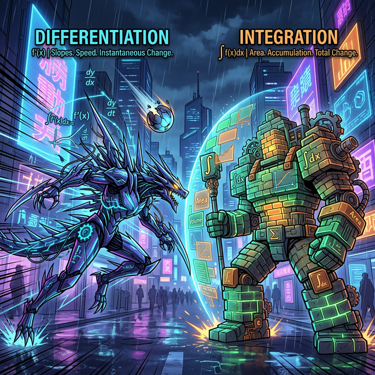
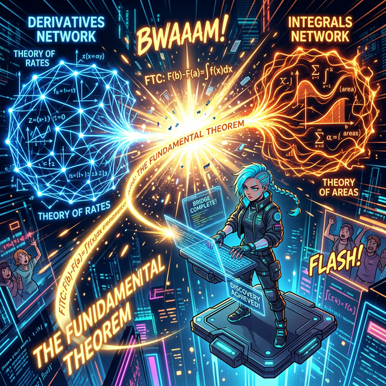

# 04. 네 번째 수업: 미적분학의 제1 기본 정리 (Fundamental Theorem)

적분(공간 넓이 구하기)은 옛날 2천 년 전 고대 이집트와 아르키메데스 시절부터 있었다고 배웠습니다. 그런데 뉴턴(Isaac Newton)과 라이프니츠(Gottfried Leibniz)가 왜 "미적분학의 공동 창시자"로 수학 역사책의 최정상 신전에 모셔져 있을까요? 

그 이유는 그 두 사람이 17세기에 인류 최악의 두 미스터리 퍼즐(순간 속도를 구하는 '미분'과 쪼개어 넓이를 구하는 '적분')이 사실상 **"동전의 양면이자 서로 완벽하게 거꾸로 된 쌍둥이 역(Inverse) 구조"** 임을 인류 역사상 최초로 발견했기 때문입니다. 이 미친 연결 고리가 바로 **"미적분학의 제1 기본 정리 (The Fundamental Theorem of Calculus)"** 입니다!

---

## 1. 전혀 다르게 생겨먹은 두 괴물

당시 수학자들은 완전히 멘붕 상태였습니다.
* **괴물 A (미분 - Differentiation):** 접선의 기울기를 재보는 행위. (위에서 무언가 떨어지는 중력 가속도, 우박이 떨어지는 순간 변동률, 롤러코스터의 수직 속도)
* **괴물 B (적분 - Integration):** 쪼개진 직사각형들을 포개서 막노동으로 채우는 면적 채우기 면적 합치기 (강물 토지 잴 때 쓰는 무식한 방법).

기울기와 면적. 
목적도, 계산하는 방법도, 공식도 전혀 안 맞고 너무 다르게 생겨 1,500년 넘게 따로 국밥처럼 놀던 분야였습니다. 그런데 이 둘이 사실 완벽한 암호 해독기라는 것을 깨닫게 됩니다. 

## 2. 미적분학의 제1 기본 정리

수학자들은 면적을 구하기 위한 함수(적분)를 만들어 이리저리 실험을 하다가 놀라운 규칙을 발명합니다. 

> $a$ 에서부터 미지의 $x$ 구간까지 구한 넓이, 즉 적분한 덩어리 함수 공식을, **아주 살짝 긁어서 쪼개기(미분)** 해버렸더니...! 믿을 수 없게도 원래 쌓아 올리기 전 장작 조각이었던 **초기 함수 곡선($f(x)$)** 모양과 완벽하게 똑같이 일치하는 결과가 튀어나왔습니다!

수식으로는 다음과 같이 무시무시하면서도 우아하게 쓰입니다.

$$ \frac{d}{dx} \left( \int_{a}^{x} f(t) dt \right) = f(x) $$

이 수식이 전 세계 이과생들의 뒤통수를 치는 "제1 기본 정리" 입니다. 저 수식 구조의 해석 로직을 프로그래머 스타일로 번역해 볼까요?
1. 괄호 안 $\int f(t) dt$ : "장작 $f(t)$를 무한히 쌓아서 **'면적 데이터'로 적분(합체)하여 인코딩(Encoding)** 하라!"
2. 바깥쪽 $\frac{d}{dx}$ : "방금 합체한 면적 덩어리를, 다시 아주 얇은 순간 변화율 슬라이스로 **미분(쪼개기)하여 디코딩(Decoding)** 해버려라!"
3. 오른쪽 $= f(x)$ : "허걱! 합쳤다가(적분) 다시 부쉈더니(미분), 놀랍게도 **오리지널 원본 데이터인 알맹이($f(x)$)** 가 보존되어 복구되어 튀어나왔어!"

## 3. 적분이라는 무식한 노가다가 해킹당하다

이 제1 기본 정리는 인간의 두뇌를 리미트 해제시켜 버린 **인류 최고의 수학적 핵(Hack) 코드**였습니다.

과거 사람들에게 곡선 아래쪽 넓이를 구하라는 문제는 한 세월이 걸리는 미친 짓(리만 합의 무한반복 계산 구역 덧셈)이었습니다. 직사각형 백만 개를 계산하다 토를 했으니까요.
하지만 뉴턴과 라이프니츠의 정리 이후, 수학계엔 혁명이 시작됩니다.

"잠깐, 미분과 적분이 동전의 반대 양면이라고??"
"그 말은, 저 지저분하고 징그러운 '적분 노가다'를 더 이상 할 필요가 없다는 말이네!"
"우리가 이미 다 알고 있는 미분(접선) 공식들을 그냥 **필름 되감기(거꾸로 역계산)** 하기만 하면 훨씬 편하고 초스피드로 단숨에 적분 면적 값을 계산할 수 있잖아?!"

이렇게 해서 이 "무한 사각형 장작 쪼개고 합치기 시뮬레이터 프로그램"은, **"단순히 미분을 반대로 되돌리기(부정적분, Antiderivative) 공식"** 으로 해킹/업그레이드되어 버립니다. 
이로 인해 미적분은 과학혁명을 이끄는 킹오브더킹으로 군림하게 됩니다. 다음 챕터에서는 필름을 되돌려 버리는 스킬, **부정적분**이 무엇인지 살펴봅시다.
