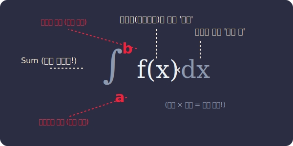

# 04. 뱀처럼 생긴 적분 기호의 암호 해독 (Integral Symbol)

이번 시간에는 고등학생 형, 누나들의 수학 노트에서 한 번쯤 봤을 법한 아주 징그럽게 생긴 기호, 
바로 **$\int$ 인테그럴(Integral)**에 얽힌 비밀을 파헤쳐보겠습니다.

"아, 기호 나오니까 이제 포기해야겠다" 라고 생각하셨나요? 전혀 그럴 필요 없습니다!
수학 기호는 외계어가 아니라 수학자들이 글씨 쓰기 귀찮아서 만든 **'효율적인 암호'이자 '명령어'일 뿐**이니까요.

---

## 1. 서론: 기호는 왜 만들어졌을까?

이전 시간까지 우리는 적분을 "아주 얇은 직사각형들을 시작점부터 끝점까지 다 더해라!!" 라고 길게 말했습니다.
만약 여러분이 수학자라면 매번 논문이나 편지에 이렇게 긴 문장으로 적분을 구구절절 설명하고 싶을까요? 

라이프니츠(Leibniz)라는 천재 수학자도 팔이 너무 아파서, 단 몇 글자만으로 이 복잡한 이야기를 완벽하게 담아낼 수 있는 '시각적 코드'를 디자인했습니다. 그것이 바로 이 무시무시해 보이는 기호 **$\int_{a}^{b} f(x) dx$** 입니다.

<div align="center">
  
</div>

> **(참고: 생성된 AI 아트워크)**
> 

---

## 2. 기초 개념: 적분 기호 완벽 해부도

자, 이 기호를 하나하나 한글로 직역해 볼까요? 당신은 지금부터 암호를 푸는 해커입니다.

1.  **$\int$ (인테그럴)**:
    *   원래 더한다는 뜻의 영어 단어 **Sum**의 첫 글자 **S**의 위아래를 잡아당겨 쭉 늘인 모양입니다.
    *   **명령어 뜻**: "지금부터 뒤에 나오는 것들을 몽땅 다 더해라!"
2.  **$f(x)$ (높이)**:
    *   그래프의 생김새, 즉 함수입니다. 
    *   사각 롤러로 칠할 때, 잘게 잘린 직사각형의 **'세로 높이'**를 상징합니다.
3.  **$dx$ (가로 폭)**:
    *   $x$축의 아주아주 얇은 틈새 간격(Difference of $x$)을 뜻합니다.
    *   잘린 막대의 **'엄청나게 얇은 가로 두께'**를 상징합니다.
>   **※ 잠깐! $f(x)$ 와 $dx$가 나란히 붙어있죠?** 
>   마치 $3 \times 4$를 $3 \cdot 4$로 쓰듯이, 사이의 곱셈기호가 생략된 것입니다.
>   즉, (세로) $\times$ (가로) 니까, 이 둘이 합쳐져 **아주 얇은 초미니 직사각형 1개의 넓이**를 의미합니다!
4.  **$a$ 와 $b$ (어디서부터 어디까지?)**:
    *   $a$: 직사각형 더하기를 시작하는 **출발선** (아래쪽 숫자) 
    *   $b$: 직사각형 더하기를 멈추는 **도착선** (위쪽 숫자)

즉 기호 $\int_{a}^{b} f(x) dx$ 의 뜻을 한 문장으로 풀면 **"a부터 b까지, (세로x가로)로 만든 아주 얇은 직사각형들을 모조리 싹 다 더해라!"** 라는 뜻이 됩니다. 정말 멋진 압축 기술이죠!

---

## 3. 전통 수학 수식과 AI 프로그래밍 (Math & Python)

현대 사회에서는 손으로 눈물을 흘리며 적분을 풀지 않습니다. 기호 $\int$의 의미만 인간이 컴퓨터에게 명확하게 입력해주면, 똑똑한 프로그래밍 언어가 수천만 개의 논리 회로를 이용해 1초도 안 돼서 답을 돌려줍니다.

이번엔 파이썬의 대표적인 수학 처리 양대 산맥인 `SymPy` (기호수학)와 `SciPy` (과학계산)의 차이를 볼까요?

### 📝 1. 수식 그대로 푸는 로봇 (SymPy의 기호 적분)
우리가 종이 위에 푸는 방식 그대로 "수학 공식의 형태"를 유지하며 답을 도출하는 녀석입니다.
```python
import sympy as sp

x = sp.Symbol('x')
fx = x**2 + 3 # 계산할 곡선 모양 (y = x^2 + 3)

# sp.integrate() 가 바로 우리가 배운 "인테그럴(∫)" 기호의 영문 명령어입니다!
result_formula = sp.integrate(fx, x)  
print(f"부정적분 수식 결과: {result_formula}")
# 출력 결과: x**3/3 + 3*x (즉, 수식의 규칙성을 완벽하게 증명해 냅니다!)

# a(0) ~ b(5) 까지 닫힌 구간 정적분 지정
result_value = sp.integrate(fx, (x, 0, 5)) 
print(f"a부터 b까지의 정적분(넓이) 값: {result_value}")
# 출력 결과: 170/3
```

### 💻 2. 오차를 분석하는 과학자의 계산기 (SciPy의 수치 적분)
데이터 과학자나 인공지능 엔지니어들은 정확한 분수 값보다는 "실제 소수로 떨어지는 값과, 그 값이 내포한 에러점수(Error)"를 봅니다.
```python
import scipy.integrate as spi

def f(x):
    return x**2 + 3

# quad 함수는 컴퓨터가 직사각형을 아주 잘게 쪼개어 실시간으로 다 더하는 행위(수치적분)를 뜻합니다
# 괄호 안의 순서: 함수 f, 시작점 a(0), 끝점 b(5). 인테그럴 암호 해독과 순서가 똑같죠?
result, error = spi.quad(f, 0, 5)

print(f"수치 적분의 넓이 결과 (소수점): {result}")
# 출력: 56.666666666666664 (170/3 과 똑같은 값을 소수로 출력합니다)
print(f"컴퓨터가 보장하는 최대 오차: {error}")
# 출력: 6.29...e-13 (즉, 0.0000000000006 만큼의 아주 미세한 오차만 존재한다는 뜻!)
```

자율주행 자동차는 무려 1초에 수십, 수백 번씩 이 `SciPy` 코드를 실행하며 자기 자동차가 센서 상에서 현재 얼마나 면적을 쓰고 이동했는지 '오차를 분석하며' 정교하게 다닙니다. 무시무시한 기호가 파이썬 명령어 1줄로 처리되다니 정말 재밌지 않나요?

---

## 4. 3줄 요약 (Summary)

1. **기호는 효율적인 디자인**: $\int$ 기호는 겁주기 위해 만든 게 아니라 "다 더하라(Sum)"는 의미를 담아 늘려 쓴 귀여운 시각화 문자다.
2. **세로와 가로의 곱**: $f(x)dx$는 무서운 수식이 아니라, 그저 직사각형의 (세로) $\times$ (가로)를 뜻하는 넓이 한 조각일 뿐이다.
3. **AI 시대의 라이브러리**: 이제 이 기호는 인간이 계산하는 도구가 아니라, Python 라이브러리의 괄호 안에 어떤 값($a, b$)과 함수($f(x)$)를 넣을지 컴퓨터에게 명령을 내리는 **지시서(명령어)의 역할**로만 쓰인다.

다음 시간에는 여기서 본 기막힌 가로 폭, 무한히 작은 $dx$가 수십 년 동안 수학자들을 괴롭혔던 "**$dx$의 딜레마 (철학적 논쟁)**"에 대해 이야기해보겠습니다!
