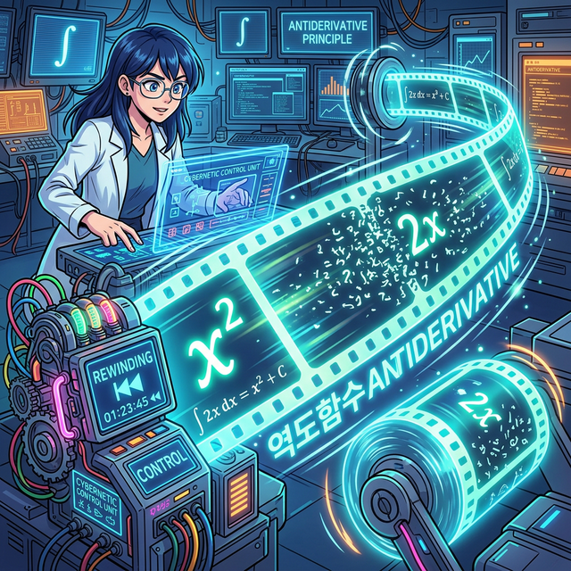

# 05. 다섯 번째 수업: 미분의 필름을 거꾸로 돌리다 (Antiderivatives)

미적분학의 제1 기본 정리를 통해, 미분(쪼개기)과 적분(합치기)이 완전히 반대 방향으로 향하는 쌍둥이 스킬이라는 점을 배웠습니다. 그렇다면 '미분(순간 기울기 구하기)' 공식만 외우면, 이 공식을 역으로 뒤집는 것만으로도 토가 쏠리게 길었던 "직사각형 넓이 합치기($\int$)" 노가다를 단 1초 만에 해치울 수 있다는 소리입니다!

---

## 1. 필름 역재생하기: "원래 함수가 뭐였지?"

프로그래밍의 해킹과 복호화(Decrypting) 기법과 비슷합니다. 어떤 해시 코드 $2x$ 덩어리가 서버 통신 중 떨어졌다고 해봅시다.
우리의 목표는 "어떤 식을 미분(잘게 부수기)했길래 파편 $2x$ 가 남았는가?" 하고 시간을 되감는(Rewind) 추리를 하는 것입니다.

과거에 외우고 피를 쏟으며 배웠던 미분 공식 표를 뇌파 스캐너로 읽어봅시다:
* $f(x) = x^2$ 를 미분($\frac{d}{dx}$) 하면? $\rightarrow$ $f'(x) = 2x$
* $f(x) = x^3$ 를 미분($\frac{d}{dx}$) 하면? $\rightarrow$ $f'(x) = 3x^2$
* $f(x) = e^x$ 를 미분($\frac{d}{dx}$) 하면? $\rightarrow$ $f'(x) = e^x$

아하! 만약 누군가가 $\int 2x dx$ (넓이의 식)를 풀라고 던져주었다면, 더이상 직사각형 100만 개를 쪼개서 `for` 문으로 더할 필요가 없게 된 겁니다. 구구단을 거꾸로 말하듯 "음, 미분해서 $2x$가 되는 원본 오리지널 함수식은... $x^2$ 이잖아!" 라고 단 1초 컷으로 해답을 역추적할 수 있습니다. 

## 2. 역도함수(Antiderivative) : $F(x)$

이렇게 미분하기 이전 상태로 **되돌아온(Anti) 원래의 덩어리 함수(Derivative)** 를 있어 보이는 말로 **역도함수(Antiderivative)** 라고 부르고, 보통 대문자 알파벳 **$F(x)$** 로 표기합니다. 

- 방금 알아낸 $F(x) = x^2$ 라는 거대한 지형 정보 역도함수를 손에 쥐게 된다면, 이것은 $2x$ 그래프 모양의 면적 데이터 전체가 압축된 '치트키 마스터키 데이터베이스 파일' 같은 존재입니다.
- 예를 들어 $1$에서 $3$ 구간까지 $2x$ 모양의 면적을 구하라! ( $\int_1^3 2x dx$ )
- 마스터키 $F(x) = x^2$ 하나에다 $x=3$ 을 집어넣고, $x=1$ 을 집어넣어서, 둘을 그냥 '빼기(Subtract)' 연산 한번 해 주면 게임이 끝납니다!
- 해설: $F(3) - F(1) = 3^2 - 1^2 = 9 - 1 = \mathbf{8}$ !  (끝) 

1초 만에 무한 직사각형을 더한 곡선 아래의 넓이 값을 도출한 것이죠. 미분의 반대 공식을 치트키 데이터베이스처럼 사용할 수 있게 된 이 역사적 순간 덕분에 인류는 계산기를 거치지 않고도 엄청나게 복잡한 방정식 면적 값을 손쉽게 구하게 됩니다.

## 3. 정보 손실이라는 치명적 버그

그런데 이 '필름 되감기' 기술에는 치명적인 버그가 하나 숨겨져 있습니다. 시간을 역재생하며(복호화하며) 어떤 정보 하나가 완벽하게 파괴되어 두 번 다시 복구되지 못하는 결함이 발생합니다.
이 정보 파괴, 미분 과정에서 흔적도 없이 증발하는 '상수'에 대한 스토리를 곧이어 파헤쳐 보겠습니다.
