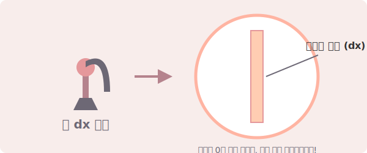

# 05. 0이라는 거야, 아니라는 거야? $dx$의 딜레마 (Dilemma of dx)

안녕하세요! 저번 시간에 살펴본 인테그럴($\int$) 암호 해독도 중에, 제일 작고 수상한 녀석이 하나 있었죠? 
바로 직사각형의 엄청나게 얇은 가로 폭이라고 했던 **$dx$** 입니다. 

적분이 발견되고 나서 무려 200년 동안, 유럽의 내로라하는 천재 수학자들은 이 $dx$ 글자 두 개 때문에 매일 서로를 원색적으로 비난하며 박 터지게 싸웠습니다. 과연 어떤 딜레마(Dilemma)가 무기였을지, 그리고 우리는 이 철학적인 문제를 21세기에 파이썬으로 어떻게 쿨하게 해결했는지 알아봅시다!

---

## 1. 서론: 반대파 수학자들의 무서운 공격

적분은 직사각형을 한없이 얇게 쪼개서 거의 '선'처럼 만든 뒤 몽땅 다 더하는 방식이라고 했었죠. 그런데 깐깐한 반대파 논리학자들이 이렇게 태클을 걸기 시작했어요.

> 😡 **깐깐한 수학자**: "야! 직사각형의 가로 폭($dx$)을 한없이 쪼갠다며? 우주 끝까지 얇게 쪼개면 결국 두께가 완전히 0(Zero)인 선(Line)이 된다는 거잖아! 
> 폭이 완전 0인 선을 백날 천날 더해봤자 **$0 + 0 + 0 = 0$** 이지, 어떻게 그게 넓이를 가지는 네모난 덩어리가 되냐? 너네 엉터리지?!" 

순간 멈칫하게 되죠? 사실 **선(Line)**은 두께가 완벽하게 무(無), 즉 $0$입니다. 도화지 위에 그은 연필 선도 현미경으로 보면 흑연 덩어리의 너비가 있으니 진짜 수학적인 선이 아닙니다. 두께가 0인 선을 아무리 겹치고 모아도 찰흙처럼 부피가 덩어리 지는 일은 논리적으로 영원히 불가능합니다. 

그렇다면 적분은 폭이 0인 선들을 모아서 억지로 기적의 넓이를 만들어냈다는 사기극일까요?

<div align="center">
  
</div>

> **(참고: 생성된 AI 아트워크)**
> 

---

## 2. 기초 개념: 0에 "가까워지는 것"과 완전한 "0"은 완전히 다르다

여기서 수학의 아주 중요한 개념이 등장합니다. 적분에서 $dx$의 진짜 정체는 **'절대 0(Zero)이 아닙니다!'** 

1. **완벽한 선 0 (Zero)**: 폭이 진짜로 $0$. 백만 개, 1조 개를 더해도 결과는 0입니다. 넓이는 영원히 나오지 않습니다. (수학적 오류)
2. **0에 한없이 가까워지는 상태 $dx$**: 우리가 2강에서 배운 위대한 극한(Limit)의 재등장입니다. 폭이 $0.00000001$ 이든, 소수점 아래 0이 수천 개 붙든 **어쨌든 폭은 존재합니다.** 단지 우리의 눈과 상상력의 한계 너머로 우주 끝까지 작아지는 중일 뿐이죠.

적분에서 $dx$는 "폭이 0이 되어 선이 되었다"는 뜻이 아닙니다.
오버를 조금 보태서, $dx$는 "여러분 눈에는 선처럼 보이지? 사실은 **아무튼 넓이를 가진, 내 지갑 속 동전보다 얇은 초미니 1원짜리 직사각형($dx > 0$)**이야!" 라는 뜻입니다.

이 미세한 직사각형들이 가진 초미니 넓이들을 티끌 모아 태산으로 무한히 끌어모았기 때문에, 결과값이 절대 $0$이 나오지 않고 "진짜 벽의 넓이(적분값)"가 탄생할 수 있었던 것입니다. 

---

## 3. 전통 수학 수식과 AI 프로그래밍 (Math & Python)

이 철학적인 수백 년 치 논란이 현대 컴퓨터 공학과 프로그래머들에게는 아주 쉽게, 그것도 치명적으로 중요한 **'해상도(Resolution)'**의 문제로 와닿습니다.

### 📝 1. 극한 공식을 통한 논란의 종결 (SymPy 극한)
수학자 코시(Cauchy)와 바이어슈트라스는 $dx$가 0이 아니라 "0으로 수렴하는 극한 상태"임을 입증하여 논란을 종결시켰습니다.
$dx \to 0$ 이라는 기호의 의미죠.

```python
import sympy as sp

# 1. 기호 설정 (가로 폭 dx)
dx = sp.Symbol('dx')

# 2. 극한 수식 (폭 dx가 0에 무한히 가까워질 때 어떻게 되느냐?)
# 주의: limit(dx, 0)은 0이 "된다"는게 아니라 0을 향해 "달려간다"는 극한 함수입니다.
limit_dx = sp.limit(dx, dx, 0)

print(f"dx가 0으로 갈 때의 극한값: {limit_dx} (하지만 0이 된 것은 아닙니다!)")
```

### 💻 2. 인공지능 엔지니어의 해상도 최적화 (Numpy 배열 분할)
디지털 세상(스마트폰 모니터나 카메라 센서)은 모든 물체를 작은 네모(픽셀, Pixel)의 조각들로 쪼개어 보여줍니다. 여기서 **가장 작은 픽셀 1개의 크기가 바로 컴퓨터 세상의 $dx$** 입니다!

* 픽셀 크기 $dx$가 매우 큼 $\rightarrow$ 깍두기 모양 계단 현상 발생, 오차가 극심함 (마인크래프트 게임 화질)
* 픽셀 크기 $dx$가 미치도록 한없이 작아짐 $\rightarrow$ 우리 눈의 한계를 넘어 완벽하게 매끄러운 곡선 사진으로 보임! (오차 0%)

프로그래밍에서 카메라 데이터를 분석하거나 무인 드론을 띄울 때, 이 $dx$ 값을 컴퓨터 램(RAM)의 한도가 허락하는 내에서 '가능한 한 가장 작은 값'으로 설정하여 미적분 연산을 실행합니다. 자, 컴퓨터가 $dx$ 크기(해상도)에 따라 오차를 어떻게 극복하는지 볼까요?

```python
import numpy as np

# 1. 진짜 곡선 넓이 정답이 33.333333... 인 어떤 넓이를 가정합시다
true_area = 100 / 3 

# 2. 컴퓨터의 데이터 쪼개기 해상도(dx) 테스트
# 해상도 1 (마인크래프트 수준 큰 조각)
dx_large = 1.0  
x_large = np.arange(0, 10, dx_large) # 0부터 10까지 1.0 간격으로 자름
area_large = np.sum( (x_large**2) * dx_large ) # 가로 * 세로 넓이 전부 더함

# 해상도 2 (4K 모니터 수준의 촘촘한 초소형 조각, dx가 거의 0에 수렴)
dx_small = 0.0001
x_small = np.arange(0, 10, dx_small) # 0부터 10까지 0.0001 간격으로 엄청 자름
area_small = np.sum( (x_small**2) * dx_small )

# 오차율 확인
error_large = abs(true_area - area_large)
error_small = abs(true_area - area_small)

print(f"dx가 {dx_large}일 때 (저화질): 에러가 꽤 큼! (결과: {area_large})")
print(f"dx가 {dx_small}일 때 (고화질): 에러가 거의 0에 수렴! (결과: {area_small:.5f})")
print("=> 즉, dx는 0이 되는 게 아니라 해상도를 높여주는 한없이 촘촘한 '조각' 크기다!")
```
이처럼 $dx$는 그냥 0이라고 무시해 버릴 녀석이 아니라, AI의 얼굴 인식 정확도를 결정짓는 "데이터 해상도의 퀄리티 값"으로 취급받고 있습니다!

---

## 4. 3줄 요약 (Summary)

1. **선들의 합인가요?**: 사각형의 가로 폭을 한없이 쪼갠다고 해서 두께가 완벽히 0 인 선(Line)이 되는 것은 아니다. 만약 폭이 0이면 백만 개를 합쳐도 넓이는 평생 0이다.
2. **파괴적 한 끗 차이 ($0$ vs 극한)**: $dx$는 값이 무(0)가 아니라, 우주에서 가장 작은 크기를 향해 멈추지 않고 **작아지고 있는 '상태'이자 아무튼 뚱뚱함을 가진 '미니 직사각형'**의 얇은 두께다.
3. **AI 시대의 모니터 해상도**: 이 철학적 말장난 같던 개념은 현대에 들어와 해상도의 픽셀(Pixel) 크기나 컴퓨터 알고리즘의 "오차 정확성"을 조절하는 실용적인 손잡이(Parameter)로 위상을 떨치고 있다.

자, 수백 년간 이어져 온 $dx$ 에 대한 억울한 오해가 드디어 파이썬과 함께 풀렸죠?
이제 이렇게 배운 완벽한 적분기호를 십자가 모양의 좌표 평면에 올렸을 때 컴퓨터 시스템에 생기는 어이없는 버그(?) 하나를 구경해 보겠습니다. 다음 강의에서 봬요!
