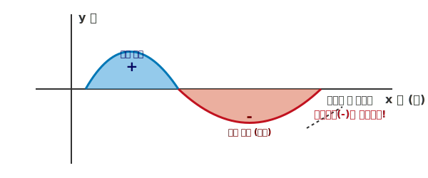

# 06. 앗! 적분을 했더니 마이너스 넓이가 나왔다? (Integral and Area)

안녕하세요! 지난 시간에 $\int_{a}^{b} f(x) dx$ 라는 멋진 기호도 배우고, $dx$의 해상도 철학도 배웠습니다.
어떤 학생이 아주 넓은 공원의 잔디밭 넓이를 구하기 위해 배운 대로 파이썬 공식을 돌려 보았습니다.

그런데 결과값 창에... **"-625 제곱미터(?!)"** 라는 값이 떴습니다. 
"네? 공원이 지하로 꺼져 있는 건가요? 넓이에 어떻게 마이너스(-)가 붙을 수 있죠?"

우리가 맹신했던 적분 계산기는 왜 이런 오류를 뱉어낸 걸까요? 오늘 그 원인과 해결 코드를 살펴봅시다.

---

## 1. 서론: 좌표평면의 기계적이고 무서운 진실

적분을 하기 위해서는 도형을 좌표계(십자가 모양의 $x$축, $y$축 평면) 위에 올려놓아야 합니다. 

공원 잔디밭의 시작점을 왼쪽, 끝점을 오른쪽에 두고 아주 잘 올려놓았지만, 이 학생이 한 가지 치명적인 실수를 했습니다. 바로 **곡선(함수 그래프)의 일부가 중간에 $x$축(땅바닥) 아래로 잠수해 버렸다**는 사실을 눈치채지 못한 것입니다! 

<div align="center">
  
</div>

> **(참고: 생성된 AI 아트워크)**
> 

---

## 2. 기초 개념: 넓이가 마이너스가 된 이유 (상쇄, Cancel-Out)

문제의 원인은 바로 인테그럴 수식 내부의 뼈대인 $f(x) \times dx$ 에 있습니다.
* $dx$: 오른쪽으로 이동하니까 가로 폭은 **언제나 양수(+)**
* $f(x)$: 세로 높이, 즉 그래프의 $y$좌표값. 만약 땅바닥 밑으로 파고들면 **마이너스(음수, -)**가 됩니다! 

즉, (가로 폭 $+ 1$) $\times$ (지하 깊이 세로 $- 5$) 를 했으니 직사각형 하나의 넓이가 $-5$라는 음수 값이 되는 것이죠. 이것을 좌우 범위 합쳐버리면 지상의 넓이(+)와 지하의 넓이(-)가 엉켜서 뺄셈이 되어버리는 대참사가 일어납니다.

> 💡 **해결책 (수학의 절댓값 꺾어 올리기)**
> 진짜 잔디밭의 넓이를 구하려면 지하에 있는 데이터의 부호를 **강제로 플러스(+)**로 꺾어 올려줍시다.
> 수학 기호로는 위아래로 선을 긋는 **절댓값 기호 $|f(x)|$**를 사용합니다. 
> 수식: $\int_{a}^{b} |f(x)| dx$

---

## 3. 전통 수학 수식과 AI 프로그래밍 (Math & Python)

이 현상은 데이터를 다루는 컴퓨터 머신러닝이나 빅데이터 통계학에서 로봇의 행동을 짤 때 너무나도 흔하게 터지는 버그의 원인이며 해결 원리도 완벽하게 동일합니다.

### 📝 1. 수식으로 절댓값 정적분 풀기 (SymPy의 Abs)
교과서에서는 구간을 두 번 나눠서 $\int_{지상}$ 구하고 $\int_{지하}$ 구해서 마이너스 곱해서 붙이는 귀찮은 방식을 쓰죠?
파이썬은 그냥 **`abs` (Absolute)** 한 방으로 알아서 수식을 계산합니다.

```python
import sympy as sp

x = sp.Symbol('x')
# 위아래로 출렁이는 뱀 모양의 곡선 함수 (y = x 세제곱)
fx = x**3

# x가 -2부터 2까지인 구간 (음수 구역과 양수 구역이 완전히 대칭됨)
# 1. 깡통 적분 (단순히 x^3을 -2부터 2까지 그냥 싹 다 더해버림)
wrong_result = sp.integrate(fx, (x, -2, 2))
print(f"단순 깡통 적분의 결과: {wrong_result}") 
# 출력 결과: 0 (위 아래 넓이가 서로 상쇄되어 0 제곱미터라는 어이없는 결과가 나옴!)

# 2. 진짜 넓이 (절댓값 abs 기호를 씌워 땅 위로 뒤집어 올려서 적분)
true_result = sp.integrate(sp.Abs(fx), (x, -2, 2))
print(f"절댓값을 씌운 진짜 잔디밭 넓이: {true_result}")
# 출력 결과: 8 (완벽한 양수 넓이가 도출됨)
```

### 💻 2. 인공지능 엔지니어의 로봇 데이터 전처리 (NumPy 차트)
머신러닝(빅데이터 분석 모델) 분야에서는 이 절댓값을 왜 중요하게 여길까요? 바로 로봇이나 주식 그래프의 **'이동 폭'**을 계산해야 하기 때문입니다.

로봇 청소기가 거실을 앞으로 $5m$ 가고, 다시 후진해서 뒤로 $5m$를 원상복귀 했다고 해볼까요?
* 무식한 단순 적분(합): $+5$ 와 $-5$ 가 상쇄되어 결과는 $0$. (배터리가 하나도 안 닳았다고 예측하는 치명적 에러 발생)
* 데이터 전처리 절댓값 넓이: $5$ 와 $|-5|$ 가 더해져 **진짜 이동한 면적 $10$**이 됨. (배터리 소모를 정확히 계산)

파이썬의 `numpy.abs`를 이용해서 데이터 배열을 어떻게 처리하는지 살펴봅시다.

```python
import numpy as np
import matplotlib.pyplot as plt

# 로봇의 속도 변화 데이터 (1초마다 측정: 전진, 후진 혼재)
drone_velocity = np.array([10, 15, -20, -10, 5]) # 마이너스는 후진!

# 1. 로봇의 '순간 위치 변화량 (Displacement)' (단순 적분 = 다 합치기)
final_position = np.sum(drone_velocity)
print(f"로봇은 시동을 켠 곳에서 {final_position}m 거리에 서 있습니다. (상쇄됨)")
# 출력: 0m (제자리)

# 2. 로봇의 '실제 이동 곡선의 넓이 (Total Distance)' (절댓값 적분)
# 모든 속도에 대해 np.abs()를 씌어 절대 다 양수로 만들어 전처리합니다!
total_distance = np.sum(np.abs(drone_velocity))
print(f"로봇 드론의 바퀴가 움직인 실제 체력(넓이): {total_distance}m")
# 출력: 60m (기름값 계산 완벽!)
```

---

## 4. 3줄 요약 (Summary)

1. **기계의 융통성 제로**: 적분 $\int f(x)dx$ 공식 자체는 $x$축 밑으로 내려가면 넓이도 음수(-)로 만들어 버려 지상의 넓이와 뺄셈(상쇄, Cancel-out)을 시키는 함정이 있다.
2. **x축 기준 절댓값 꺾어 올리기**: 잔디밭의 진짜 넓이를 구하려면 $f(x)$에 절댓값 기호 $|f(x)|$ 또는 파이썬 `Abs()` 함수를 씌워 음수 값을 전부 양수로 전환한 뒤 면적을 휩쓸어야 한다.
3. **AI 데이터 분석의 기초**: 적분 값이 혼재되어 상쇄되는 현상은 딥러닝 손실(Loss) 오차 계산이나 드론 센서 데이터(자율주행)에서 배터리 한도 측정 등에서 매우 중요하게 처리해야 하는 기초 버그 수정 작업이다.

자, 이제 수학적 오류도 회피하는 프로그래버의 마인드를 배웠습니다! 다음번 **마지막 시간**에는 머리를 식히며, 오솔길의 삐딱한 모양에 절대 속지 않는 시각 마술 같은 **"카발리에리의 원리"**를 끝으로 멋지게 1부 적분 여행의 마침표를 찍어볼게요!
