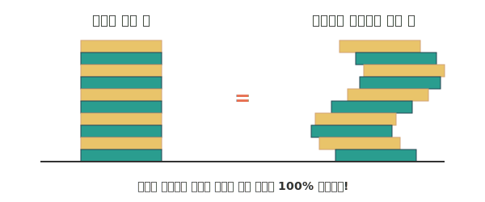

# 07. 층층이 쌓은 카드의 마술, 카발리에리의 원리 (Cavalieri's Principle)

안녕하세요! 어느덧 길고도 흥미로웠던 1부 적분 여행의 대미를 장식할 마지막 수업, 7강에 도착했습니다.

이번 시간에는 복잡한 수식과 기호($\int$)는 잠시 잊고, 상상 비틀기 마술 같은 원리를 하나 살펴볼게요. 
이 원리는 카발리에리가 400여 년 전에 고안한 고전 이론이지만, 신기하게도 오늘날 3D 애니메이션 렌더링 스튜디오나 최신식 병원 의료 AI의 뼈대가 되는 핵심 논리이기도 합니다.

---

## 1. 서론: 구부러진 길 vs 반듯한 길

어느 도시에 두 개의 산책 도로가 있습니다. 하나는 대각선으로 쭉 뻗은 반듯한 도로이고, 다른 하나는 뱀처럼 S자로 구불구불하게 나 있는 도로입니다. 
아, 한 가지 조건이 있습니다. **그 도로 어딜 가로로 토막 내든 간에, 도로의 폭(너비)은 언제나 딱 1m로 일정**합니다. 

질문! **어느 도로의 전체 면적이 더 넓을까요? (어디에 페인트를 더 많이 부어야 할까요?)**

십중팔구 "당연히 구불구불한 쪽이 요리조리 피하느라 길이가 더 길어지니까 코스 면적도 잡아먹었겠죠!"라고 생각하게 됩니다. 
하지만 정답은: **"놀랍게도 두 도로의 페인트 양(면적)은 완벽하게 같다!"** 입니다. 이게 대체 어떻게 가능한 걸까요?

---

## 2. 기초 개념: 트럼프 카드를 비스듬히 무너뜨려도 부피는 같다

답답함을 날려버릴 명쾌한 비유를 들어봅시다. 아주 두꺼운 새 트럼프 카드 세트 50장이 책상 위에 반듯한 직육면체 모양으로 쌓여 있습니다.
이제 여러분이 손가락으로 카드의 옆면을 쓱~ 밀어서 이탈리아의 피사의 사탑처럼 약간 기우뚱하게, 혹은 아예 S자로 미끄러뜨려 놓았습니다.

<div align="center">
  
</div>

> **(참고: 생성된 AI 아트워크)**
> 

자, 여기서 직관적인 깨달음이 하나 오죠?
모양은 삐딱해졌지만, 카드의 총 개수나 플라스틱의 **전체 부피가 우주로 증발하며 변했을까요?**
당연히 아니죠! 카드 낱장을 중간에 슬쩍 빼거나 추가한 적이 없으니까요!

> 🪄 **카발리에리의 마술 (원리)**
> "같은 높이(구간)에 있는 두 입체도형(또는 평면도형)이 있습니다. 만약 이것을 어떤 위치에서 가로로 쓱쓱 평행하게 밀어서 잘랐을 때, 그 **단면의 넓이(잘린 폭의 크기)가 언제나 똑같다면**, 원래 두 덩어리의 **총 부피(전체 넓이)는 무조건 똑같다!**"

시작할 때 도로 면적 문제의 힌트 기억나시나요? 
어디를 가로로 잘라도 폭이 1m로 똑같다고 했죠. 폭이 1m인 카드 낱장들을 옆으로 이리저리 미끄러뜨려 구불구불하게 쌓았을 뿐이니, 결국 똑같은 페인트의 양이 필요한 것입니다.

---

## 3. 전통 수학 수식과 AI 프로그래밍 (Math & Python)

이 놀라운 슬라이스(Slice, 단면) 합치기의 원리는, 카드가 아니라 3D 데이터라는 이름으로 **현대 최첨단 의료 및 렌더링 장비**에서 그대로 사용됩니다.

우리의 몸을 직접 잘라내지 않고 폐나 뇌의 부피, 종양의 크기를 머신러닝 AI가 어떻게 그토록 정확하게 측정할까요? 병원의 **CT(컴퓨터 단층 촬영기)**나 **MRI 장비**를 떠올려보세요.

### 💻 인공지능 엔지니어의 3D 신체 부피 계산 (Python MRI 스캔 시뮬레이션)
1. MRI 장비가 사람의 몸을 일정한 얇은 두께($dx$) 단위로 사진 수십 장(Slice)을 찍어냅니다. 
2. 인공지능이 무수히 찍힌 각 사진(2D 픽셀)의 넓이들을 `Numpy` 배열 연산으로 싹 다 계산해서 적분($\int$, Sum)으로 몽땅 합쳐버립니다.
3. 그러면 몸속의 복잡한 3D 장기 부피가 카발리에리 원리에 의해 탄생하는 것이죠!

```python
import numpy as np

# MRI 원리를 흉내 낸 부피(Volume) 구하기 파이썬 코드!
# 뇌 종양의 2D 평면 스캔 단면 사진 데이터가 10장 있다고 가정합니다.

# 카발리에리 1원칙: 높이(잘린 단면의 두께, dx)가 항상 일정해야 한다!
slice_thickness_dx = 0.5  # MRI 한 장의 두께: 0.5 cm

# 인공지능이 10장의 2D 사진을 스캔해서 넓이(Area)들을 컴퓨터 배열 형태로 추출해냈다!
area_slices = np.array([1.2, 2.5, 3.8, 5.0, 5.5, 5.1, 4.0, 2.8, 1.4, 0.5]) # 단위: cm^2

# 3D 부피를 계산하는 적분(Integral) 마법!
# 전체 부피 = 단면의 넓이(f(x)) * 두께(dx) 들을 각각 곱해서 몽땅 Sum !
# np.sum() 함수가 수학의 인테그럴(∫) 역할을 대신해 줍니다. 
total_tumor_volume = np.sum(area_slices * slice_thickness_dx)

print(f"카발리에리 적분법을 통해 알아낸 우리 몸속 종양의 3D 부피: {total_tumor_volume} cc(cm^3)")
# 출력 결과: 카발리에리 적분법을 통해 알아낸 우리 몸속 종양의 3D 부피: 15.9 cc(cm^3)
```

이것을 역으로 생각하면, 거대한 3D 컴퓨터 설계도를 2D 단면 카드 슬라이스로 엄청나게 잘게 자른 뒤, 기계가 이 도면(얇은 층) 1장 1장을 차곡차곡 쌓아 올리면서 진짜 입체 물건을 뽑아내는 기술이 바로 **3D 프린터** 인 것입니다!

---

## 4. 3줄 요약 (Summary)

1. **착시에 속지 마세요**: 우리는 구부러지거나 삐딱해진 모양을 볼 때 넓이나 부피가 다를 것이라고 착각라기 쉽다. 수학의 잣대(카드 폭)를 들이대자!
2. **카발리에리의 원리**: 어떤 덩어리를 층층이 잘랐을 때 모든 단면적의 크기가 유지된다면, 탑을 어떻게 어슷하게 밀쳐놓든 간에 전체 "총 부피"는 완벽하게 동일하다.
3. **적분과 카발리에리의 꽃, MRI & 3D**: 얇은 2차원(2D, Slice) 데이터를 무한히 쌓아서 전체의 3차원(3D, Volume) 부피를 구현해 내는 이 방식은 현대 의료 CT 장비와 3D 모델링/프린터 분야의 핵심 설계도로 활약하고 있다.

자, 이로써 파이썬과 시각화 그래픽이 함께 한 <대망의 1부 적분 특강>이 모두 끝이 났습니다! 
이집트 파라오 시대 강둑 구석에서 태어나 한낱 땅 넓이 재기 편법으로 출발한 기술이 이제 4차 산업혁명의 스페이스X, 3D 프린터, 암세포 데이터 분석기까지 돌리는 것을 보셨나요? 이래서 우리가 적분을 '수학의 심장', 파이썬의 핵심 뼈대라고 부르는 것이랍니다.

재미있었길 바라며, 나중에 2부 미적분학에서 기회가 되면 다시 뵙기를 바랄게요! 안녕!
