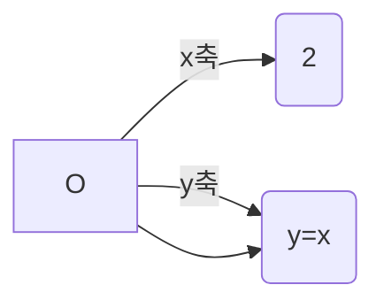

<!-- page: 009.jpg -->
## 차례

추천사 박경미(홍익대학교 수학교육과 교수 | 《수학콘서트》 저자) 
책머리에
길라잡이
리만을 소개합니다

### 1 첫 번째 수업
적분이란 무엇인가?

### 2 두 번째 수업
적분의 원리

### 3 세 번째 수업
넓이 구하기의 일반화 시도

### 4 네 번째 수업
적분 기호 $\int_{a}^{b} f(x)dx$

  

<!-- page: 010.jpg -->
### 5 다섯 번째 수업
$dx$의 딜레마 - 더하는 것은 선분인가, 직사각형인가?

### 6 여섯 번째 수업
적분과 넓이

### 7 일곱 번째 수업
카발리에리의 원리

  

<!-- page: 011.jpg -->
## 길라잡이

### 1 이 책은 달라요

《리만이 들려주는 적분 1 이야기》는 적분의 탄생 과정에 얽힌 역사적 사실을 함께 담고 있습니다. 역사적 사실과 배경을 통해 400년 전 적분학의 탄생에는 단순히 번뜩이는 한 수학자의 천재성이 아니라 2000년이라는 긴 역사 속 수많은 수학자들의 노력이 있었음을 보여 줌으로써, 수학을 거부감 없이 바라볼 수 있도록 구성하였습니다.

적분의 필요성과 적분 기호 속에 담겨 있는 적분의 의미를 설명하여, 적분이 갖는 의미와 적분하는 과정을 알 수 있도록 하였습니다.

### 2 이런 점이 좋아요

1 초등학생에게는 ‘적분’ 하면 매우 어려운 수학 주제라고 알고 있지만, 실은 도형의 내부 넓이를 구하려는 소박한 열망에서 시작되었습니다. 수학자들이 단순히 하늘에서 영감을 받아 그들만의 학문을 만든 것이 아니라, 생활 속에 필요한 수학적 풀이법 중 하나로 적분이 등장했음을 보여 줌으로써,

  

<!-- page: 012.jpg -->
수학을 바라보는 시각을 긍정적으로 변화시킬 수 있습니다.

2 초·중학생에게는 수학 이론 중 가장 유명한 미분·적분학을 소개하여 고등학교 교과 과정의 일면을 엿볼 수 있게 했습니다. 나아가 적분을 선행 학습하는 기회가 됩니다.

3 고등학생에게는 적분의 탄생 과정을 역사적으로 살펴볼 수 있는 기회가 되어 함수와 그래프에 대한 활용 능력을 키우고 나아가 수학이 발전해 온 과정을 이해함으로써 수학에 대한 거부감을 줄일 수 있게 했습니다. 특히 미분과 연계하여 정리하지 않았기 때문에 미분을 모르더라도 적분의 기초와 그 의미를 학습할 수 있도록 하였습니다.

4 학교에서 적분을 배우는 순서와는 다른 접근 방법으로 적분을 다루었기 때문에 이공계를 진학하려는 고등학생은 적분이 갖고 있는 의미를 새롭게 학습할 수 있습니다. 단순한 계산 이면에 숨어 있는 적분의 본질과 의미를 깨우칠 수 있어 교과 학습에 흥미를 가지게 됩니다.

  

<!-- page: 013.jpg -->
### 3 교과 과정과의 연계

| 구분     | 단계  | 단원                    | 연계되는 수학적 개념과 내용              |
| -------- | ----- | ----------------------- | ---------------------------------------- |
| 초등학교 | 1-가  | 양의 비교               | '길다, 짧다', '많다, 적다', '크다, 작다' |
|          | 2-가  | 기본적인 평면도형       | 선분, 직선, 삼각형, 사각형, 원의 이해    |
|          | 4-가  | 삼각형                  | 삼각형의 내각, 여러 가지 삼각형          |
|          | 4-나  | 사각형과 도형 만들기    | 여러 가지 사각형                         |
|          | 5-가  | 평면도형의 둘레와 넓이  | 도형의 넓이                              |
|          | 5-나  | 넓이와 무게             | 여러 가지 도형의 넓이                    |
|          | 6-나  | 원주율과 원의 넓이      | 원주, 원주율, 원의 넓이                  |
|          | 6-나  | 규칙과 대응             | 두 수의 대응 관계                        |
| 중학교   | 7-가  | 문자의 사용과 식의 계산 | 문자를 사용하여 간결한 식 만들기         |
|          | 7-가  | 함수와 그 그래프        | 함수의 개념, 그래프                      |
|          | 7-나  | 도형의 길이, 넓이, 부피 | 원주율 $\pi$                             |
|          | 8-가  | 일차함수와 그 그래프    | 일차함수의 뜻과 그래프 그리기            |
| 고등학교 | 10-나 | 평면좌표, 직선의 방정식 | 문자를 사용하여 간결한 식 만들기         |
|          | 10-나 | 함수                    | 함수의 뜻과 그 그래프                    |
|          | 수1   | 무한수열의 극한         | 극한의 뜻, 무한등비급수                  |
|          | 수2   | 다항함수의 적분법       | 정적분, 구분구적법                       |

### 4 수업 소개

**첫 번째 수업_적물이란 무엇인가?**
적분의 간단한 의미 파악과 함께 도형의 넓이를 구하는 방법에 대해 알아봅

  

<!-- page: 014.jpg -->
니다.

* **선행 학습**
  * **넓이 단위 $m^2$**: 한 변의 길이가 $1\text{m}$인 정사각형의 넓이는 $1\text{m}^2$입니다.
* **공부 방법**: 도형의 넓이를 구하는 방법을 학습하면서, 넓이를 구할 수 있는 도형에는 어떤 것들이 있는지를 이해합니다.
* **관련 교과 단원 및 내용**
  * 5-가 평면도형의 둘레와 넓이

**두 번째 수업_적분의 원리**
원의 넓이를 구하는 아이디어를 소개하면서 적분의 원리를 살펴봅니다.

* **선행 학습**
  * **원에 내접하는 정육각형**: 원 위에 6개의 꼭지점이 위치하는 정육각형을 말합니다.
  * **원에 외접하는 정육각형**: 6개의 변이 원의 접선이 되는 정육각형을 말합니다.
  * **문자식**: 문자를 사용하여 나타낸 식을 말합니다.
  * **꺾은선그래프**: 시간에 따른 수량의 변화 상태를 나타낼 때 이용되며 특히 기온, 시간 등에 대응하는 값의 변화를 살펴보는 데 적합한 자료의 표현 방식 중 하나입니다.
* **공부 방법**: 원의 넓이를 구하는 과정을 직접 손으로 적어 보고, 선생님이

  

<!-- page: 015.jpg -->
알려 주는 대로 실험해 봅니다.

* **관련 교과 단원 및 내용**
  * 4-가 여러 가지 삼각형, 삼각형의 내각의 크기
  * 4-나 여러 가지 사각형
  * 6-나 원주율과 원의 넓이
  * 7-가 문자의 사용과 식의 계산
  * 두뇌 속 사고 실험을 통하여 사물의 변화를 유추할 수 있는 능력을 키웁니다.

**세 번째 수업_넓이 구하기의 일반화 시도**
직사각형을 이용해 도형의 넓이를 구하는 방법을 배웁니다.

* **선행 학습**
  * **무한급수**: 수를 무한하게 더하는 것을 말합니다. 이 값은 무한히 커질 수도 있고, 또 그 값을 알지 못할 때도 있으며, 어떤 특정한 수가 되기도 합니다.
* **공부 방법**: 철수와 영희의 활동을 주의 깊게 따라가면서 도형의 넓이를 적분의 아이디어로 구하는 원리를 이해합니다.
* **관련 교과 단원 및 내용**
  * 수1 무한급수
  * 수2 다항함수의 적분법, 구분구적법

  

<!-- page: 016.jpg -->
**네 번째 수업_적분 기호 $\int_{a}^{b} f(x) dx$**
$x$축과 그래프 사이의 넓이를 구하는 적분의 원리를 직각삼각형의 넓이를 구하는 예를 통해 공부합니다.

* **선행 학습**
  * **좌표평면**: 점에 고유 좌표값을 매길 수 있도록 한 평면
  * **함수**: 하나의 값이 변할 때, 그에 따라 다른 값도 변하는 관계
  * **그래프**: 함수의 모든 값들을 좌표평면에 표시했을 때 만들어지는 도형
  * **일차함수**: 그래프가 직선으로 나타나는 함수 ex) $y = ax + b$
* **공부 방법**: 리만 선생님의 설명을 따라가면서 적분을 공부합니다. 특히 적분기호 속에 숨겨진 수학적 의미를 보물찾기 하듯 하나하나 분해한다고 생각하면 좋겠습니다.
* **관련 교과 단원 및 내용**
  * 수2 다항함수의 적분법, 구분구적법
  * 함수를 그래프를 통하여 이해하는 능력을 키울 수 있습니다.

**다섯 번째 수업_$dx$의 딜레마**
**더하는 것은 선분인가, 직사각형인가?**
최초 적분의 아이디어에서 등장하는 여러 문제점과 수학자들의 고민들을 소개하고 이를 극복하는 과정을 살펴봅니다.

  

<!-- page: 017.jpg -->
* **선행 학습**
  * **타원**: 두 점에 이르는 거리의 합이 일정한 점들을 이은 도형을 말합니다.
  * **닮음**: 모양을 바꾸지 않고 확대 또는 축소한 도형 사이의 관계를 말합니다. 일반적으로 어떤 도형을 일정 비율로 확대 또는 축소한 도형은 서로 닮은 도형이 됩니다. 이때, 확대 또는 축소하는 데 사용된 일정 비율을 **닮음비**라고 합니다.
  * **닮음의 응용**: 두 닮은 도형의 닮음비가 $a : b$이면 두 도형의 넓이의 비는 $a^2 : b^2$입니다.
  * **중점 연결 정리**: 삼각형의 두 변의 중점을 연결한 선분은 나머지 변과 평행하고, 그 길이는 나머지 변의 길이의 $\frac{1}{2}$입니다.
* **공부 방법**: 선생님의 설명을 따라가면서 학습합니다.
* **관련 교과 단원 및 내용**
  * 수2 다항함수의 적분법, 구분구적법

**여섯 번째 수업_적분과 넓이**
좌표평면 위에 그려진 도형의 위치에 따라 적분값이 넓이가 되지 않는 경우도 있습니다.

* **공부 방법**: 철수와 영희가 고민하는 문제를 선생님의 설명을 따라가면서 풀어 갑니다.
* **관련 교과 단원 및 내용**

  

<!-- page: 018.jpg -->
* 수2 다항함수의 적분법

**일곱 번째 수업_카발리에리의 원리**
적분의 원리 중 하나인 카발리에리의 원리를 배우고 그 쓰임새에 대하여 알아봅니다.

* **선행 학습**
  * **평행**: 평면 위에 놓인 두 직선이 서로 만나지 않을 때, 두 직선을 서로 '평행'하다고 합니다. 그리고 평행인 두 직선을 부를 때 '평행선'이라고 합니다.
* **공부 방법**: 리만 선생님의 친구가 고민하는 문제를 선생님의 설명을 따라가면서 이해합니다.
* **관련 교과 단원 및 내용**
  * 5-나 넓이와 무게