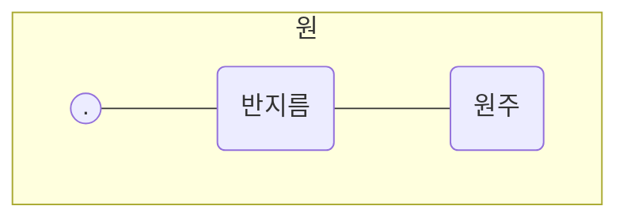

<!-- page: 048.jpg -->
## 2 두 번째 수업

# 적분의 원리

> (그림: 원의 중심과 반지름을 나타내는 곡선을 모티브로 한 귀여운 캐릭터들 그림)

원을 만드는 곡선은 원의 중심에서
모두 같은 거리만큼 떨어져 있습니다.

이 거리를 '반지름'이라고 합니다.

  

<!-- page: 049.jpg -->
### 두 번째 학습목표

**1** 원의 넓이 구하는 공식을 알아봅니다.
**2** 원의 넓이를 구하는 아이디어를 이해합니다.

---

### 미리 알면 좋아요

**1** 원에 내접하는 정육각형
원 위에 6개의 꼭짓점이 위치하는 정육각형을 말합니다.

**2** 원에 외접하는 정육각형
6개의 변이 원의 접선이 되는 정육각형을 말합니다.

**3** 문자식
문자를 사용하여 나타낸 식을 말합니다.

**4** 꺾은선그래프
수량의 시간적 변화 상태를 나타낼 때 이용되며, 특히 기온, 시간
등에 대응하는 값의 변화를 살펴보는 데 적합한 자료의 표현 방식 중 하나입니다.

  

<!-- page: 050.jpg -->
## 리만이 두 번째 수업을 시작했다

첫 시간은 어땠나요? 어렵진 않았나요? 적분 이야기는 하지 않았
지만 적분의 시작이 도형의 넓이 측정이었기 때문에 학교에서 배우
는 다각형의 넓이 계산을 다뤘습니다. 이번 시간부터는 곡선으로 둘
러싸인 도형의 넓이를 구해 보기로 하지요.

수학자들은 곡선으로 된 도형의 넓이를 계산하기 시작합니다. 대

  

<!-- page: 051.jpg -->
충 어림잡아 계산한 근사값으로는 자존심이 허락지 않았던 것이지
요. 이러한 그들의 노력은 몇몇 곡선도형의 넓이 계산에서 놀라운 성
과를 냅니다. 특히 2500년 전의 그리스 시대에 살았던 수학자들은 원, 타원, 포물선의 넓이 계산을 해 냅니다. 물론 정확한 값은 아니었지만 당시에
는 매우 혁명적인 근사값이었습니다.

> **포물선** 물체를 던졌을 때 그 물체가 나아가면서 그려내는 궤적을 이은 곡선

곡선으로 둘러싸인 도형 중 가장 대표적이고 익숙한 도형이 무엇
인가요? 맞아요, 원입니다. 고등학교 과정에서나 배울 수 있다는 적
분을 초등학교 과정에서도 만날 수 있습니다. 언제냐고요? 바로 원의
넓이를 구할 때입니다. 단지 적분이라는 말을 하지 않았을 뿐입니다.

원은 매우 아름다운 도형입니다. 어디서 보아도 대칭입니다. 여럿
이 모여 먹는 음식은 서로 싸우지 말라고 주로 원으로 만듭니다. 케
이크나 피자 등이 대표적이죠. 그리고 등분, 즉 같은 모양, 같은 넓이
가 되도록 최대한 원의 중심을 지나도록 잘라서 나누어 먹습니다. 물
론 싸우기도 하는데요, 싸움의 원인은 등분하지 않은 자르기의 능력
부족이기도 하지만 보통은 음식을 나누는 사람의 욕심 때문이지요.

원을 만드는 곡선은 원의 내부의 한 점, 즉 우리가 '원의 중심'이라

  

<!-- page: 052.jpg -->
> (그림: 피자나 케이크를 공평하게 나누는 것에 대한 3컷 만화)
> 1. 와아! 맛있는 케이크다. / 내가 공평하게 나눌게.
> 2. 공평하게 한 조각씩이지? 냠냠. (한 조각이 엄청 큼)
> 3. 뭐가 공평해? / 크기가 같아야지. (결국 싸움)

고 하는 점에서 모두 같은 거리만큼 떨어져 있습니다. 이 거리를 반지
름이라고 합니다. 그리고 원의 둘레의 길이를 원주라고 합니다.

  

<!-- page: 053.jpg -->
$$ \text{원주} = 2 \times (\text{반지름}) \times (\text{원주율}) $$

원의 지름과 원주 사이에는 항상 일정한 비율이 유지된다는 걸 알
게 된 고대 수학자들은 이 비율을 원주율이라고 이름 붙이고 그리스
문자로 '$\pi$(파이)'라는 기호를 달아 주었습니다. 원
주율의 값은 $3.14$로 배우지만 이 값은 근사값으로
정확한 값은 아닙니다. 원주와 원주율에 대한 자세한 이야기가 궁금
하면 《수학자가 들려주는 수학 이야기》 시리즈 《원 이야기》를 읽어

> **원주율 $\pi$** 원의 지름과 원주 사이의 비율

> (그림: 지름이 1인 동전이 굴러갔을 때 원주의 길이가 3.14배가 됨을 보여주는 만화 형태의 그림)
> 지름과 원주 사이의 비율 = 3.14

  

<!-- page: 054.jpg -->
보세요.

원의 넓이를 구하기 전에 우리가 옳다고 인정할 수 있는 몇 가지 사
실을 되짚고 가겠습니다.

첫째, 도형의 내부는 여러 개의 작은 조각으로 분리할 수 있습니다.
둘째, 도형의 넓이는 여러 개의 분리된 조각들의 넓이를 모두 합한
값과 같습니다.

이 사실들은 다각형의 넓이를 구하기 위해 다각
형의 내부를 여러 개의 삼각형들로 분리한 후 그
것들의 넓이를 모두 합해 원래 도형의 넓이를 구
하는 방법에서 이미 배웠습니다.

> **다각형** 세 개 이상의 선분으로 둘러싸인 평면도형. 꼭짓점의 개수에 따라 삼각형, 사각형 등으로 불리며, 특히 선분의 길이와 내각의 크기가 모두 같은 다각형을 정다각형이라고 한다.

자, 본격적으로 원의 넓이를 구해 보겠습니다. 계산은 원을 여러 개
의 똑같은 조각으로 등분하는 것부터 시작합니다.

우선 원을 6등분합니다. 그리고 6등분하는 데 사용한 3개의 지름이
원과 만나는 6개의 점을 꼭짓점으로 하는 정육각형을 그립니다. 그리
고 3개의 지름을 연장한 선에 꼭짓점이 오도록 다음과 같이 외접하는
정육각형을 그립니다. 다음 페이지의 오른쪽 그림은 여섯 조각 중 한
조각을 확대한 그림입니다.

  

<!-- page: 055.jpg -->
> (그림: 원과 정육각형)
> 원 안에 꽉 맞게 그려진 선이 **내접**, 원 밖에 꽉 맞게 그려진 선이 **외접**

> **외접** 도형이 다른 도형과 접할 때, 바깥쪽에서 접하는 것
> **내접** 도형이 다른 도형과 접할 때, 안쪽에서 접하는 것
> **원호** 원주상의 두 점 사이의 부분

원의 넓이는 외접한 정육각형의 넓이보다는 작지
만, 내접한 정육각형의 넓이보다는 큽니다. 위 그림
에서 원호는 내접하는 정다각형의 바깥쪽에, 외접
하는 정다각형의 안쪽에 위치함을 알 수 있습니다.

> **내접한 정육각형의 넓이 < 원의 넓이 < 외접한 정육각형의 넓이**

이 책에서는 정육각형의 넓이를 직접 구하지 않겠습니다. 하지만 여
러분이 삼각비를 공부한다면 구할 수 있습니다. 대신 다음의 그림처럼
6등분된 조각을 서로 엇갈리게 돌려 맞추어 놓습니다. 왼쪽은 내접한
정육각형 조각을 모은 그림이고, 오른쪽은 외접한 정육각형 조각을 모

  

<!-- page: 056.jpg -->
> (그림: 6개의 조각을 엇갈려 놓아 평행사변형을 만든 모습)
> - 왼쪽 그림(내접): 아래쪽 변의 길이는 '내접 정육각형의 둘레의 반', 빗변은 '반지름'
> - 오른쪽 그림(외접): 아래쪽 변의 길이는 '외접 정육각형의 둘레의 반', 높이가 '반지름'

은 그림입니다. 조각 삼각형은 이등변삼각형입니다. 두 변의 길이가
같은 삼각형이지요.

> **평행사변형** 마주 보는 두 변이 서로 평행한 사변형. 혹은 마주 보는 두 변의 길이가 같은 사각형

배열을 달리하니 평행사변형이 되는군요. 이 평
행사변형의 넓이는 왼쪽의 6개의 삼각형을 나열
한 넓이를 합한 값과 같습니다. 그리고 분명 오른쪽의 평행사변형이
왼쪽보다 큽니다. 따라서 앞에서 주어진 세 도형의 넓이 사이의 부등
호 관계는 여전히 유효합니다.

이제 원을 12등분해 보겠습니다. 내접하는 정십이각형을 만드는 과
정은 의외로 쉽습니다. 내접하는 정육각형에 이웃하는 두 꼭짓점 사
이의 원호 정중앙을 새 꼭짓점으로 하면 쉽게 만들어집니다. 그리고
내접하는 정십이각형의 마주 보는 꼭짓점을 이어서 만든 6개의 지름

> (그림: 12등분 조각 그림의 일부)

  

<!-- page: 057.jpg -->
을 연장한 선에 꼭짓점이 오도록 외접하는 정십이각형을 만듭니다.
그런 다음 위와 동일한 방법으로 12개의 조각을 엇갈려 배열합니다.

여기서 주목할 것은 원의 넓이가 아니라 삼각형들의 넓이의 합, 즉
내 · 외접한 정다각형의 넓이 전체입니다. 그리고 넓이의 값 자체가
아니라 평행사변형의 크기와 모양입니다. 앞에서 살펴본 정육각형으
로 만든 평행사변형과 정십이각형으로 만든 평행사변형의 크기와 모
양은 어떻게 다른가요?

모양은 여전히 평행사변형이지만 점점 세로 변이 서 있는 느낌이
들지요? 달리 말하면 전과 비교해서 직사각형 모양으로 변하고 있다
는 것입니다.

다음으로 넓이를 볼까요? 내접한 정다각형의 넓이는 점점 커집니
다. 반면에 외접한 정다각형의 넓이는 작아집니다. 그리고 두 정다각
형의 넓이 차이 또한 점점 작아지고 있습니다. 언뜻 보면 같은 크기
처럼 보이는군요. 이를 부등호로 표현하면 다음과 같습니다.

> **내접한 정육각형의 넓이 < 내접한 정십이각형의 넓이 < 원의 넓이 < 외접한 정십이각형의 넓이 < 외접한 정육각형의 넓이**

  

<!-- page: 058.jpg -->
표현이 너무 길어지니까 약간의 약속을 하려 합니다.

앞으로 $I_6$을 내접한 정육각형의 넓이라고 쓰겠습니다. 그리고 $O_6$을
외접한 정육각형의 넓이라고 하겠습니다. 그럼 $I_{12}$는 어떤 약속일까
요? 네, 내접한 정십이각형의 넓이입니다. 마지막으로 원의 넓이는 $S$
라고 쓰겠습니다.

그럼 이렇게 간단히 표현할 수 있겠군요.

$$ I_6 < I_{12} < S < O_{12} < O_6 $$

긴 한글 표현을 기호로 쓰니까 길이가 확 줄었죠? 이것이 문자식의
위력입니다. 처음 약속만 확실히 하면 시간과 물자를 효율적으로 절
약할 수 있답니다.

한 번 더 잘게 등분해서 내 · 외접하는 정이십사각형의 도형을 만
들고 역시 위와 같은 방법으로 배열하겠습니다.

> (그림: 24개의 조각을 엇갈려 놓아 평행사변형을 만든 모습. 점점 더 직사각형에 가까워짐)

  

<!-- page: 059.jpg -->
외견상으로는 두 평행사변형 사이에 크기 차이를 별로 느낄 수 없
을 정도입니다. 하지만 분명한 것은 오른쪽 평행사변형의 넓이가 더
크다는 것이고, 그 사이에 원의 넓이가 존재한다는 것입니다. 또한
평행사변형의 모양은 이제 직사각형에 더욱 가까워진 모양입니다.
부등호로 넓이를 비교하면 다음과 같습니다.

$$ I_6 < I_{12} < I_{24} < S < O_{24} < O_{12} < O_6 $$

아래 그림은 정구십육각형을 이용하여 만든 평행사변형입니다. 이
제 둘의 넓이는 거의 같습니다. 그리고 그 모양 또한 직사각형이라 해
도 큰 무리가 없어 보입니다. 확대하면 여전히 크기가 다르지만 두
넓이의 차는 훨씬(!) 작아졌습니다.

> (그림: 96등분 조각 그림)
> - 왼쪽 그림(내접 정구십육각형): 가로 길이가 '내접 정구십육각형의 둘레의 반'
> - 오른쪽 그림(외접 정구십육각형): 기로 길이가 '외접 정구십육각형의 둘레의 반', 세로 길이가 '반지름'

$$ I_6 < I_{12} < I_{24} < I_{48} < I_{96} < S < O_{96} < O_{48} < O_{24} < O_{12} < O_6 $$

  

<!-- page: 060.jpg -->
다음은 반지름이 10인 원의 내 · 외접한 정다각형을 쪼개서 나온
삼각형의 크기와 그 밑각을 정다각형의 변화에 따라 계산한 표와 정
다각형의 넓이 변화 추이를 나타낸 꺾은선그래프입니다.

| 정다각형     | 밑각    | 내접하는 삼각형 |      | 외접하는 삼각형 |       | 정다각형의 넓이 |               |           |
| :----------- | :------ | :-------------- | :--- | :-------------- | :---- | :-------------- | :------------ | :-------- |
|              |         | 밑변            | 높이 | 밑변            | 높이  | 내접 정다각형   | 외접 정다각형 | 넓이의 차 |
| 정육각형     | 60°     | 10.00           | 8.66 | 11.55           | 10.00 | 259.81          | 346.41        | 86.60     |
| 정십이각형   | 75°     | 5.18            | 9.66 | 5.36            | 10.00 | 300.00          | 321.54        | 21.54     |
| 정이십사각형 | 82.5°   | 2.61            | 9.91 | 2.63            | 10.00 | 310.58          | 315.97        | 5.39      |
| 정사십팔각형 | 86.25°  | 1.31            | 9.98 | 1.31            | 10.00 | 313.26          | 314.61        | 1.35      |
| 정구십육각형 | 88.125° | 0.65            | 9.99 | 0.65            | 10.00 | 313.94          | 314.27        | 0.33      |

> (그림: 정다각형의 꼭짓점 수 증가에 따른 내접/외접 정다각형의 넓이 변화를 보여주는 꺾은선 그래프)
> 가로축: 정육각형, 정십이각형, 정이십사각형, 정사십팔각형, 정구십육각형
> 세로축: 넓이 (250 ~ 350)
> 내접 정다각형의 넓이는 점점 증가하고, 외접 정다각형의 넓이는 점점 감소하여 두 그래프가 수렴하는 형태를 보임

  

<!-- page: 061.jpg -->
> **이제, 제가 무엇을 말하고 싶어 하는지 눈치 챘나요?**

정다각형의 꼭짓점이 많아짐에 따라 발생하는 변화에 대한 우리의
추측을 정리해 볼까요?

첫째, 삼각형의 밑각은 점점 $90^\circ$가 될 것입니다.

둘째, 조각 삼각형들을 모아서 만든 평행사변형의 두 가로의 길이
는 원둘레의 길이와 점점 같아질 것입니다.

셋째, 평행사변형은 점점 직사각형이 될 것입니다.

마지막으로, 넓이의 차는 거의 0에 가까워질 것입니다. 그리고 두
정다각형의 넓이 사이에 원의 넓이가 존재하므로 원의 넓이는 결국
각각의 정다각형의 넓이와 같아질 것입니다.

이 추측들은 손으로 정다각형을 그리는 것만으로는 확인이 불가능
합니다. 앞에서 구십육각형을 그리는데도, 삼각형 모양이 거의 선분
처럼 되어 버렸으니까요.

그래서 이번에는 실험실을 옮기겠습니다.

지금부터가 중요합니다. 이제 우리는 눈으로 볼 수 없는 실험을 할
것입니다. 오로지 여러분의 머릿속이 실험실이 되어 상상 실험을 해

  

<!-- page: 062.jpg -->
야 합니다.

이제 원에 여러분이 생각하고 있는 가장 큰 자연수보다 더 많은 꼭
짓점을 가지는 정다각형을 그리세요. 그리고 아까처럼 무수히 많은
삼각형 조각을 엇갈리게 배열하세요. 그러면 삼각형의 한 각은 거의
$0^\circ$와 같은 값을 가져서 그 모양은 직선이 되어 버릴 것입니다.

또한 내접한 정다각형의 넓이와 외접한 정다각형의 넓이는 차이가
없을 정도로 거의 같아집니다.

조각 삼각형을 모아서 만든 평행사변형은 네 각이 $90^\circ$인 평행사변
형이 됩니다. 여러분의 상상이 올바르게 진행되었다면 여러분만의
실험실에서 만들어진 도형은 다음과 같을 것입니다.

> (그림: 가로가 '원둘레의 반', 세로가 '반지름'인 완벽한 직사각형)

위의 직사각형이 실험의 결과물입니다. 실험실에서 무엇을 보고
있나요? 내접한 정다각형의 넓이는 외접한 정다각형의 넓이와 같습
니다. 그리고 두 넓이 사이에 원의 넓이가 있습니다. 따라서 세 도형

  

<!-- page: 063.jpg -->
> (만화: 피자 모양에 따른 넓이 비교)
> 1. 우아! 피자다! 잠깐!
> 2. 동그란 피자랑 네모난 피자가 있네. 왜?
> 3. 동그란 피자랑 네모난 피자 중 어느 쪽이 더 양이 많을까? 글쎄? 우리가 배운 적분을 이용하면 돼. 모르겠는데...
> 4. 쓱싹! 쓱싹! 파바박!! (동그란 피자를 잘게 잘라 네모나게 만듦) 동그란 피자랑 네모난 피자랑 크기가 거의 똑같네. 하지만 손때가 덕지덕지 묻은 걸 어떻게 먹어?
> 5. 그럼 내가 희생하지. 왠지 또 속은 것 같아.

의 넓이는 모두 같아집니다. 결국 원의 넓이 구하기는 직사각형의 넓
이 구하기로 변환되었습니다. 우리는 원의 넓이를 구하는 과정을 정
다각형의 넓이를 구하는 것으로 변환한 것입니다.

그러면 이 직사각형의 세로의 길이는 무엇일까요? 바로 원의 반지

  

<!-- page: 064.jpg -->
름입니다. 가로의 길이는 무엇일까요? 직사각형의 가로는 부채꼴의
호이니까 위아래 두 가로의 길이의 합은 바로 원주가 됩니다.

따라서 가로의 길이는 $\frac{1}{2} \times (\text{원주}) = \frac{1}{2} \times 2 \times (\text{반지름}) \times (\text{원주율})$이므
로, 직사각형의 넓이는 $(\text{반지름}) \times \{(\text{반지름}) \times (\text{원주율})\}$이 됩니다. 이
값이 곧 원의 넓이입니다. 원의 넓이 구하는 공식이 만들어졌군요.
이때 첨자 2는 '제곱'이라는 수학 기호입니다.

> **원의 넓이 = (반지름) $\times$ { (반지름) $\times$ (원주율) }**
>              **= (원주율) $\times$ (반지름)$^2$**

원의 넓이를 구하는 과정은 식이 없을 뿐 적분의 처음과 끝을 자세
하게 보여 주는 좋은 예입니다. 처음에 우리가 적분의 한자 뜻이 '나
눈 부분을 모으는 행위'라고 했지요? 적분은 넓이를 구하려는 도형
의 내부를 극히 미세한 도형, 하지만 넓이를 계산할 수 있는 도형으
로 나눈 후, 나눈 도형의 넓이를 모두 합하여 원래 도형의 넓이를 구
하는 과정입니다. 넓이를 직접 계산할 수 없는 원의 넓이를 계산하는
대신 넓이 계산이 가능한 정다각형의 넓이를 계산한 후 몽땅 더한 값

  

<!-- page: 065.jpg -->
으로 우회하여 넓이를 구하는 방식이 바로 적분의 원리입니다.

적분의 아이디어는 부분을 합하여 전체를 계산하는 단순한 생각에
서 시작됩니다. 하지만 우리가 적분을 어려워하는 이유는 그것을 직
접 풀어 계산하는 것이 아니라 머릿속으로만 하는 상상의 행위이기
때문입니다. 게다가 적분 과정에는 이해할 수 없는 사실들이 숨어 있
습니다.

위에서 설명했던 원의 넓이 구하는 과정을 다시 살펴보겠습니다.
우리는 마지막 과정에서 무수히 많은 삼각형의 재배열된 모양을 직사
각형으로 여겼습니다. 하지만 실제로는 결코 직사각형이 될 수 없습
니다. 곡선은 여전히 곡선이며 내각의 크기 또한 결코 직각이 되지 않
습니다. 하지만 우리는 직사각형으로 원의 넓이를 계산했습니다. 만
일 원과 직사각형의 넓이가 같아진다는 것을 곧바로 이해했다면 여러
분은 이미 고등수학을 접했거나 매우 뛰어난 수학적 재능을 가진 것
입니다.

이 적분 원리를 처음으로 생각해 낸 사람은 안티폰으로 알려져 있
지만, 실제로 원의 넓이를 계산했다고 기록된 수학자는 아르키메데

  

<!-- page: 066.jpg -->
스입니다. 아르키메데스는 정구십육각형의 넓이를 계산하여 원의 넓
이를 최대한 참값에 가깝게 계산하였습니다. 그는 반지름이 1인 원의
넓이를 소수점 둘째 자리까지 정확하게 계산했습니다. 사실 반지름
이 1인 원의 넓이는 원주율 파이($\pi$)입니다. 파이는
$3.141592\dots$로 소수점 아래의 숫자가 멈추지 않고
끝없이 계속되는 무한소수입니다.

> **무한소수**
> 소수점 이하의 숫자가 0이 아닌 숫자로 무한히 계속되는 소수

그러나 그 작업은 실제로 이루어진 실험이 아니었기 때문에 정당
성을 얻기까지 많은 시간이 흘러야 했습니다. 방법이 워낙 독특해서
많은 의문을 낳았고 그것들은 아르키메데스의 실험 이후 2000년 동
안이나 해결되지 못했습니다. 여기에 그 의문들을 정리해 보면 다음
과 같습니다.

첫째, 눈에 보이는 세 개의 도형, 그러니까 원과 원에 내접하는 다
각형 그리고 외접하는 다각형 모두 넓이가 같아질 수 있는지 의문이
다. 아무리 꼭지점이 많다 해도 여전히 그 넓이는 달라 보인다.

둘째, 무한히 많은 꼭지점을 가진 정다각형을 조각내서 만든 평행
사변형이 직사각형으로 변신하려면 삼각형이 더 이상 세 각을 가지
는 도형이라는 삼각형의 본질을 잃어버리는 결과가 되고 만다. 그럴

  

<!-- page: 067.jpg -->
> (만화: 0의 합계 및 넓이에 대한 토론)
> 여학생: 선분의 넓이는 0이야.
> 남학생: 그럼 $0+0+0+0+0+0+0$은 뭐지?
> 여학생: 0은 아무리 더해도 0이야!
> 남학생: 그래? (칠판에 곡선 형태의 면적을 그림) 그럼 이 도형의 넓이도 0이야?
> 여학생: 어~ 0을 계속 더하면 0이 아닌 건가?

경우 한 각의 크기가 $0^\circ$가 되어야 하는데, 이 경우 삼각형이 아니라
선분이라고 불러야 하기 때문이다. 선분의 넓이는 0이라고 배웠는데
어떻게 0인 넓이를 갖는 선분을 더해 넓이가 있는 직사각형이 되는지
의문이다. 0을 아무리 무한 번 더해도 그 값은 역시 0이 아닌가? 우
리가 배우고 있는 덧셈은 무한 번 더하는 행위에서는 성립하지 않는
것인가?

혹시 여러분도 이런 의문이 생겼다면 박수!! 저와의 수업이 잘 이뤄

  

<!-- page: 068.jpg -->
졌다는 증거입니다. 여러분의 의문은 아르키메데스도, 미적분의 창시
자인 뉴턴과 라이프니츠도 조리 있게 증명해 해결하진 못했습니다.

아르키메데스는 정다각형의 꼭짓점을 무한히 늘림으로써 원의 넓
이를 구할 수 있음을 증명했습니다. 하지만 우리가 지닌 의문을 명확
한 논리로 논증하지는 못했습니다. 그 이유는 아르키메데스의 수학
실력이 떨어져서였다기보다 당시의 수학 수준이 낮아서였다고 보는
게 옳습니다. 그리스 시대에는 우리가 머릿속 실험실에서 했던 모든
작업을 부질없는 것으로 생각했습니다. 눈에 보이지 않는 계산은 무
의미하다는 게 그 이유였죠.

적분은 도형의 넓이를 구하려는 인간의 소박한 희망에서 탄생했지
만, 그 내면에 숨겨져 있는 수학적 아이디어의 무결성 검증은 약간
고차원적인 수학 지식과 혁신적인 사물의 관찰력이 필요했습니다.

다음 시간에는 넓이의 계산에서 나왔던 의문들을 해결하면서, 제
가 적분을 어떻게 정형화했는지에 대해 공부하겠습니다.

  

<!-- page: 069.jpg -->
# 두 번째 수업 정리

### 1 원의 넓이를 구하는 원리와 과정

원에 내접하는 정다각형의 넓이는 항상 원 넓이보다 작다. 또 원에
외접하는 정다각형의 넓이는 항상 원 넓이보다 크다.

하지만 정다각형의 꼭짓점이 많아질수록 내ㆍ외접하는 두 정다각
형의 넓이는 점점 근접해진다. 결국 우리의 상상 속에서 꼭짓점을
무한히 늘린다면 두 정다각형의 넓이는 같아질 것이고 원의 넓이
도 각각의 두 정다각형의 넓이와 같아진다.

### 2. 원의 넓이 공식

$$ \text{원의 넓이} = (\text{반지름}) \times \{(\text{반지름}) \times (\text{원주율})\} $$
$$ = (\text{원주율}) \times (\text{반지름})^2 $$

> (만화 캐릭터: 두 번째 수업의 내용을 골똘히 생각하는 소년 리만)