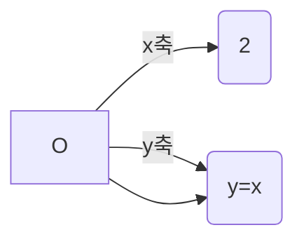

수학을 바라보는 시각을 긍정적으로 변화시킬 수 있습니다.

2 초·중학생에게는 수학 이론 중 가장 유명한 미분·적분학을 소개하여 고등학교 교과 과정의 일면을 엿볼 수 있게 했습니다. 나아가 적분을 선행 학습하는 기회가 됩니다.

3 고등학생에게는 적분의 탄생 과정을 역사적으로 살펴볼 수 있는 기회가 되어 함수와 그래프에 대한 활용 능력을 키우고 나아가 수학이 발전해 온 과정을 이해함으로써 수학에 대한 거부감을 줄일 수 있게 했습니다. 특히 미분과 연계하여 정리하지 않았기 때문에 미분을 모르더라도 적분의 기초와 그 의미를 학습할 수 있도록 하였습니다.

4 학교에서 적분을 배우는 순서와는 다른 접근 방법으로 적분을 다루었기 때문에 이공계를 진학하려는 고등학생은 적분이 갖고 있는 의미를 새롭게 학습할 수 있습니다. 단순한 계산 이면에 숨어 있는 적분의 본질과 의미를 깨우칠 수 있어 교과 학습에 흥미를 가지게 됩니다.

