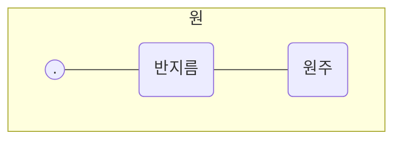

> (그림: 피자나 케이크를 공평하게 나누는 것에 대한 3컷 만화)
> 1. 와아! 맛있는 케이크다. / 내가 공평하게 나눌게.
> 2. 공평하게 한 조각씩이지? 냠냠. (한 조각이 엄청 큼)
> 3. 뭐가 공평해? / 크기가 같아야지. (결국 싸움)

고 하는 점에서 모두 같은 거리만큼 떨어져 있습니다. 이 거리를 반지
름이라고 합니다. 그리고 원의 둘레의 길이를 원주라고 합니다.

