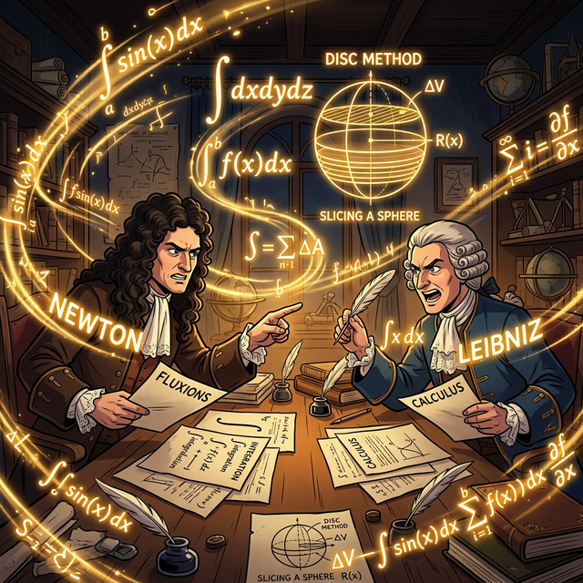

# 수학이야기 83.적분2 (Integration 2)

적분 1부에서 우리는 무한히 작은 직사각형 장작들을 쌓아 올려 넓이를 구하는 기초 공사(Riemann Sum)와, 미분의 필름을 되감는 기적의 공식(제1 기본 정리)을 배웠습니다.

이제 적분은 단순한 1차원 선 아래의 면적을 구하는 수준을 넘어서게 됩니다.
공중에 떠 있는 **두 개의 곡선이 교차하며 만드는 미지의 영토 넓이**를 구하고, 사과나 도넛을 종잇장처럼 얇게 썰어 올려 **3차원 입체의 부피**를 계산하며, 지구 중력을 뚫고 올라가는 우주선 로켓의 **물리적인 노동량(Work)**까지 계산하는 '통합의 마법'의 끝판왕 기술들을 만나봅시다.

  

---

## 목차

- [00. 인트로: 스킬 트리를 융합하다 (Intro)](00_intro.md)
- [01. 첫 번째 수업: 허공에 뜬 영토, 두 곡선 사이의 넓이 (Area Between)](01_area_between_curves.md)
- [02. 두 번째 수업: 3D 프린터처럼 쌓아 올리는 입체의 부피 (Volumes)](02_volumes_of_solids.md)
- [03. 세 번째 수업: 물리학과 노동의 결실 (Work and Force)](03_work_and_force.md)
- [04. 네 번째 수업: 껍데기를 바꿔치기하는 치환적분법 (Substitution)](04_integration_by_substitution.md)
- [05. 다섯 번째 수업: 곱의 미분을 역설계하는 부분적분법 (By Parts)](05_integration_by_parts.md)
- [06. 여섯 번째 수업: 무한 우주의 끝까지 넓이 구하기 (Improper Integrals)](06_improper_integrals.md)
- [07. 일곱 번째 수업: 코드로 그리는 인공지능 속 확률의 넓이 (CS & Probabilities)](07_cs_applications.md)
