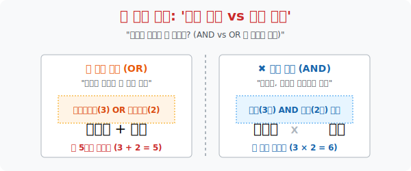

# 1. 분기점과 미로의 설계: '합의 법칙과 곱의 법칙'

## [도입부] 학습 목표 (Learning Objectives)
- 수많은 경우의 수(모든 가능성의 지점) 를 탐색할 때, 두 사건이 절대 만날 수 없는 평행선인지(OR), 아니면 꼬리를 물고 이어지는 연속극인지(AND) 를 판단하여 덧셈과 곱셈을 구별하는 스킬을 배웁니다.
- '동시' 라는 물리적 시간의 개념이 아니라, '영향력을 미치는가' 에 따른 독립성과 연속성의 수학적 번역 과정을 **'합의 법칙'** 과 **'곱의 법칙'** 으로 압축해 냅니다.
- 파이썬(Python)의 중첩 반복문(`For loop`) 을 활용하여 곱의 법칙이 만들어 내는 방대한 경우의 수 폭발(트리 구조) 을 컴퓨터의 연산력으로 1초 만에 직접 출력해 봅니다.

---

## 1. 인생의 분기점: 더할 것인가, 곱할 것인가?

우리는 매일 '경우의 수' 라는 미로를 걷고 있습니다. 식당에 갔을 때, 옷을 고를 때, 비밀번호를 누를 때 우리는 무의식적으로 머릿속에서 가지치기(트리 구조) 를 합니다.
이 가지치기의 절대 원칙은 딱 두 가지, 더하기($+$) 와 곱하기($\times$) 입니다.

**[상황 1] 합의 법칙 (Rule of Sum) $\rightarrow$ "A 이거나 B (OR)"**
* **상황**: 뷔페에 갔는데 엄마가 "디저트는 딱 1개만 골라!" 라고 하십니다. 케이크 코너에는 3종류, 아이스크림 코너에는 2종류가 있습니다.
* **로직**: 나는 케이크를 고르면서 '동시에' 아이스크림을 고를 수 없습니다. 하나의 행동이 끝(End) 임을 의미합니다. 
* **해커의 계산**: 3가지 + 2가지 = **총 5가지** 선택지

**[상황 2] 곱의 법칙 (Rule of Product) $\rightarrow$ "A 이고 B (AND)"**
* **상황**: 아침에 외출하려고 옷장을 열었습니다. 상의가 3벌, 하의가 2벌 있습니다.
* **로직**: 상의 하나를 입었다고 외출 준비가 끝나는 게 아닙니다. 바지도 입어야 합니다! 상의를 입는 사건에 '연이어서(동시에)' 하의를 입는 사건이 발생합니다.
* **해커의 계산**: 빨간 셔츠를 입었을 때 바지 2개, 파란 셔츠일 때 바지 2개, 검은 셔츠일 때 바지 2개 $\rightarrow$ $3 \times 2$ = **총 6가지** 코디

> **"두 사건이 절대 겹칠 수 없고 독립적으로 끝난다면 더하라! 하나의 사건 뒤에 꼬리를 물고 다음 선택이 강요된다면 곱하라!"**



<br>

## 2. 💻 파이썬(Python)의 `For` 루프와 곱의 법칙

수학책의 '곱의 법칙'은 사실 컴퓨터 프로그래밍의 핵심인 **'중첩 반복문 (Nested Loop)'** 과 완전히 똑같은 구조입니다. 상의 1개에 하의 2개가 매칭되는 과정은 파이썬이 데이터를 순회하는 방식 그 자체입니다.

### 🐍 파이썬 예제: 옷장 코디 생성기 (곱의 법칙 시뮬레이션)

```python
print("--- 👔 패션 코디 AI 생성기 (곱의 법칙) 가동 ---")

# 상의(Top) 3종류와 하의(Bottom) 2종류 데이터 배열
tops = ['빨간 셔츠', '파란 셔츠', '검은 셔츠']
bottoms = ['청바지', '면바지']

print(f" [DB 로드] 상의: {len(tops)}벌 / 하의: {len(bottoms)}벌")
print("-" * 50)

# 코디 경우의 수 저장용 카운터
combination_count = 0

# 곱의 법칙의 프로그래밍적 구현: 이중 for 루프 (Nested Loop)
# 첫 번째 루프(상의) 가 1번 돌 때, 두 번째 루프(하의) 가 2번 돕니다.
for top_item in tops:
    for bottom_item in bottoms:
        combination_count += 1
        print(f" 👖 [코디 {combination_count:02d}번] {top_item} + {bottom_item}")

print("-" * 50)
print(f" ✅ [연산 종료] 수학적 곱의 법칙 ({len(tops)} x {len(bottoms)}) 에 따라,")
print(f"    총 '{combination_count}' 가지의 착장 경우의 수가 도출되었습니다!")

# 결과창:
# --- 👔 패션 코디 AI 생성기 (곱의 법칙) 가동 ---
#  [DB 로드] 상의: 3벌 / 하의: 2벌
# --------------------------------------------------
#  👖 [코디 01번] 빨간 셔츠 + 청바지
#  👖 [코디 02번] 빨간 셔츠 + 면바지
#  👖 [코디 03번] 파란 셔츠 + 청바지
#  👖 [코디 04번] 파란 셔츠 + 면바지
#  👖 [코디 05번] 검은 셔츠 + 청바지
#  👖 [코디 06번] 검은 셔츠 + 면바지
# --------------------------------------------------
#  ✅ [연산 종료] 수학적 곱의 법칙 (3 x 2) 에 따라,
#     총 '6' 가지의 착장 경우의 수가 도출되었습니다!
```

이 코드는 상의와 하의에 머물지 않고 모자, 신발, 시계 등 $N$차원의 중첩 루프로 확장될 수 있으며, 이것이 우주의 모든 암호(비밀번호 4자리: $10 \times 10 \times 10 \times 10$) 를 만들어 내는 절대 공식이 됩니다.

---

## [결론] 학습 정리 (Summary)

1. **합의 법칙 (+)**: 두 사건 A, B가 절대 동시에 진행될 수 없을 때 (둘 중 하나만 선택해야 끝날 때) 각각의 경우의 수를 더해 주는 평행선 구조입니다.
2. **곱의 법칙 (x)**: 사건 A가 일어난 후, 그 각각의 경우에 대하여 사건 B가 연이어 일어날 때 (A의 결정이 B에 꼬리를 물 때) 두 선택지를 곱해주는 나뭇가지(트리) 구조입니다. 
3. **컴퓨팅 사고력**: 인간이 곱셈표 하나로 구하는 경우의 수를, 프로그래머는 이중 `For` 루프로 치환하여 실시간으로 모든 경우의 데이터를 화면에 뽑아냅니다.
