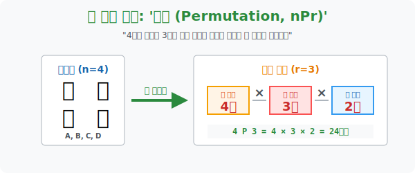

# 2. 자리가 사람을 만든다: '순열 (Permutation)'

## [도입부] 학습 목표 (Learning Objectives)
- $A, B, C, D$ 4명의 대기자 중 3명을 골라 1등석, 2등석, 3등석에 순서대로 앉히는 줄 세우기 알고리즘, **'순열(Permutation)'** 의 작동 원리를 분석합니다.
- 단순히 고르는 것(조합) 과, 고른 뒤에 예쁘게 '순서대로 배열' 하는 것의 치명적인 결과값 차이를 기호 ${}_n\mathrm{P}_r$ 와 팩토리얼($!$) 계산을 통해 터득합니다.
- 파이썬(Python)의 수학 무기고인 `itertools.permutations` 모듈을 발동시켜 반장, 부반장을 뽑는 잔혹한 정치 게임의 모든 경우의 수를 화면에 수놓아 봅니다.

---

## 1. 4명의 후보, 3개의 의자 (nPr)

우리 반에 아이돌 연습생을 준비하는 끼 많은 친구 4명(A, B, C, D) 이 있습니다.
학교 축제 무대에 오를 수 있는 자리는 딱 3자리(센터 1번, 보컬 2번, 댄스 3번) 뿐입니다.
과연 이 4명을 3자리에 순서대로 꽂아 넣는 경우의 수는 몇 가지일까요? 이전 시간에 배운 '곱의 법칙' 을 그대로 가져오면 됩니다.

1. **센터 1번 자리**: 아직 아무도 뽑히지 않았습니다. 대기자 4명이 모두 치열하게 싸웁니다. $\rightarrow$ **(4명 가능)**
2. **보컬 2번 자리**: 한 명이 센터로 발탁되어 나갔습니다. 남은 3명이 다음 자리를 놓고 싸웁니다. $\rightarrow$ **(3명 가능)**
3. **댄스 3번 자리**: 이제 대기실엔 탈락의 공포에 떠는 2명만 남았습니다. $\rightarrow$ **(2명 가능)**

각 자리에 배치되는 사건은 '연이어(꼬리를 물고)' 발생하므로 곱의 법칙이 적용됩니다.
* **계산**: $4 \times 3 \times 2 = 24$ 가지!

수학자들은 매번 이렇게 곱하기로 늘어놓는 것을 귀찮아하여 깔끔한 기호를 만들었습니다.
**"서로 다른 $n$개 중에서, $r$개를 골라 '일렬로(순서대로)' 나열하는 경우의 수"**
이것을 영어 단어 Permutation(순열) 의 앞 글자를 따서 **${}_n\mathrm{P}_r$** 이라 부릅니다.

> 예시 계산: **${}_4\mathrm{P}_3 = 4 \times 3 \times 2$**

만약 4명을 4자리에 모조리 앉히면 어떻게 될까요?
${}_4\mathrm{P}_4 = 4 \times 3 \times 2 \times 1 = 24$ 가지. 
수학자들은 1까지 끝까지 쥐어짜며 곱하는 이 방식을 **팩토리얼(Factorial, !)** 이라 부르며, 강렬한 느낌표 기호인 **$4!$** 로 표기합니다. 



<br>

## 2. 순열의 철학: "순서가 다르면 다른 우주다"

왜 '순열(P)' 은 지난 단원에서 배웠던 '조합(C)' 과 다를까요?
대기자 A, B, C 가 뽑혔다고 가정해 봅시다.

* **조합의 시선**: "야, 어차피 지들 3명이 무대 올라가는 거잖아? 순서가 무슨 상관이야. 한 덩어리 취급해!" (결과: 묶음 1개)
* **순열의 시선**: "미쳤어? 자리 배치가 생명이라고! (A-B-C) 로 서있는 우주와, (C-B-A) 로 서있는 우주는 완전히 다른 세계관이야!" (결과: $3! = 6$개로 뻥튀기됨)

즉, 순열은 대상을 뽑은 뒤, **의자 번호(서열, 이름표) 라는 이름표 위에 앉혀서 지위를 부여**하는 고도화된 배열 절차입니다. 

---

## 3. 💻 파이썬(Python)의 순열 제너레이터

4명 중 3명을 골라 일렬로 세우는 24가지를 인간이 종이에 적으려면 (A-B-C), (A-B-D)... 머리가 하얗게 백지화됩니다. 파이썬의 `itertools` 는 우리가 요구한 인원수대로 알아서 대형을 쫙 짜주는 군대 조교와도 같습니다.

### 🐍 파이썬 예제: 학급 임원 선출 (순열 엔진)

```python
from itertools import permutations

print("--- 👑 순열 자동화 시스템: 학급 임원(반장, 부반장) 선출 가동 ---")

# 후보군 4명 (n = 4)
students = ['아이언맨', '배트맨', '슈퍼맨', '스파이더맨']

# 직책의 개수 (r = 2: 반장, 부반장)
positions = 2

# 퍼뮤테이션(순열) 알고리즘 폭발! (순서가 권력을 의미함)
# combinations(조합) 이었다면 '배트맨-슈퍼맨' 하나만 남겼겠지만,
# permutations 이므로 '슈퍼맨-배트맨' 도 완전히 다른 결과로 토해냅니다!
all_perms = list(permutations(students, positions))

print(f" [데이터 세팅] 총 {len(students)}명의 영웅 중 {positions}개의 수직적 직책에 배치합니다.")
print("-" * 50)
print(f" 📊 [출력 시나리오: 4P2 = {len(students)*(len(students)-1)}가지]")

# 결과 예쁘게 렌더링하기
for i, perm in enumerate(all_perms, 1):
    # perm 은 ('아이언맨', '배트맨') 같은 튜플 형태입니다.
    print(f"  [시나리오 {i:02d}] 짱: {perm[0]} / 부짱: {perm[1]}")

# 파이썬 안에는 math.factorial() 이라는 팩토리얼 전용 무기도 내장되어 있습니다.

# 결과창:
# --- 👑 순열 자동화 시스템: 학급 임원(반장, 부반장) 선출 가동 ---
#  [데이터 세팅] 총 4명의 영웅 중 2개의 수직적 직책에 배치합니다.
# --------------------------------------------------
#  📊 [출력 시나리오: 4P2 = 12가지]
#   [시나리오 01] 짱: 아이언맨 / 부짱: 배트맨
#   [시나리오 02] 짱: 아이언맨 / 부짱: 슈퍼맨
#   [시나리오 03] 짱: 아이언맨 / 부짱: 스파이더맨
#   [시나리오 04] 짱: 배트맨 / 부짱: 아이언맨
# ... (중략)
```

이 알고리즘은 128비트 암호 키 생성, 자동차 번호판 경우의 수 파악, 바코드 설계 등 "순서가 조금이라도 틀어지면 다른 정보가 되는" 현대 IT 암호학의 최전선에서 엔진 역할을 담당합니다.

---

## [결론] 학습 정리 (Summary)

1. **순열 (${}_n\mathrm{P}_r$)**: 서로 다른 $n$개의 원소 중에서 $r$개를 선택한 후, 첫 번째 자리, 두 번째 자리... 와 같이 '엄격한 순서와 서열' 을 부여하여 일렬로 배열하는 행위입니다.
2. **팩토리얼 ($n!$)**: 시작 숫자부터 1이 될 때까지 계단식으로 계속 깎아 내려가며 모조리 곱하는 융단폭격 연산입니다. (모든 대상을 줄 세우는 극강의 스킬)
3. **순열 vs 조합**: 대상들의 위치 좌표가 뒤바뀌었을 때 그것을 "색다른 매력 뿜뿜인 새로운 경우의 수다!" 라고 쳐주면 순열이고, "에이, 어차피 같은 패밀리잖아!" 라고 버려버리면 조합입니다.
