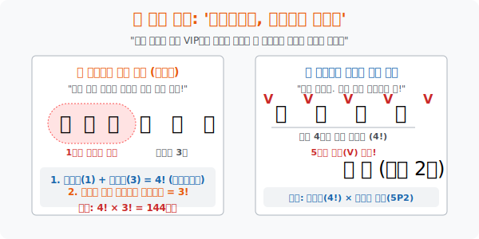

# 3. 찰거머리와 웬수들: '이웃하거나, 이웃하지 않게 세우기'

## [도입부] 학습 목표 (Learning Objectives)
- 평온하게 일렬로 줄을 세우던 순열의 세계에, 특정 인물들끼리 "무조건 붙겠다는(이웃하는)" 요구 조건이 들어왔을 때, 컴퓨터의 그룹화(Grouping) 방식처럼 한 덩어리로 박싱(Boxing) 하여 연산량을 압축하는 스킬을 배웁니다.
- 반대로, 앙숙들끼리 "절대 내 옆에 붙이지 마라(이웃하지 않게)" 라고 요구했을 때, 안전지대인 제3자들을 먼저 벽돌로 세워놓고 그 빈틈 사이사이에 시한폭탄들을 꽂아 넣는 **'슬롯(Slot) 할당'** 의 천재적 발상을 체화합니다.
- 파이썬(Python)의 문자열(`String`) 과 `If` 문자열 포함 연산자(`in`) 를 활용해, 만들어진 순열 더미 속에서 이웃 조건 필터를 적용하여 불합격 데이터들을 모조리 걷어내는 가스라이팅 로직을 짜봅니다.

---

## 1. 접착제로 묶어버려라: 이웃하는 경우

학생 6명(A, B, C, D, E, F) 을 일렬로 세웁니다. 원래대로라면 $6! = 720$ 가짓수의 우주가 펼쳐집니다. 
근데 절친 3인방(A, B, C) 이 손에 본드를 바른 듯 "우린 절대 안 떨어져! 무조건 셋이 붙어 다닐 거야!" 라고 선언합니다.
수학자들은 쿨합니다. 그래? 그럼 너희 셋을 밧줄로 꽁꽁 묶어 버리겠습니다.

**[모듈화(Modularity) 스킬 발동]**
1. **왕도토리 굴리기**: A, B, C 세 명을 보따리에 집어넣어 **'1개의 거대한 도토리'** 로 취급합니다. 이제 우리 반에는 왕도토리 1명과, 나머지 쩌리 3명(D, E, F) $\rightarrow$ 마치 **총 4명**만 남은 것처럼 착각이 듭니다.
   * এই 4명을 줄 세우는 방법 = **$4!$** (4 x 3 x 2 x 1 = 24가지)
2. **보따리 내부 폭동**: 줄 세우기가 끝난 줄 알았는데, 보따리 안에서 A, B, C 가 "야, 내가 가운데 설 거야!" 라며 지들끼리 멱살 잡고 자리를 바꿉니다. 
   * 그 3명이 보따리 내부에서 서열을 정하는 방법 = **$3!$** (3 x 2 x 1 = 6가지)
3. **최종 덧셈(아니고 곱셈)!**: 겉포장이 도는 각각의 경우마다 보따리 내부가 꿈틀대는 곱의 법칙이 지배합니다.
   * **$4! \times 3!$** = $24 \times 6$ = **144가지**

<br>

## 2. 벽 간을 세워라: 이웃하지 '않는' 경우

이번엔 B와 C가 대판 싸웠습니다. "선생님, 저 녀석이랑 절대 옆자리에 붙이지 마세요. 진짜 죽여버립니다!" 
이럴 때는 수학자들이 '건축가' 로 돌변합니다.

**[안전지대(Safe Zone) 구축과 빈틈(Slot) 공략]**
1. **착한 애들 먼저 세우자**: 웬수 2명(B, C) 을 잠시 복도로 쫓아냅니다. 착하고 조용한 나머지 4명(A, D, E, F) 을 먼저 널찍하게 일렬로 세웁니다.
   * 착한 애들 줄 세우기 = **$4!$** (24가지)
2. **빈틈(V) 의 생성**: 착한 애들 4명이 서 있는 사이사이, 그리고 맨 앞과 맨 뒤끝 자리에 '빈 공간(Slot)' V가 생깁니다.
   * `[V] A [V] D [V] E [V] F [V]` $\rightarrow$ 빈 공간은 무조건 사람 수보다 하나 많은 **5개** 가 생탄됩니다!
3. **웬수들 꽂아넣기**: 이제 복도에 있던 B와 C를 부릅니다. "너희 저기 비어있는 5칸 중에 알아서 2칸 골라서 조용히 들어가. 그럼 절대 서로 닿을 일이 없잖아!"
   * 5개의 빈자리 중 순서대로 2칸을 고르는 권한(순열) = **${}_5\mathrm{P}_2$** (5 x 4 = 20가지)
4. **최종 합산**: 안전빵 세우기 $\times$ 웬수 꽂기
   * **$4! \times {}_5\mathrm{P}_2$** = $24 \times 20$ = **480가지** 



---

## 3. 💻 파이썬(Python) 정규화 필터링 (If-In)

이번엔 노가다의 황제, 파이썬에게 $6! = 720$ 가짓수를 모두 무식하게 긁어오게 한 뒤, 특정 패턴(A-B-C 가 연속으로 붙어있는 문자열) 만 `If문` 필터 망으로 건져내어 정말 $4! \times 3! = 144$ 가 맞는지 확인 사살을 해보겠습니다.

### 🐍 파이썬 예제: 문자열 스캔을 이용한 묶음 검증기

```python
from itertools import permutations

print("--- 🔍 이웃 조건 검열 시스템(Adjacency Filter) 가동 ---")

# 전체 6명의 학생 데이터
students = ['A', 'B', 'C', 'D', 'E', 'F']

# 파이썬 깡패 짓: "일단 6명을 죄다 일렬로 720가지 서봐!"
all_lines = list(permutations(students, 6))

print(f" [DB 생성 완료] 무작위 일렬 배치 모델: 총 {len(all_lines)}가지")

friends = ['A', 'B', 'C']
friends_perms = list(permutations(friends, 3)) # A,B,C 내부에서 만들 수 있는 (ABC, ACB, BCA..) 조합들

valid_count = 0

# 720가지 경우의 수를 한 땀 한 땀 검열합니다.
for line_tuple in all_lines:
    # 파이썬은 문자열 비교가 예술입니다. 리스트를 ['A', 'D', 'B', 'C', ..] -> 'ADBC..' 문자열로 합쳐버림.
    line_str = "".join(line_tuple) 
    
    # 이 라인(문자열) 안에 무조건 'ABC' 나 'ACB', 'BCA' 같은 덩어리가 통째로 들어있나 검사
    for f_perm in friends_perms:
        f_str = "".join(f_perm) # 예: 'ABC'
        if f_str in line_str:   # <- 해킹 스킬: 'ADABCEF' 안에 'ABC' 가 통으로 들어있냐? (True/False)
            valid_count += 1
            break # 찾았으면 더 검사할 필요 없이 카운트 올리고 다음 라인으로!

print("-" * 50)
print(f" 🎯 [필터링 결과] 720가지 혼돈 속에서, 절친 3인방이 찰싹 붙어있는 경우는:")
print(f"    총 {valid_count}가지 발견!")
print(f" 💡 [수학의 증명] (도토리 4개 배열 4!) * (내부 폭동 3!) = 24 * 6 = 144")
print("    파이썬의 브루트포스 렌더링 값과 수학 공식이 완벽하게 일치합니다!")

# 결과창:
# --- 🔍 이웃 조건 검열 시스템(Adjacency Filter) 가동 ---
#  [DB 생성 완료] 무작위 일렬 배치 모델: 총 720가지
# --------------------------------------------------
#  🎯 [필터링 결과] 720가지 혼돈 속에서, 절친 3인방이 찰싹 붙어있는 경우는:
#     총 144가지 발견!
#  💡 [수학의 증명] (도토리 4개 배열 4!) * (내부 폭동 3!) = 24 * 6 = 144
#     파이썬의 브루트포스 렌더링 값과 수학 공식이 완벽하게 일치합니다!
```

이 필터링 기법은 실제 유전자 서열(DNA) 분석에서 "이 질병을 유발하는 특정 염기서열 패턴(A-C-G-T 덩어리) 이 유전자 코드 안에 이웃하여 존재하는가?" 를 검출해 내는 생명정보학(Bio-Informatics) 의 뼈대 알고리즘과 같습니다.

---

## [결론] 학습 정리 (Summary)

1. **이웃하는 경우 (1 덩어리 화)**: 껌딱지처럼 붙어야 하는 대상을 보따리에 넣어 '큰 1명' 으로 취급하여 전체를 나열($n!$) 한 뒤, 무조건 그 보따리 안에서 자기들끼리 배열하는 꼬장($k!$) 을 '곱' 해주어야 합니다.
2. **이웃하지 않는 경우 (빈칸 꽂기)**: 폭탄 제조의 원리. 먼저 안전한 일반 대상들을 배열($n!$) 하고, 그 사이의 빈 구역 슬롯 번호를 딴 뒤 폭탄들을 하나씩 조각내어 꽂아 넣는 순열(${}_k\mathrm{P}_r$) 을 가동합니다.
3. 이 두 가지 원리는 프로그래머들이 "특정 문자나 코드가 무조건 옆에 붙어 있어야 함" 혹은 "패스워드 생성 시 두 숫자가 연속하면 안 됨" 등의 강력한 보안 예외 처리를 짤 때 고스란히 사용됩니다.
